# Geometry

## 目录
+ 几何的表达方式
+ 曲线
+ 曲面
+ 几何处理

## 几何的表达方式
### 隐式表示和显式表示
+ Implicit representation of geometry，几何的隐式表示，指将几何体表面的点归纳到特定的关系中
    换句话说，就是用几何表面的点满足的函数来表示这个几何体

    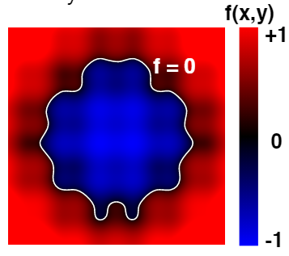

    如图所示，这样一个几何体可以用类似 `f(x, y, z) = 0` 的函数关系式表示
+ Explicit representation of geometry，几何的显式表示
    + 直接给点的位置
    + 通过参数映射
        + 给定2维的坐标 $(u, v)$ 和2维到3维的映射函数
        + $f:\R^2 \rarr \R^3 \Rightarrow (u, v) \rarr (x, y, z)$

    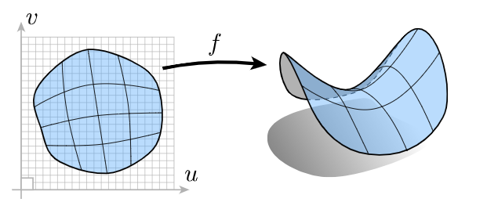

### 隐式表示和显式表示的差异
#### 描述几何体
+ 隐式表示非常简洁，但是非常抽象，很难描述几何体具体形状
+ 显式表示很容易将几何体的形状的给描述出来

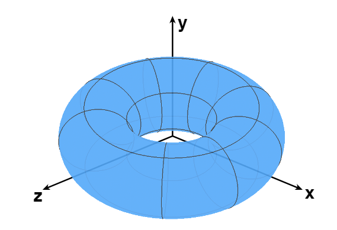

例如图中这样形状的几何体：
+ 隐式表示：$f(x, y, z) = (2 - \sqrt{x^2 + y^2})^2 + z^2 - 1$ ，这个式子我们很难去想象出图里的形状
+ 显式表示：2维坐标点，以及映射关系 $f(u, v) = ((2 + \cos u)\cos v, (2 + \cos u)\sin v, \sin u)$ ，我们可以算出每一点的坐标，得到表面坐标就等于知道了这个几何体的形状

同样的形状，几何的显式表示比隐式表示更容易被描述出来

#### 判断点和几何体的位置关系
给定点 $(3/4, 1/2, 1/4)$ ，判断在下面图形内部还是外部

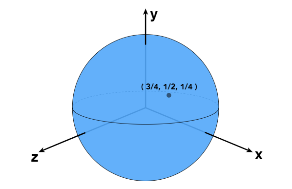

+ 隐式表示：$f(x, y, z) = x^2 + y^2 + z^2 - 1$，做法很简单，直接将点带入这个表达式，然后将结果和0做比较
    + 小于0，在几何体内
    + 等于0，在几何体表面
    + 大于0，在几何体外
+ 显式表示：$f(u, v) = (\cos u \sin v, \sin u  \sin v, \cos v)$，我们很难判断给定的点在显式几何体内还是外

同样的形状，几何的隐式表示比显式表示更容易得到给定点的位置关系

### 图形学中的隐式表示
列举图形学中常见的隐式表示几何体的方式
#### Algebraic Surfaces
用代数方法来表示曲面的点的关系，上一节已经提到过一点了

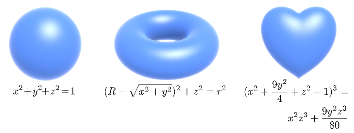

越简单规律的形状，它的函数式越简洁。那么也因为意味着越复杂的形状，它的函数式越难以求取

像奶牛这样复杂的形状，我们难以求得它的函数关系式

#### Constructive Solid Geometry
通过数学运算（逻辑运算 Boolean operations），将基本几何体组合成复杂的难以表示的形状

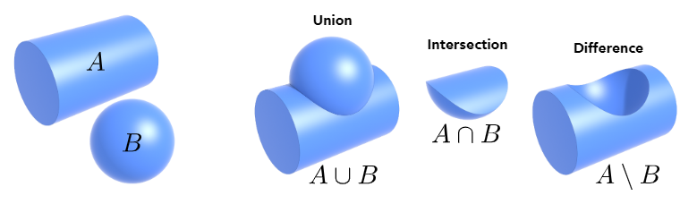

我们能非常容易的表示出简单几何体的函数关系式，那么通过运算组合将它进行组合，就可以表示出图中这样不太好写出关系式的几何体

我们来看一个稍微复杂一点的例子：

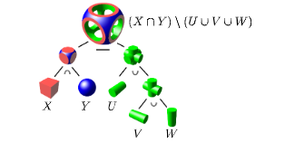

+ 立方体 $X$ 和球体 $Y$ 取交集，得到 $X \cap Y$
+ 水平圆柱体 $V$ 和竖直圆柱体 $W$ 取并集，得到 $V \cup W$
+ $V \cup W$ 与垂直于 $V, W$ 圆柱体 $U$ 取并集，得到 $U \cup V \cup W$
+ $X \cap Y$ 减去自己与 $U \cup V \cup W$ 相交的部分，得到 $(X \cap Y) \setminus (U \cup V \cup W)$

#### Distance Functions
距离函数，Distance functions，空间上任意一点到几何体的的最小距离

常用来做几何体的表面混合

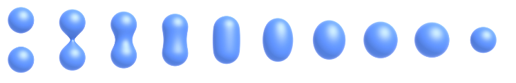

通过一个例子来理解距离函数：
我们要融合两个几何体，如果采用线性的融合方式，过程和结果像这样

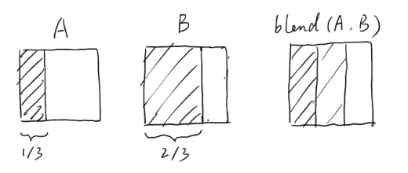

直接将几何体 $A$ 和 $B$ 混合到一起得到最终结果 $blend(A, B)$

但是如果我们想得到这个融合的中间过程

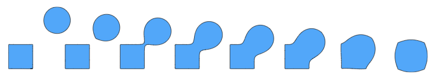

使用距离函数的融合就能和轻松的得到中间过程，距离函数的混合就是在混合几何体的边界

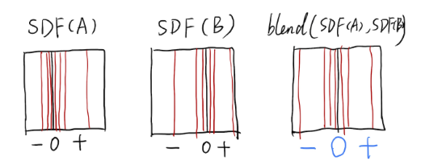

设不同距离为0，就能得到不同融合阶段图形的状态

#### Level Set Methods
水平集法，Level Set Methods，采样和距离函数相同的思想（存储几何体和空间中点的距离关系），使用网格记录几何体周围到几何体表面的距离，用这个网格的值来近似代替距离函数

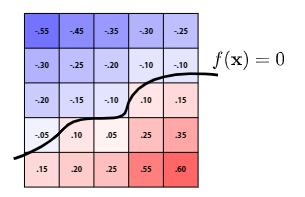

如果是三维的水平集，那么就是我们在 Shading 章节中提到的三维贴图

#### Fractals
分形，Fractals，指自相似，简单的情况就是边缘按照不同比例重复之前的图像

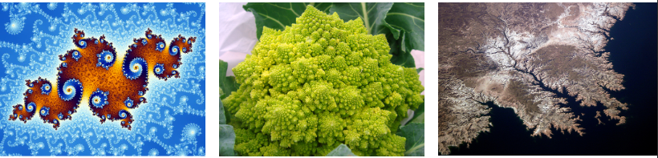

很多自然界的物体就具有类似的分形结构，最常见的就是雪花

#### 隐式表示的优缺点
##### 优点
+ 简洁
    + 通常就记录一个函数就OK
+ 便于查询
    + 查询点在几何体内还是外
    + 查询点到几何体表面的具体
+ 便于光线和几何体表面求交点（光线追踪里会展开说明）
+ 对于简单的几何体，隐式表示更加精确
+ 便于处理几何体拓扑结构（topology）的变化
##### 缺点
+ 难以描述复杂几何体的形状

### 图形学中的显式表示
列举图形学中常见的显式表示几何体的方式
#### Point Cloud
点云，Point Cloud，不把物体表示为几何体，而是点的集合，由点占据空间中的位置来组合成不同的几何体形状

点云非常容易表示各种几何体，因为我们已知点云所有点的空间位置

点云表示几何体所用到的数据量非常大，跟其他表示方式差了好几个数量级

#### Polygon Mesh
多边形面，Polygon Mesh，用多边形（常用三角形和四边形）去描述几何体的表面，并将多边形或者他们的顶点记录下来

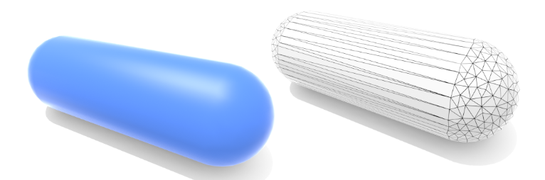

+ Mesh（特别是Triangle Mesh）是图形学中使用最多最广泛的几何表示方法
+ 非常利于对几何体做处理、模拟、自适应采样（adaptive sampling）等等
+ 多边形的连接关系比较复杂，这一块的研究相对多一些

简单介绍一下The Wavefront Object文件（.obj文件）的格式

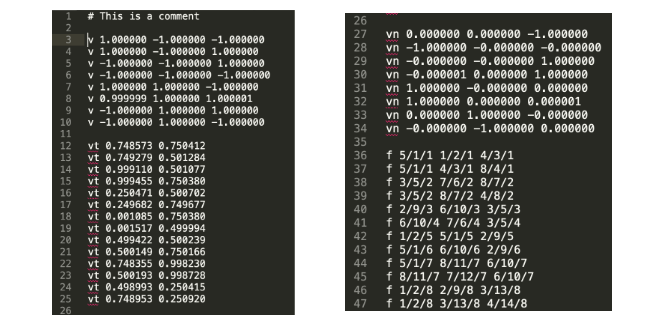

+ `v`：模型所用到的顶点的坐标
+ `vt`：模型表面的纹理坐标
+ `vn`：模型每个面的法线
+ `f`：模型每个三角形的连接关系

## 曲线
曲线，Curves，也是显式表示的一种，但我们单独将它拿出来进行了解和学习

### 贝塞尔曲线

#### 用切线定义贝塞尔曲线
我们可以使用4个控制点 $p_0, p_1, p_2, p_3$ 定义出唯一一条曲线，这条曲线被称为贝塞尔曲线（Bézier Curve）

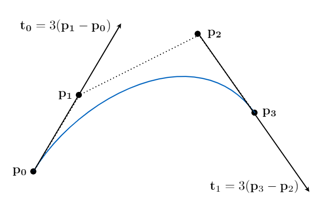

贝塞尔曲线需要满足以下几个性质：
+ 贝塞尔曲线必须从点 $p_0$ 开始，并且从点 $p_3$ 结束
+ 贝塞尔曲线在点 $p_0$ 的切线 $\mathbf{t_0}$ 必须满足 $\mathbf{t_0} = 3(p_1 - p_0)$
+ 贝塞尔曲线在点 $p_3$ 的切线 $\mathbf{t_0}$ 必须满足 $\mathbf{t_1} = 3(p_3 - p_2)$
+ 有唯一一条复合以上要求的贝塞尔曲线

#### 贝塞尔曲线的性质
+ $b(0) = b_0;b(1) = b_3$，这对应我们规定的贝塞尔曲线的起点和终点
+ 4个控制点的贝塞尔曲线满足：$b'(0) = 3(b_1 - b_0);b'(1) = 3(b_3 - b_2)$
+ 对整个贝塞尔曲线做仿射变换，可以转换成对控制点做对应变换（好性质）
+ 曲线一定在控制点所形成的凸包内（凸包性质）

凸包，能够包围给定的几个点的最小的凸多边形，如下图：
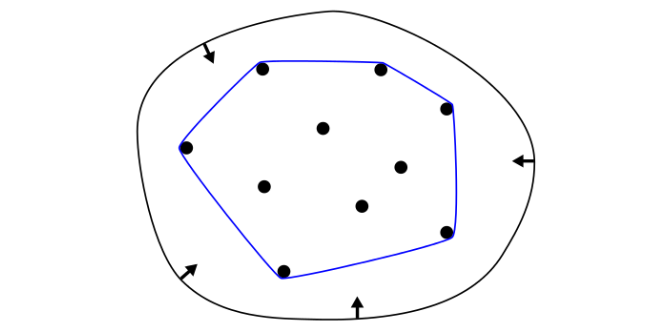

### de Casteljau Algorithm
#### 贝塞尔曲线计算过程
我们学习 de Casteljau Algorithm 来理解贝塞尔曲线的生成过程

如何画出贝塞尔曲线，首先我们考虑只有3个点的情况（最简情况是3个控制点，如果更少的点就不能表示曲线了），即4个控制点其中两个重合（这种曲线被称为二次贝塞尔曲线）

我们有 $b_0, b_1, b_2$ 三个控制点

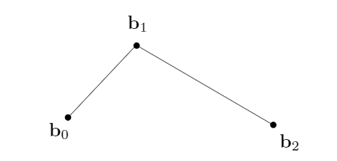

假设贝塞尔曲线从 $b_0$ 出发，到 $b_2$ 结束，整个耗时为1，我们要求取贝塞尔曲线就是求时间 $t$ 时，贝塞尔曲线上对应点 $t$ 的位置

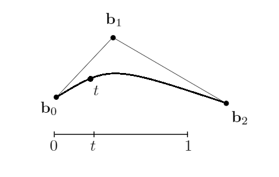

我们在 $b_0b_1$ 线段上按照时间 $t$ 做线性插值，得到 $t$ 时刻时的点 $b_0^1$

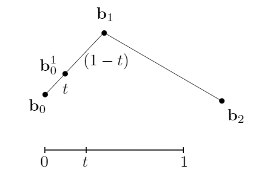

按照同样的方法，我们插值得到 $t$ 时刻在线段 $b_1b_2$ 上的点 $b_1^1$

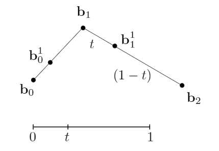

在线段 $b_0^1b_1^1$ 上做第三次时刻 $t$ 的插值，得到点 $b_0^2$

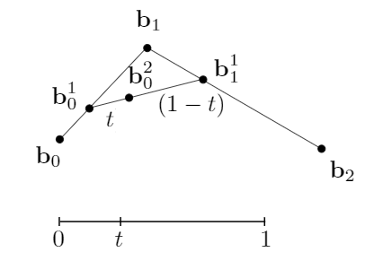

我们认为点 $b_0^2$ 就是贝塞尔曲线在时刻 $t$ 时的位置

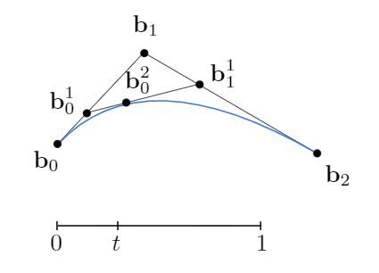

现在我们使用上述的方式将整个计算流程推广到4个控制点（$b_0, b_1, b_2, b_3$）的贝塞尔曲线

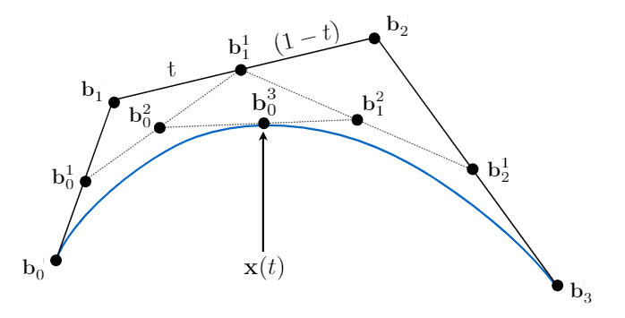

+ 使用三个点带入 de Casteljau Algorithm 可以得到时刻 $t$ 时的确定点
    + 将 $b_0, b_1, b_2$ 带入算法可以得到确定点 $b_0^2$
    + 将 $b_1, b_2, b_3$ 带入算法可以得到确定点 $b_1^2$
+ 在线段 $b_0^2b_1^2$ 上再做一次时刻 $t$ 的插值，得到点 $b_0^3$
+ 我们认为点 $b_0^3$ 就是贝塞尔曲线在时刻 $t$ 时的位置

总结起来，贝塞尔曲线计算就是递归的对不同的线段做线性插值

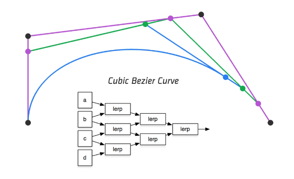

#### 贝塞尔曲线的计算公式
我们已经了解了贝塞尔曲线的计算过程，计算核心就是，我们根据贝塞尔曲线的的4个控制点，算出某一时刻的贝塞尔曲线上对应的某个点
，简化出来的就是下图中的过程

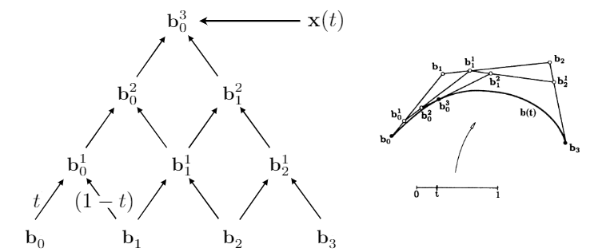

对 n 个输入点进行相邻的两两插值，得到 n-1 个输出点

我们将控制点带入这个计算逻辑进行递归计算，最终得到一个唯一的点，这就是求得的贝塞尔曲线上对应时刻的唯一点

还是从三次贝塞尔曲线开始，我们写出整个过程的计算公式：

首先还是分别对线段 $b_0b_1$ 和 $b_1b_2$ 做 $t$ 时刻的插值得到 $b_0^1$ 和 $b_1^1$ ，我们写出关于 $t$ 的关系式：
$b_0^1(t) = (1 - t)b_0 + tb_1 \\ b_1^1(t) = (1 - t)b_1 + tb_2$

我们再对 $b_0^1$ 和 $b_1^1$ 做 $t$ 时刻的插值得到 $b_0^2(t) = (1 - t)b_0^1 + tb_1^1$

将 $b_0^1$ 和 $b_1^1$ 带入
$b_0^2(t) = (1 - t)^2b_0 + 2t(1 - t)b_1 + t^2b_2$

这是控制点为3时，贝塞尔曲线的关系式，我们推广到任意多个控制点

$$\LARGE b^n(t) = b_0^n(t) = \displaystyle \sum_{j = 0}^nb_jB_j^n(t)$$
+ 给定 $0 到 n$ 一共 $n+1$ 个控制点
+ $b_j$ 表示第 $j$ 个控制点
+ $B_j^n(t)$ 是每个控制点的系数的伯恩斯坦多项式
    伯恩斯坦多项式（Bernstein polynomial，是描述二项分布的多项式），其展开式为 $B_i^n(t) = \begin{pmatrix} n \\ i \end{pmatrix}t^i(1 - t)^{n - i}$

    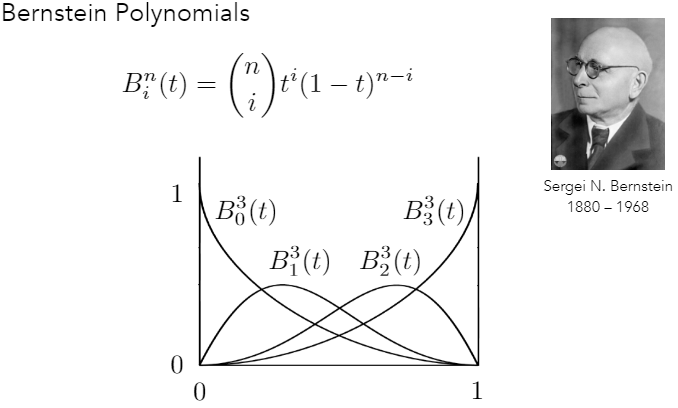

这里我们给出4个控制点的贝塞尔曲线的计算式：
$$\LARGE b^n(t) = b_0(1 - t)^3 + b_13t(1 - t)^2 + b_23t^2(1 - t) + b_3t^3$$

### 分段贝塞尔曲线
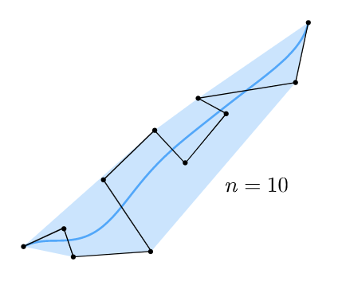

像图中这样，假如我们有从 0 到 10，一共 11 个控制点的一条贝塞尔曲线，你会发现它几乎是沿着控制点覆盖区域的中间进行分布的，我们很难去让贝塞尔曲线描述出控制点这样蜿蜒曲折的走向

于是，我们使用分段贝塞尔曲线（piecewise curve）来控制曲线的形状

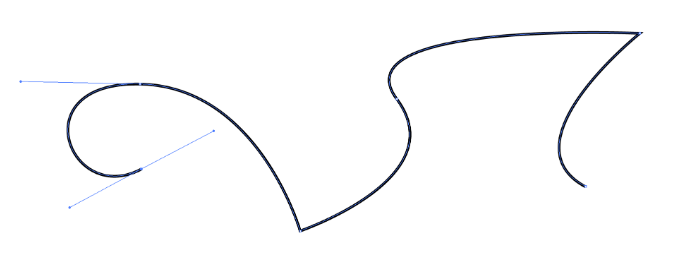

分段贝塞尔曲线，将整条曲线按照 4 个控制点为一组，分为 n 个三次贝塞尔曲线，每段曲线的结束点作为下一段曲线的开始点

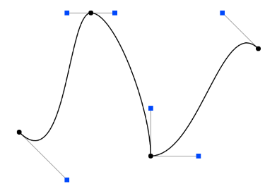

可以在[贝塞尔曲线小栗子online](https://math.hws.edu/eck/cs424/notes2013/canvas/bezier.html)里手动拖拽控制点对贝塞尔曲线和分段贝塞尔曲线进行理解

可以在例子中发现，如果要将分段的贝塞尔曲线组合成一条平滑的曲线，我们必然要考虑两条曲线之间如何连接

考虑 $\mathbf{a}:[k, k + 1] \rarr \R^N$ 和 $\mathbf{b}:[k + 1, k + 2] \rarr \R^N$ 这样两条相邻曲线，如何连接才比较平滑

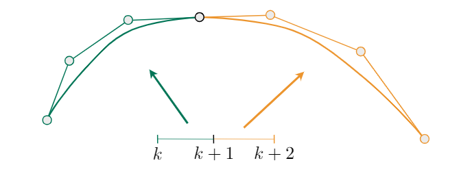

在几何上，认为一条线段的结束点与另一条线段的开始点是同一个点，那么表示两条线段连续
这种连续关系被称为 $C^0$ 连续，即 $\mathbf{a_n} = \mathbf{b_0}$

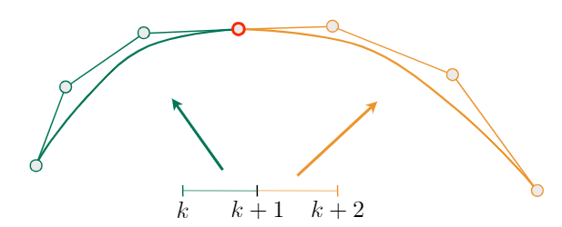

但是这种连续仅仅表示共点，连接的角度可以是任意的，它很多时候都是有一个夹角的

于是，我们定义另一种连续关系， $C^1$ 连续，两条线段不仅要共点，而且前一条线段结束点的前一个点与后一条线段开始点后一个点要满足离共用点距离一样且方向相反，即 $\mathbf{a_n} = \mathbf{b_0} = \frac 1 2 (\mathbf{a_{n - 1}} + \mathbf{b_1})$

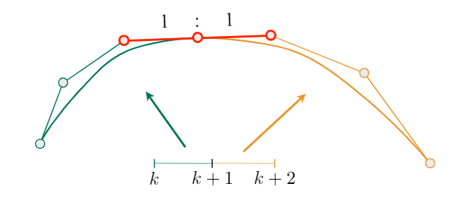

### Spline
可控的曲线被称为样条（Spline），由一系列给定的控制点组成的满足明确的连续关系的曲线

#### B-splines
B-splines，就是一种样条，它有这样的一些特点：
+ B-splines 是对基样条的简称，即使用伯恩斯坦多项式（Bernstein polynomial）作为基函数的样条
    + 伯恩斯坦多项式作为基函数：多项式不同的项在时间 t 对对应的控制点做一个加权平均
    + 也可以反过来理解，用控制点的位置对伯恩斯坦多项式进行加权求和，这里就把伯恩斯坦多项式当做了一个基函数
+ 因为有了加权项，所有 B-splines 比贝塞尔曲线需要更多的信息进行表达
+ 加权项有一个好处，使得控制点具有局部性
    + 局部性，定义了控制点对曲线的影响范围
    + 我们往往实际使用中，会控制每个点对曲线的影响范围，不希望调节某个点时过多的影响其他点，希望它只影响自己周围的曲线走向

## 曲面
与曲线相对应的就是曲面（Surfaces），本节主要讨论曲面相关的内容

### 贝塞尔曲面
我们已经了解的贝塞尔曲线的定义，以及它的表示过程，但在实际生产中，我们处理模型更多的是对曲面的处理，因此本节将贝塞尔曲线扩展到曲面上

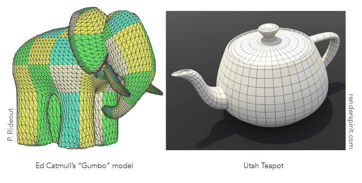

#### 三次贝塞尔曲面
我们从三次贝塞尔曲线过度到三次贝塞尔曲面，有点类似于升了一个维度，从线升到了面

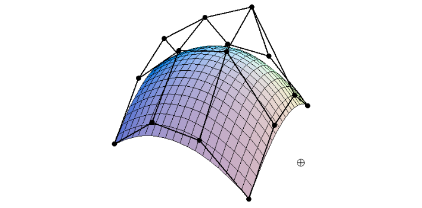

相对应的，三次贝塞尔曲面会有 $4 \times 4$ 个网格排布的控制点，从水平和竖直方向去描述一个面弯曲情况

我们任意取水平或竖直的一条曲线来看，刚好能得出复合4个控制点的贝塞尔曲线

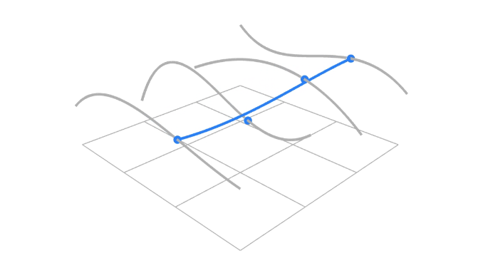

#### 贝塞尔曲面的计算过程
计算过程也是从三次贝塞尔曲线推广出来的，对于三次贝塞尔曲面而言：
+ $4 \times 4$ 个网格状的控制点作为输入
+ 在水平和竖直方向各取一个时刻 $u$ 和 $v$，经过 de Casteljau Algorithm 的插值计算
+ 在 $(u, v)$ 时刻，我们会得到曲面上唯一一个对应点的坐标

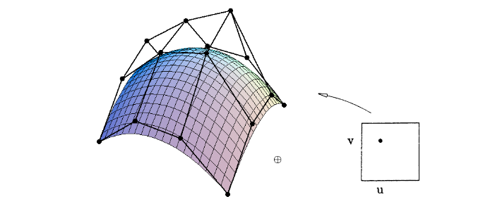

我们来理解一下第二步：水平和竖直方向各取一个时刻 $u$ 和 $v$，做 de Casteljau Algorithm 的插值计算
+ 我们先从竖直方向将控制点分为4组，这样每组4个控制点可以形成各自的贝塞尔曲线（如下图灰色曲线）
+ 对每条灰色贝塞尔曲线做时刻 $u$ 的插值，得到4个蓝色点
+ 将4个点作为新的贝塞尔曲线，我们再做一次时刻 $v$ 的插值，得到唯一的黑色点
+ 将黑色点记录到对应的 $(u, v)$ 上，这就是曲面当前位置的唯一点

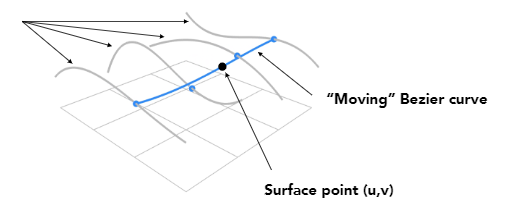

整个插值步骤像这样

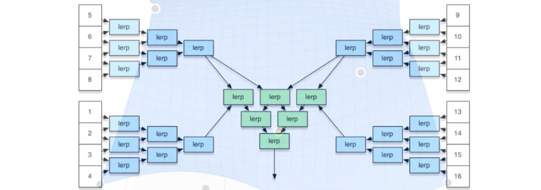

## 几何处理
网格，Mesh，才是我们最常使用的描述几何体的方法，我们接下来学习Mesh的处理
+ 网格细分，Mesh subdivision
+ 网格简化，Mesh simplification
+ 网格正则化（规则化），Mesh regularization

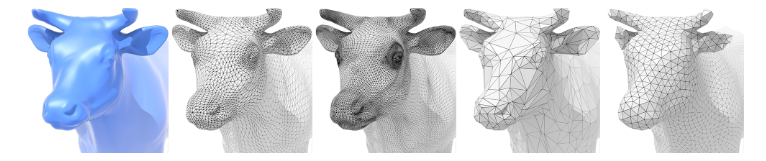

### Mesh Subdivision
网格细分，是一种增加三角形面数的手段，为Mesh增加更多的细节信息

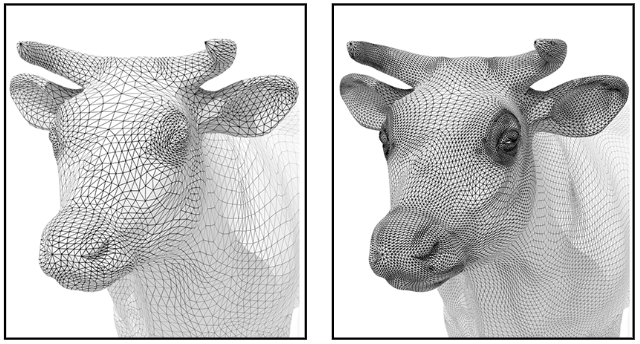

#### Loop Subdivision
Loop细分(发明这种细分方法的老哥叫 Loop，不是循环细分的意思)，思路如下：
+ 将每个三角形细分成 4 个小三角形

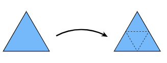

+ 通过不同的权重计算方法计算出新旧顶点的位置，让 Mesh 更加光滑

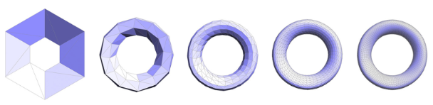

思考一下如何调整新顶点的位置
总体思路是，按照一定权重值按比例取新生成顶点周围的旧顶点的位置，计算出新顶点的位置

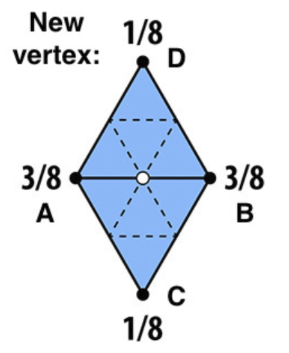

+ 一般情况下，新的顶点在两个三角形公共的线段上，我们假设：
    + 共线的两个顶点为 $A, B$
    + 不同线的两个顶点为 $C, D$
+ 约定共线的顶点的权重大于不共线顶点的权限
    按照 $P = 3/8 * (A + B) + 1/8 * (C + D)$ 进行位置计算

现在考虑如何调整旧顶点的位置
设定旧顶点本身和旧顶点周围其他相邻旧顶点的权重，计算出这个旧顶点的新位置

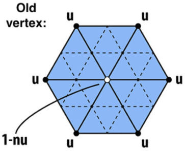

+ 旧顶点只接受来自自身和相邻旧顶点的贡献，不相邻的旧顶点无贡献，新顶点也不做贡献（我觉得应该是为了保证几何信息不过多改变）
+ 旧顶点自身的权重受该点的度 $n$ 的影响
    + 顶点的度（vertex degree），顶点连接的边的数量（图论里面的概念）
+ 设定一个跟度有关的一个数 $u$ ，用来给顶点自身和相邻顶点加权，保证他们的和仍然为1
    + $u = \begin{cases} 3/16 &\text{if } n = 3 \\ 3/(8n) &\text{if } n \not= 3\end{cases}$
    + 顶点的度最小为3
+ 按照 $P = (1 - n * u) * original_pos + u * neighbor_pos_sum$
    + 这个公式的意义是，顶点的相邻顶点数量越多，则顶点本身的贡献越小（挺有道理的，除了特殊情况，比较符合事实）

让我们看一下Loop细分的结果：

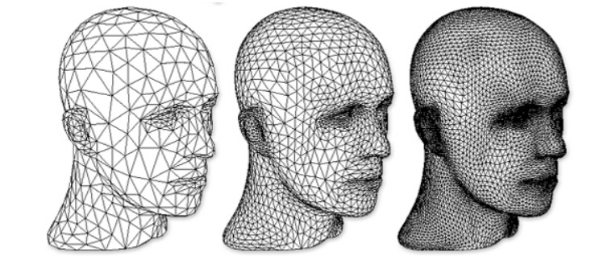

#### Catmull-Clark Subdivision
Catmull-Clark Subdivision 更多的是将非三角形网格进行细分，把不规则网格细分成三角形网格，如果有必要可以使用Loop细分对它进一步细分

首先对网格数据做一些预先的定义：

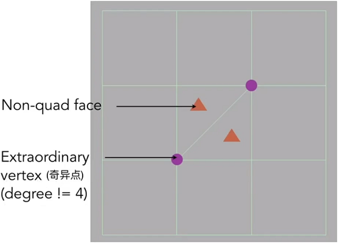

+ Non-quad face，非四边形面，如上图中的橙色三角形所在的三角形面
+ Extraordinary，奇异点，所有度不为 4 的顶点，如上图中紫红色的顶点

现在开始做细分：
+ 为每个面增加一个顶点
+ 为每条边增加一个中点作为顶点
+ 每个面增加的点去连接周围边增加的中点

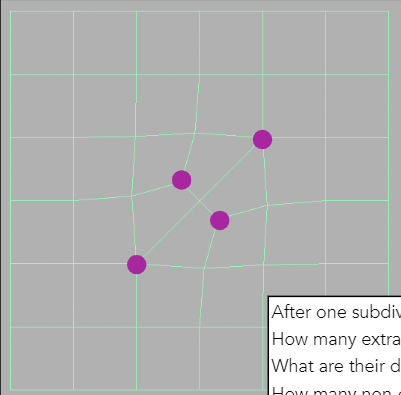

我们来看一下一次细分之后的结果：
+ 非四边形面已经全部细分为了四边形面
+ 奇异点的数量增加，增加的数量等于非四边形面减少的数量
+ 增加的奇异点的度，恰好是对应的非四边形面的边的数量

随着不停的细分，结果会变得越来越光滑
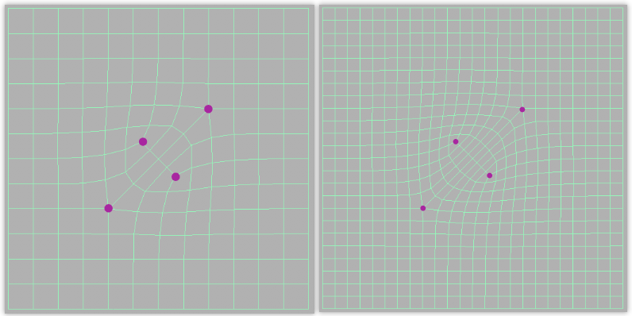

看一下 Catmull-Clark Subdivision 的顶点是如何调整位置

### Mesh Simplification
网格简化，是一种减少三角形面数的手段，为Mesh删掉一些不重要或者我们不关注的细节信息

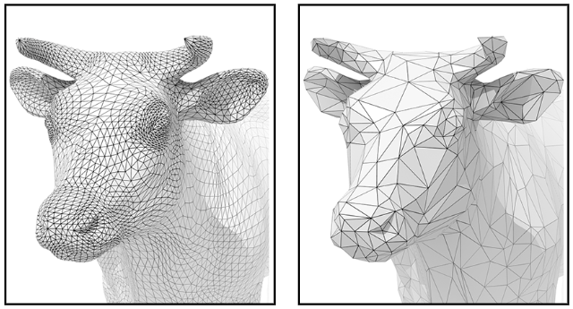

### Mesh Regullarization
网格正则化，是一种改变三角形质量的手段，主要是规范化每个三角形，让三角形整体大小差不多，形状近似正三角形

