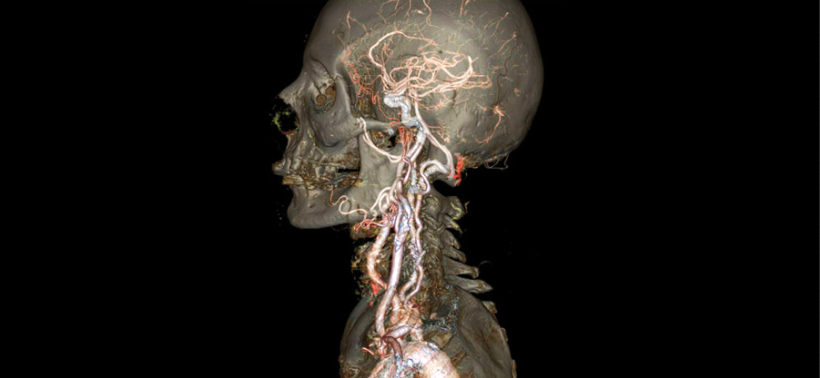

# Geometry

## 目录
+ 几何的表达方式
+ 曲线
+ 曲面
+ 几何处理

## 几何的表达方式
### 隐式表示和隐式表示
+ Implicit representation of geometry，几何的隐式表示，指将几何体表面的点归纳到特定的关系中
    换句话说，就是用几何表面的点满足的函数来表示这个几何体

    

    如图所示，这样一个几何体可以用类似 `f(x, y, z) = 0` 的函数关系式表示
+ Explicit representation of geometry，几何的显式表示
    + 直接给点的位置
    + 通过参数映射
        + 给定2维的坐标 $(u, v)$ 和2维到3维的映射函数
        + $f:\R^2 \rarr \R^3 \Rightarrow (u, v) \rarr (x, y, z)$

    

### 隐式表示和显式表示的差异
#### 描述几何体
+ 隐式表示非常简洁，但是非常抽象，很难描述几何体具体形状
+ 显式表示很容易将几何体的形状的给描述出来

例如图中这样形状的几何体：
+ 隐式表示：$f(x, y, z) = (2 - \sqrt{x^2 + y^2})^2 + z^2 - 1$ ，这个式子我们很难去想象出图里的形状
+ 显式表示：2维坐标点，以及映射关系 $f(u, v) = ((2 + \cos u)\cos v, (2 + \cos u)\sin v, \sin u)$ ，我们可以算出每一点的坐标，得到表面坐标就等于知道了这个几何体的形状

同样的形状，几何的显式表示比隐式表示更容易被描述出来

#### 判断点和几何体的位置关系
给定点 $(3/4, 1/2, 1/4)$ ，判断在下面图形内部还是外部

+ 隐式表示：$f(x, y, z) = x^2 + y^2 + z^2 - 1$，做法很简单，直接将点带入这个表达式，然后将结果和0做比较
    + 小于0，在几何体内
    + 等于0，在几何体表面
    + 大于0，在几何体外
+ 显式表示：$f(u, v) = (\cos u \sin v, \sin u  \sin v, \cos v)$，我们很难判断给定的点在显式几何体内还是外

同样的形状，几何的隐式表示比显式表示更容易得到给定点的位置关系

### 图形学中的隐式表示
列举图形学中常见的隐式表示几何体的方式
#### Algebraic Surfaces
用代数方法来表示曲面的点的关系，上一节已经提到过一点了

越简单规律的形状，它的函数式越简洁。那么也因为意味着越复杂的形状，它的函数式越难以求取

像奶牛这样复杂的形状，我们难以求得它的函数关系式

#### Constructive Solid Geometry
通过数学运算（逻辑运算 Boolean operations），将基本几何体组合成复杂的难以表示的形状

我们能非常容易的表示出简单几何体的函数关系式，那么通过运算组合将它进行组合，就可以表示出图中这样不太好写出关系式的几何体

我们来看一个稍微复杂一点的例子：

+ 立方体 $X$ 和球体 $Y$ 取交集，得到 $X \cap Y$
+ 水平圆柱体 $V$ 和竖直圆柱体 $W$ 取并集，得到 $V \cup W$
+ $V \cup W$ 与垂直于 $V, W$ 圆柱体 $U$ 取并集，得到 $U \cup V \cup W$
+ $X \cap Y$ 减去自己与 $U \cup V \cup W$ 相交的部分，得到 $(X \cap Y) \setminus (U \cup V \cup W)$

#### Distance Functions
距离函数，Distance functions，空间上任意一点到几何体的的最小距离

常用来做几何体的表面混合

通过一个例子来理解距离函数：
我们要融合两个几何体，如果采用线性的融合方式，过程和结果像这样

直接将几何体 $A$ 和 $B$ 混合到一起得到最终结果 $blend(A, B)$

但是如果我们想得到这个融合的中间过程

使用距离函数的融合就能和轻松的得到中间过程，距离函数的混合就是在混合几何体的边界

设不同距离为0，就能得到不同融合阶段图形的状态

#### Level Set Methods
水平集法，Level Set Methods，采样和距离函数相同的思想（存储几何体和空间中点的距离关系），使用网格记录几何体周围到几何体表面的距离，用这个网格的值来近似代替距离函数

如果是三维的水平集，那么就是我们在 Shading 章节中提到的三维贴图

#### Fractals
分形，Fractals，指自相似，简单的情况就是边缘按照不同比例重复之前的图像

很多自然界的物体就具有类似的分形结构，最常见的就是雪花

#### 隐式表示的优缺点
##### 优点
+ 简洁
    + 通常就记录一个函数就OK
+ 便于查询
    + 查询点在几何体内还是外
    + 查询点到几何体表面的具体
+ 便于光线和几何体表面求交点（光线追踪里会展开说明）
+ 对于简单的几何体，隐式表示更加精确
+ 便于处理几何体拓扑结构（topology）的变化
##### 缺点
+ 难以描述复杂几何体的形状