# Ray Tracing

## 目录
+ 为什么要使用光线追踪
+ Basic Ray Tracing Algorithm
    + 光线的说明
    + Ray Casting
    + Recursive Ray Tracing
+ Ray Surface Intersection
    + 光线的表达式
    + 光线和球求交
    + 光线和隐式表示求交
    + 光线和Mesh求交
+ Accelerating Ray Surface Intersection
    + Bounding Volumes
    + 光线和包围盒求交
    + 为什么要使用AABB
    + 光线和AABB求交
+ Using AABBs to accelerate ray tracing
    + Uniform Spatial Partitions
    + Spatial Partitions
    + Object Partitions
    + Spatial vs Object Partitions
+ Basic Radiometry

## 为什么要使用光线追踪
光栅化无法处理全局的一些效果
+ 软阴影
+ Glossy reflection（光线的多次反射）
+ 光线的多次弹射到人眼（间接光照）

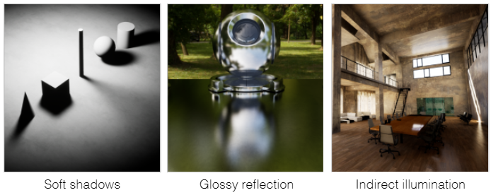

光栅化是一种快速但结果不精确的方法，PUBG的低画质效果就是一个很好的例子

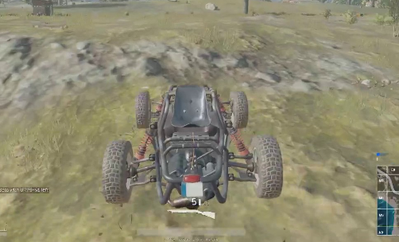

光线追踪恰好相反，它的结果非常精确可信但速度很慢，疯狂动物城的一帧使用光追着色耗时 10k 左右的 CPU 小时


## Basic Ray Tracing Algorithm
基础的光线追踪算法说明

### Light Rays
先做一些关于光线的说明：
+ 光沿直线传播
    + 图形学中假设光线沿直线传播
    + 忽略物理意义上的波粒二象性
+ 光线之间不会发生碰撞
    + 图形学中假设光线不会碰撞，即使发生交叉，也会直接穿过互不影响
    + 忽略物理意义上的波粒二象性
+ 光线一定是从光源出发，最终到达观察者的眼睛
    + reciprocity——光线的可逆性：从光源出发到达眼睛等价于眼睛出发逆着光的路径可以到达光源

早期的视觉发射理论（Emission Theory of Vision）就人的眼睛里可以发射出感知光线，所以我们感知物体的颜色和遮挡关系（由眼睛照亮？）

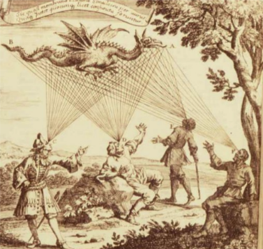

### Ray Casting

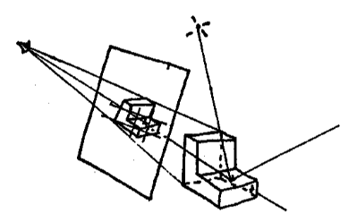

Ray Casting 是 Appel 在1968年提出的一种着色的方法
+ 从摄像机到成像平面的任意一个像素位置发射一根光线

    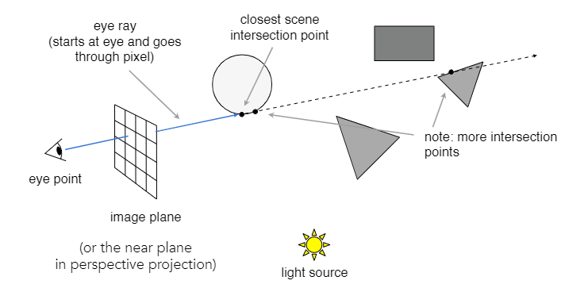

+ 在光线射中最近的物体后，将击中点与光源进行连接

    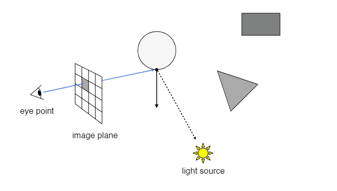

+ 如果是这是一条光通路（击中点与光源之间没有其他遮挡），则表示光可以从这条路径到达人的眼睛，然后可以计算光线在这条光路的对颜色值，从而进行着色

    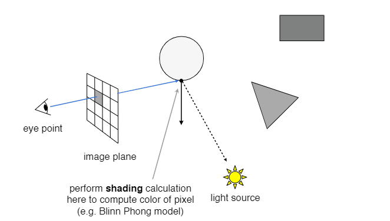

这个方法和光栅化可以得到近似的结果，但是它仍然只计算了一次光线，并没有光线追踪核心的多次反射折射的计算

### Recursive Ray Tracing

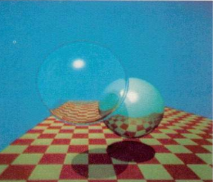

递归光线追踪（Recursive Ray Tracing），也就是大名鼎鼎的 Whitted-Style 光线追踪，是由 T.Whitted 在1980年提出的基于光透射的模型的光线追踪算法

核心思路如下：
+ 仍然是从摄像机向着成像平面的任意一个像素位置出发，发射一根光线

    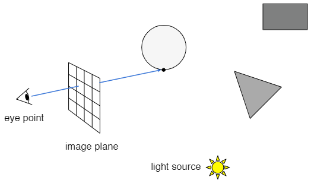

+ 光线会发生一次反射，部分光线的能量会沿着反射方向继续往前

    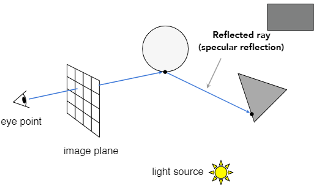

+ 光线可能会发生一次折射（玻璃等材质的物体），部分光线的能量会在物体内部沿着折射的入射方向打到物体的另一个位置，再次发生折射，部光线的能力离开物体表面沿着出射方向继续往前

    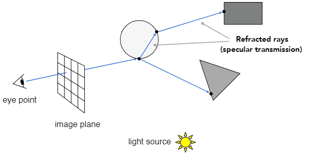

+ 收集所有的光线路径上的击中点到光源的连线，如果形成光通路，则表示这个光通路对成像平面的的颜色值有贡献，最后累计所有的贡献值对成像平面的像素进行着色

    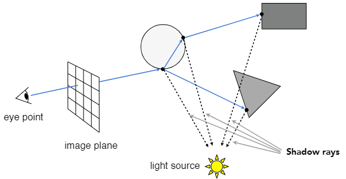

给出过程中涉及的不同光线的含义
+ primary ray：摄像机发射的光线
+ secondary rays：反射、折射等光线
+ shadow rays：判定可见性而连接光源的线（不是光线）

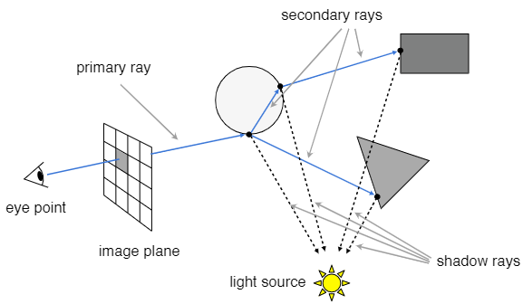

## Ray Surface Intersection
讨论一下光线和物体表面的交点

### 光线的表达式
光线可以被一个点和一个方向向量定义出来

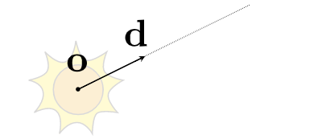

Ray equation：
$$\begin{matrix} \LARGE \mathbf{r}(t) = \mathbf{o} + t\mathbf{d} & 0 \eqslantless t < \infty \end{matrix}$$
+ $\mathbf{r}$，光线在某一时间的表示
+ $t$，时间 t ，用来描述不同时刻光线的位置变换
+ $\mathbf{o}$，光线的起点
+ $\mathbf{d}$，光线的方向

### 光线和球的交点
我们知道光线的方程式：
Ray equation：$\begin{matrix}\mathbf{r}(t) = \mathbf{o} + t\mathbf{d},0 \eqslantless t < \infty \end{matrix}$

也知道球的方程式：
Sphere equation：$\mathbf{p} : (\mathbf{p} - \mathbf{c})^2 - R^2 = 0$

如何求交？

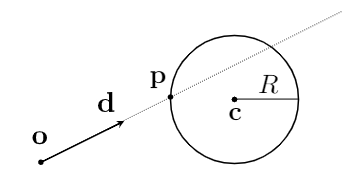

非常简单，将光线的方程式带入球的方程，解算出时刻 t 即可：

$(\mathbf{o} + t\mathbf{d} - \mathbf{c})^2 - R^2 = 0$

其中 $\mathbf{o}, \mathbf{d}, \mathbf{c}, R$ 都是已知的，可以将方程变换成这样的形式 $at^2 + bt + c = 0$

$a = \mathbf{d \cdot d}$
$b = 2(\mathbf{o - c}) \cdot \mathbf{d}$
$c = (\mathbf{o - c}) \cdot (\mathbf{o - c}) - R^2$

将上面这些已知量带入求根公式 $t = \frac {-b \pm \sqrt{b^2 - 4ac}} {2a}$ 中

根据 $t : 0 \eqslantless t < \infty$ 和 $b^2 > 4ac$ 对结果进行约束，就可以得到想要的相交情况

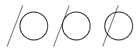

### 光线和隐式表示求交
光线的方程式：
Ray equation：$\begin{matrix}\mathbf{r}(t) = \mathbf{o} + t\mathbf{d},0 \eqslantless t < \infty \end{matrix}$

几何体的隐式表示方程：
General implicit surface equation：$\mathbf{p} : f(\mathbf{p}) = 0$

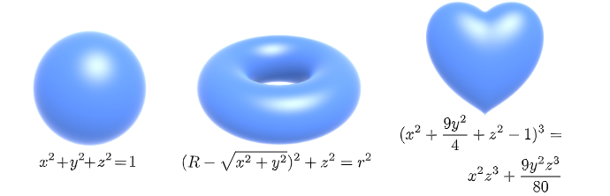

将光线和球求交的过程推广到这里来，显然可以得到：
$\mathbf{p} : f(\mathbf{o} + t\mathbf{d}) = 0$
我们仍然取**正实数解（t 要大于0，且 t 不为虚数）**，作为最后求交的结果

### 光线和Mesh求交
我们最关注的是肯定是对Mesh做求交，有这几个原因：
+ 可以用交点做一些渲染工作，例如可见性（遮挡）判断，阴影判断，光线的作用
+ 可以用来判断光源在mesh内还是外

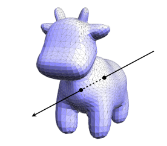

最直接的求交的方法就是使用光线和 Mesh 的每一个三角形面求交
+ 想法很简单，但是很慢（resolution * Mesh triangle counts）
+ 对于每一个三角形面，我们只考虑光线与它有 0 或 1 个交点，即相交或不想交（为了简化，不考虑共面相交的情况）

#### 光线和三角形面求交

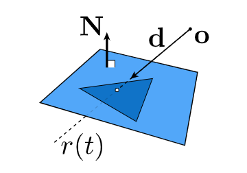

如何做光线和三角形面求交？我们可以近一步分解问题，将三角形认为是一个平面，那么就可以得到求交的步骤：
+ 光线和平面求交
+ 判断交点在三角形内还是在三角形外

#### 平面的表达式
我们对平面做定义：
只用平面上的一个点和平面的法线就可以定义一个平面：平面上任意一点 $\mathbf{p}$ 与给定点 $\mathbf{p'}$ 的连线如果和法线 $\mathbf{N}$ 垂直，那么任意点 $\mathbf{p}$ 就在平面上

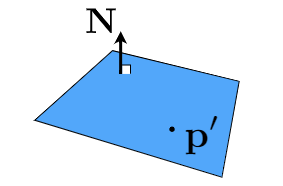

Plane Equation：
$$\LARGE \mathbf{p}:(\mathbf{p - p'}) \cdot \mathbf{N}$$
+ $\mathbf{p}$，平面上任意一点
+ $\mathbf{p'}$，平面方程的已知点
+ $\mathbf{N}$，面法线

#### 光线和平面求交
光线的方程式：
Ray equation：$\begin{matrix}\mathbf{r}(t) = \mathbf{o} + t\mathbf{d},0 \eqslantless t < \infty \end{matrix}$

平面的方程式：
Plane equation：$\mathbf{p}:(\mathbf{p - p'}) \cdot \mathbf{N}$

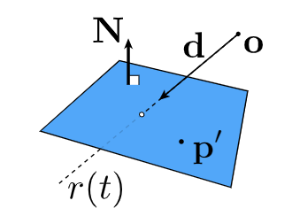

和前面隐式表示求交的思路一致，光线和平面求交：

+ 将 $\mathbf{r}(t)$ 带入平面方程中可得 $(\mathbf{p - p'}) \cdot \mathbf{N} = (\mathbf{o} + t\mathbf{d} - \mathbf{p'}) \cdot \mathbf{N} = 0$
+ 解出 $\Large t = \frac {\mathbf{(p' - o) \cdot N}} {\mathbf{d \cdot N}}$ ，最后用 $0 \eqslantless t < \infty$ 约束结果即可

#### 平面求交优化
求交过程可以使用 Möller Trumbore Algorithm 进行优化，直接算出交点

这个优化方法的核心就是重心坐标，平面上任意一点都可以由重心坐标和三角形的三个顶点表示出来，我们恰好有平面内三角形的三个顶点

于是，我们可以得到这样的式子：

$$\mathbf{O} + t\mathbf{D} = (1 - b_1 - b_2)\mathbf{P_0} + b_1\mathbf{P_1} + b_2\mathbf{P_2}$$

其中的 $\mathbf{O, D, P_0, P_1, P_2}$ 都是向量，我们要求 $t, b_1, b_2$ ，就是求解行列式

可以直接写出这个行列式的解 $\begin{bmatrix} t \\ b_1 \\ b_2 \end{bmatrix} = \frac{1}{\mathbf{S_1 \cdot E_1}}\begin{bmatrix} \mathbf{S_1 \cdot E_2} \\ \mathbf{S_1 \cdot S} \\ \mathbf{S_2 \cdot D} \end{bmatrix}$ ，然后用 $0 \eqslantless t < \infty$ 和 $0 \eqslantless b_1, b_2, b_1 + b_2 \eqslantless 1$ 约束得到求交的结果

行列式解的变量 $\mathbf{E_1, E_2, S, S_1, S_2}$ 可以由已知量简单计算得到：$\begin{matrix}\mathbf{E_1 = P_1 - P_0} \\ \mathbf{E_2 = P_2 - P_0} \\ \mathbf{S = O - P_0} \\ \mathbf{S_1 = D \times E_2} \\ \mathbf{S_2 = S \times E_1}\end{matrix}$

因此，我们可以统计出光线与平面（三角形）求交的计算量：1 div, 27 mul, 17 add

## Accelerating Ray-Surface Intersection
我们现在回顾一下光线在场景中求交的过程（以最常见的 Mesh 表示为例）：
+ 对场景中每个 mesh 的每个三角形面求交
+ 选择交点的 t 最小的那个

这样有什么问题呢？
每个像素都发射一根光线，并和场景中的所有三角形面求交，并且每根光线还有多次反射折射，计算量太大，导致我们实际进行光线追踪的时候非常慢

举几个比较出名的栗子
+ San Miguel Scene ，场景中有 10.7M 三角形

    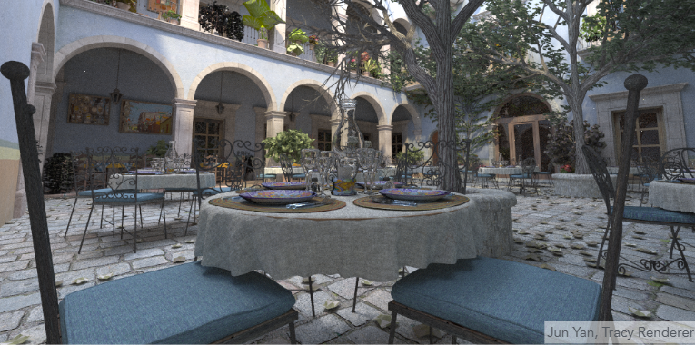

+ Plant Ecosystem ，场景中由 20M 个三角形

    

因此，我们需要减少计算次数，来加速做光线追踪的过程，比如现在被广泛使用的包围盒（Bounding Volumes/Boxes）

### Bounding Volumes
包围盒，Bounding Volume/Box，用一个简单规则的盒子将复杂的对象（边界情况复杂、三角形面数多等等）给包起来，以光线对盒子求交来代替对复杂对象求交
+ 包围盒是完全将对象给包围起来的
+ **如果光线和包围盒没有交点，那么光线一定和包围盒内的物体没有交点**
+ 我们实际使用时，先对包围盒求交，如果有交点再对包围盒对象的三角面求交


### Ray Intersection With Box
之所以要将这个方法叫做包围盒，是因为我们最常用的用来包裹物体的对象就是长方体，也就是一般意义上的盒子

TODO：Picture（使用视频里的截图内容比较好，截取长方体）

所以，我们先来认识一下 Box ，包围盒由 3 对互相平行的面形成的交集

TODO：Picture（使用视频里的截图内容比较好，分别截取三个平行面的交集）

这个东西也就是图形学中非常出名的 Axis-Aligned Bounding Box（AABB） ，轴对齐包围盒，包围盒的边和坐标轴 $x, y, z$ 是对齐的

### 为什么要使用AABB
+ 对于一般的平面求交：$\Large t = \frac{\mathbf{(p' - o)} \cdot \mathbf{N}}{\mathbf{d \cdot N}}$
    
    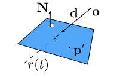

+ 对于轴对齐包围盒求交（以 x 轴为例）：$\Large t = \frac{\mathbf{p'_x - o_x}}{\mathbf{d_x}}$

    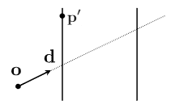
    
    + 相当于将光源的方向分解到了 $x, y, z$ 三个轴上，不用再去加入 $\mathbf{N}$ 的计算

### Ray Intersection With Axis Aligned Box
我们还是从 2 维开始，理解光线和 AABB 求交

我们有包围盒外的任意一根光线 $\mathbf{o} + t\mathbf{d}$ 和一个 2D 的包围盒 $x_0, x_1, y_0, y_1$
+ 先对 $x = x_0$ 和 $x = x_1$ 形成的集合求交点，得到 $t_{min}$ 时刻光线和 $x = x_0$ 相交， $t_{max}$ 时刻光线和 $x = x_1$ 相交

    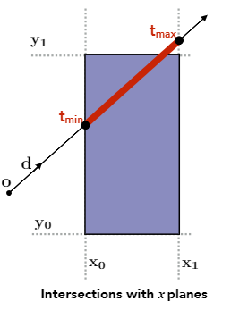

+ 再对 $y = y_0$ 和 $y = y_1$ 形成的集合求交点，得到 $t_{min}$ 时刻光线和 $y = y_0$ 相交， $t_{max}$ 时刻光线和 $y = y_1$ 相交
    图中可以看到，$t_{min} < 0$ ，我们先假设光线是一根直线，最后可以在取约束结果的时候将这种情况给处理掉

    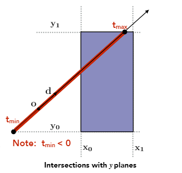

+ 最后我们对 x 平面交点的连线和 y 平面交点的连线取交集，就得到了光线和包围盒求交的结果

    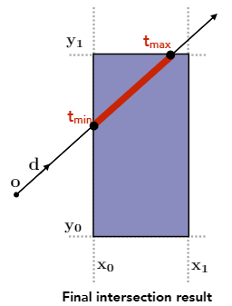

3 维包围盒是由 3 对无穷大的面取交集形成，每对面相互平行并且对面和其他对面两两垂直
将刚才的 2 维过程推广到 3 维
+ 光线进入全部 3 个对面内，表示光线进入了包围盒
+ 光线离开任意一个对面，表示光线离开了包围盒

因此对 3D 的包围盒求交：
+ 分别对 3 对平行面求 $t_{min}$ 和 $t_{max}$
    + 即使结果为负也没有关系，可以在约束的时候处理掉
+ 那么进出包围盒的时刻 $t_{enter} = max(t_{min})$ ， $t_{exit} = min(t_{max})$ ，这很好理解
    + 光线最晚进入第三对平行面的时刻，才能保证此时光线进入了所有的平行面
    + 光线最早离开第一对平行面的时刻，意味着光线不满足在所有的平行面内了，必然离开了某一平面
+ 如果 $t_{enter} < t_{exit}$ 说明光线在这段时间内在包围盒中，也就意味着光线和包围盒必然相交

最后我们来解决刚才遗留的问题，光线是射线而不是直线，$t$ 不能小于 0 ，我们来考虑 $t_{enter}$ 和 $t_{exit}$ 的特殊取值情况
+ 如果 $t_{exit} < 0$ ，包围盒一定在光线的背后，那么光线和包围盒不想交
+ 如果 $t_{exit} \eqslantgtr 0$ 并且 $t_{enter} < 0$ ，光线的原点在包围盒内部，那么光线和包围盒有交点

那么总结出光线和 AABB 相交的条件： $t_{enter} < t_{exit}$ $and$ $t_{exit} \eqslantgtr 0$

## Using AABBs to accelerate ray tracing
现在我们正式的使用包围盒来给光线追踪做加速，这里我们介绍几种方法：
+ 标准网格（Uniform Grids），也可以叫均匀网格
+ 空间划分（Spatial Partitions）
+ 物体划分（Object Partitions）

### Uniform Spatial Partitions
标准网格划分，Uniform spatial partitions，预先对场景进行处理，把场景划分为标准网格，用光线对划分出来的网格做AABB求交

我们来看一下 Build Acceleration Grid 的具体步骤：
+ Find bounding box，为场景划出一个大的包围盒，将所有物体包围起来

    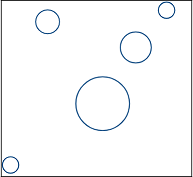

+ Create grid，将网格均匀的划分为标准网格大小的网格块

    

+ 做一遍预处理，将和物体表面相交的格子打上标记

    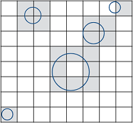

+ 现在开始做光线与物体求交，从第一个和光线相交的标准网格块开始

    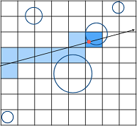

    + step0：检查网格块与物体是否有相交标记
    + step1：
        + 如果网格块有相交标记，就进入 step2：光线就与网格块包含的物体求交
        + 如果网格块没有相交标记，就从下一个与光线相交的网格块开始重复 step0
    + step2：
        + 如果光线和物体有交点，记录交点，并从下一个与光线相交的网格块开始重复 step0
            那么这就是光线在场景中的交点（如果是第一个交点，那么这就是距离最近的交点）
        + 如果光线和物体没有交点，就从下一个与光线相交的网格块开始重复 step0
    + step over：没有下一个与光线相交的网格块，光线离开包围盒，表示整个求交过程结束
    + question：如何选出下一个与光线相交的网格块？
        + 下一个网格块一定和当前网格块相邻
        + 根据光线的方向选取相交网格块

划分标准网格的大小（Grid Resolution）对加速效果的影响：
+ One cell，相当于没有划分网格块，没有加速效果

    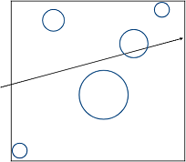

+ Too many cell，网格块划分过于细密，导致和网格块求交就进行了大量计算，负优化（严重情况下，可能让整个过程更慢）

    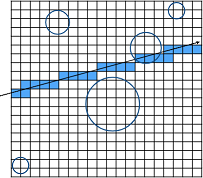

+ Heuristic，启发式的网格尺寸设置，根据经验给出的网格数量和场景中模型数量的关系 —— $cells = C * objs$，在 3 维情况下 $C \approx 27$

    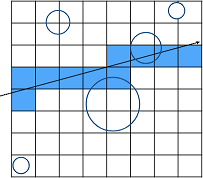

标准网格在较为密集且分布均匀的的场景中有很好的工作效果，例如图中的草地分布就比较均匀，能有效的加速光线追踪的求交过程：


但是对于物体大小不一（特别是差异很大），分布不均匀，出现大面积空置的场景，标准网格就没有那么好的效果（甚至可能有负优化），下图场景比较杂乱，物体有大有小，分布很不均匀，导致了求教过程反而变得更慢：

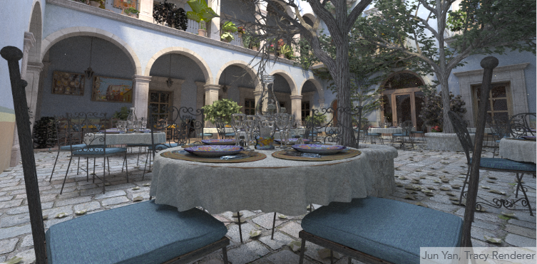

究其原因，密集且分布均匀可以说明场景分割出来的网格块利用率高，可以高效的剔除一些求交的多余操作；分布不均匀，有大面积空置则表示了网格的利用率低下，每次求交都要去检查很多无效的网格块

### Spatial Partitions
Uniform Spatial Partitions 的网格有大面积的空置，导致求交的次数变多，性能反而下降。

那么我们肯定要想办法优化掉空置的网格，这就是本章的重点讨论内容 —— 合理的划分场景

常见的空间划分方法：

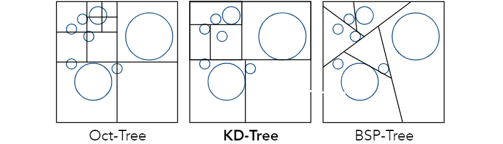

+ Oct-Tree，八叉树，将每一个区域分成 $2^n$ 块形成子节点，继续对子节点进行划分，直到划分成了设定停止条件
    + $n$ 指的是划分对象的维度，比如例子中是 2 维平面，划分结果就是 4 个子节点，如果是 3 维对象，那么就需要划分 8 个子节点
+ KD-Tree，每个区域沿着某一个轴划分成 2 个子节点，考虑划分结果要尽量均匀，在例子中划分轴是水平和竖直交替选取的
+ BSP-Tree，每个区域沿着某个方向划分成 2 个子节点，和 KD-Tree 的区别就是做二分的时候不限制划分的方向

#### KD-Tree Pre-Processing
KD-Tree 的划分过程：
+ step0：将根节点的包围盒划分成两块

    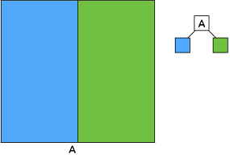

+ step1：将划分后的两个子节点分别做划分（例子中只划分了右边的节点作为演示）

    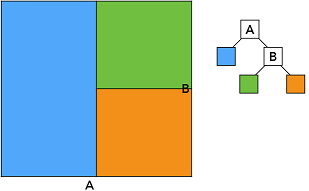

+ step2：递归的将每个叶子节点进行划分，直到划分得到的叶子节点符合设定的要求（例如划分后只包含多少个物体）

    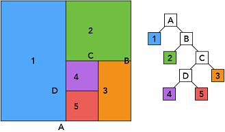

KD-Trees 的数据结构：
中间节点：
+ 当前节点的划分轴：x-, y-, or z-axis
+ 当前节点的划分位置：不是必须沿着中间划分
+ 指向子节点的指针，每次划分必然产生两个子节点
+ 不存储节点对应的网格块的模型对象（中间节点是已经被划分过的节点，不再存储有哪些模型对象在节点内）
叶子节点：
+ 存储当前节点对应的网格块内的模型对象，所有对象都只会存在叶子节点

#### 光线穿过 KD-Tree

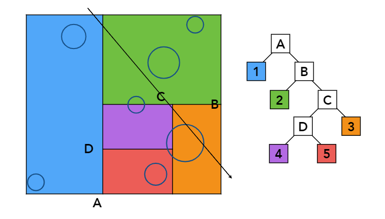

以上图的例子来了解完整的求交过程：
+ step0：先和根节点（A）的包围盒求交，也就是和整个场景的包围盒求交
    如果有交点才继续往子节点做求交，毕竟**根节点和光线没有交点，那么它的子节点也和光线没有交点**

    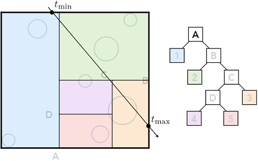

+ step1：光线和左子节点（1）求交，左子节点是叶子节点
    该节点的包围盒和光线相交，表示该节点对应的物体可能和光线相交，那么就需要对叶子节点存储的物体进行求交

    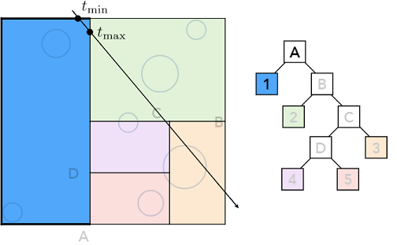

+ step2：光线和右子节点（B）求交，右子节点是中间节点
    该节点的包围盒和光线相交，表示该节点的子节点（2、C）必然和光线相交，我们继续递归向下求交

    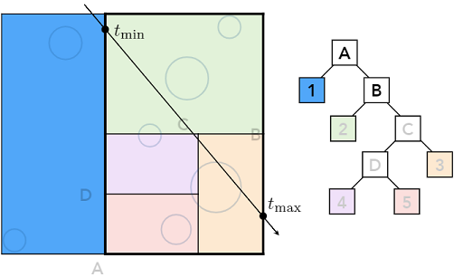

+ step3：光线和中间节点（B）的左子节点（2）求交，叶子节点的处理过程都和 step1 相同

    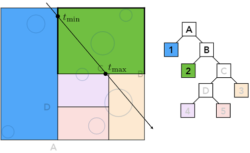

+ step4：光线和中间节点（B）的右子节点（C）求交，中间节点的处理过程都和 step2 相同

    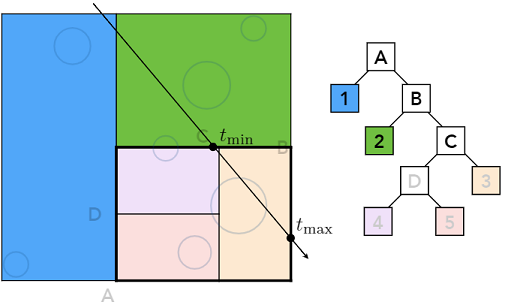

+ step5：光线和中间节点（C）的右子节点（3）求交，叶子节点的处理过程都和 step1 相同

    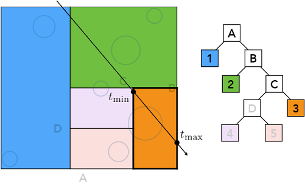

+ step6：光线和中间节点（C）的左子节点（D）求交，发现该节点只有两个叶子节点
    这时，已经达到递归的返回条件，对两个叶子节点的物体对象分别求交之后，进行递归返回

    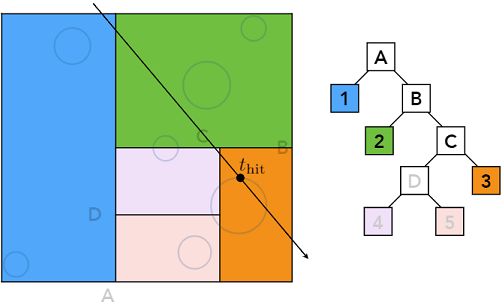

KD-Tree 中的遗留问题：
+ 一个模型对象被划分到了多个不同区域，那么这个物体可能被多个叶子节点存储，可能造成物体的重复求交
+ 我们不好做三角形是否在划分区域内的判断，这样的逻辑比较难以处理，且情况复杂

这些问题导致 KD-Tree 渐渐的在行业中被抛弃

### Object Partitions
接下来介绍对模型对象进行划分的包围盒划分方法，这种方法被称为 Bounding Volume Hierarchy（BVH），解决了 KD-Tree 求交过程中的问题

#### Building BVH
BVH 的划分过程：
+ step0：找到场景的包围盒作为初始节点

    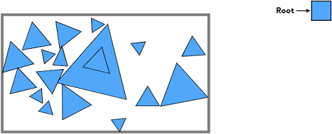

+ step1：将节点分成两个集合（按照一定规则划分）作为子节点

    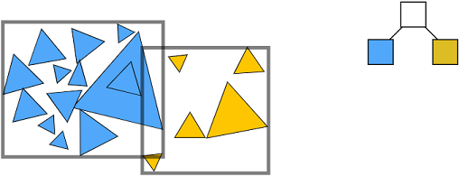

+ step2：重新计算两个子节点各自的包围盒（得到的包围盒比原来的包围盒小了，感觉这一点也比较不错）

    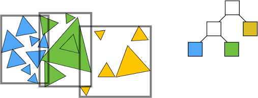

+ step3：对划分出来的子节点分别重复执行 step1 ，直到满足一定的结束条件（例如每个包围盒的三角形面数不超过5）

    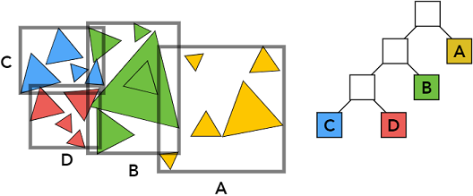

+ step4：模型被存储在叶子节点的包围盒中

其中，如何制定划分规则划是对 BVH 的结果影响最大的因素，给出划分子节点的一些策略：
+ 按某个维度进行划分，比如水平和竖直交替划分
+ 选择节点的包围盒最长的轴进行划分，分成两半
+ 选择范围内中间数量的物体，将模型按照数量划分到两个子节点

BVH 数据结构：
中间节点：
+ 包围盒
+ 指向子节点的指针
叶子节点：
+ 包围盒
+ 存储当前节点包围盒内的模型对象，所有对象都只会存在于叶子节点，且只会存在一个叶子节点内

#### 光线穿过 BVH
光线穿过 BVH 和光线穿过 KD-Tree 并没有本质的区别，都是光线与树形分割的包围盒求交，这里我们直接给出伪代码：
```c++
Intersection(Ray ray, BVH node)
{
    if (ray misses node.bbox) return;

    if (node is a leaf node) {
        test intersection with all objs;
        return closest intersection;
    }

    hit1 = Intersection(ray, node.child1);
    hit2 = Intersection(ray, node.child2);

    return the closer of hit1, hit2;
}
```


### Spatial vs Object Partitions
Spatial Partitions


+ 按照空间划分，并且划分后不会有重叠区域
+ 一个模型对象可能被多个划分区域给包含

Object Partitions


+ 按照模型对象（数量）进行划分，并且划分出来的对象集合没有交集
+ 对象集合之间的包围盒区域可能会有重叠

对于光线求交而言，显然重复对几个包围盒求交的代价远远小于重复对几个模型求交

## Basic Radiometry
为什么要学习辐射度量学的基础（Basic Radiometry）？
+ Blinn-Phong model 是基于经验判断的光照模型，其中的光照强度（light intensity）都是我们自己设置，然后设定经验上的影响系数
+ Whitted style ray tracing 也是基于经验的光照模型，光照强度、反射率、折射率这些参数都是我们基于经验设置的
+ 要真正正确的绘制光的作用结果，我们必须正确的了解和认知光结构和组成
+ 辐射度量学也是路径追踪（Path Tracing）的基础

在辐射度量学中的学习内容：
+ 关于照明的度量系统和度量单位
+ 光照在空间中的属性
    + Radiant flux、intensity、irradiance、radiance
+ 物理上，准确定义和描述光照的方法

### Radiant Energy and Flux
Radiant energy （辐射能），电磁辐射所具有的能量，单位是焦耳（Joule），符号表示为
$$\large Q [J = Joule]$$

Radiant flux/power（辐射通量），单位时间内辐射能量通过某一面积的总功率的度量，单位是瓦特（Watt），符号表示为
$$\large \varPhi = \frac {dQ} {dt} [W = Watt][lm = lumen]$$

### Radiant Intensity
Radiant Intensity（辐射强度），单位立体角的辐射通量（Radiant flux），单位是瓦特每球面度


符号表示为 
$$\Large I(\omega) = \frac {d \varPhi} {d \omega} [\frac{W} {sr}][\frac {lm} {sr} = cd = candela]$$

先回顾一下角度的定义，以此来理解什么是立体角：
角（angle）：radians ，弧度，圆上角的对端弧长与圆半径之比


+ $\large \theta = \frac {l} {r}$
+ 圆的弧度： $2 \pi$ radians
+ 角度的度量应该与圆的半径和周长无关，即角度不随圆的放大和缩小而变化

立体角（Solid angle）：steradians ，球面上立体角对端面积与球半径的平方之比


+ $\large \Omega = \frac {A} {r^2}$
+ 球的立体角： $4 \pi$ steradians
+ 从而为推广到三维，理解一点即可，立体角不随球的半径的放大和缩小而变化，2 维是周长对应到 3 维就是面积

以极坐标表示的球体 $r, \theta, \phi$ 为例，算出单位立体角：


先求出单位面积 $\large dA = (rd\theta)(r \sin \theta d \phi) = r^2 \sin \theta d\theta d\phi$

单位立体角用单位面积除以半径的平方得出 $\large d\omega = \frac{dA}{r^2} = \sin \theta d\theta d\phi$

那么，假设球体的面积是 $S^2$ ，从单位立体角进行积分，就可以得到整个球的立体角
$\large \Omega = \displaystyle\int_{S^2} d\omega = \displaystyle\int_{0}^{2 \pi} \displaystyle\int_{0}^{\pi}\sin \theta d\theta d\phi = 4\pi$

现在我们回到光照这边，由辐射强度的单位立体角和单位辐射通量定义公式 $I(\omega) = \frac {d\varPhi}{d\omega}$ 计算点光源的辐射通量


可以积分得到 $\large \varPhi = \displaystyle\int_{S^2} I d\omega = 4\pi I$

将结果同时除以 $4\pi$ 就能得到：$\large I = \frac {\varPhi}{4\pi}$

最后给一个现实生活中的例子，LED 灯的输出 815 lumens ，我们根据公式来算移项它的辐射强度：$Intensity = 815 lumens / 4\pi sr = 65 candelas$


### Irradiance
Irradiance（辐照度），入射表面上单位面积接收的辐射通量（Radiant flux），单位是瓦特每平方米


符号表示为
$$\Large E(x) = \frac {d\varPhi(x)}{dA} [\frac{W}{m^2}][\frac {lm}{m^2} = lux]$$

使用 Irradiance 理解 Lambert's Cosine Law：


+ 表面辐照度和光线方向跟表面法线夹角的余弦值成正比 $\Large E = \frac {\varPhi}{A} \cos \theta$
+ 辐照度定义中单位面积接收的辐射通量，指的是接收平面和辐射方向垂直，如果表面不平行于接收平面，会先投影后计算辐照度

生活中的例子，地球之所以会有冬天和夏天，是因为太阳直射南或北半球时，另一个半球和太阳光有了夹角，辐照度减小了


使用 Irradiance 理解 Irradiance 衰减 $E' = \frac {\varPhi}{4\pi r^2} = \frac {E}{r^2}$


+ 辐照度会随着距离的增加而减小
+ 随着距离增加，球面积会增加，而立体角不变，由公式可以得知：辐照度会随着距离衰减，辐射强度不会

### Radiance
辐射率是描述光线在空间中分布的基本场量


+ 辐射率是描述光线的相关属性
+ 辐射率是渲染的主要计算对象

Radiance（辐射率），光源发射的单位立体角单位面积的辐射通量（Radiant flux），单位是瓦特每球面度每平方米


符号表示为
$$\Large L(p, \omega) = \frac {d^2 \varPhi(p, \omega)}{d\omega dA \cos\theta} [\frac {W}{sr m^2}][\frac {cd}{m^2} = \frac {lm}{sr m^2} = nit]$$

### 辐射强度、辐照度、辐射率之间的关系：
#### 定义上的区别
+ 辐射强度：单位立体角的辐射通量
+ 辐照度：单位面积的辐射通量
+ 辐射率：单位立体角单位面积的辐射通量
#### 转换关系
+ 辐射率，单位面积的辐射强度 $L(p, \omega) = \Large \frac {dI(p, \omega)} {dA \cos\theta}$

    

    辐射强度，单位立体角方向发射的辐射通量的总和。随着距离的增加，辐射强度就分摊到了一个区域内。对辐射强度做微分，取单位面积的辐射通量就获得了单位面积的辐射强度，也就是辐射率。
+ 辐射率，单位立体角的辐照度 $L(p, \omega) = \Large \frac {dE(p)} {d\omega \cos\theta}$

    

    辐照度，单位面积上各个方向的辐射通量的总和。对辐照度做微分，取每个方向的辐射通量就获得了单位立体角的辐照度，也就是辐射率。

### Irradiance vs Radiance
图形学中使用最多的两个物理量，单独拎出来对比一下

Irradiance ，单位面积内接收到的来自各个方向的辐射通量的总和
Radiance ，单位面积内接收到的来自某一个方向（单位立体角）的辐射通量


显然，二者之间是可以进行转换的：
$$\begin{equation*}\begin{split}
dE(p, \omega) &= L_i(p, \omega) \cos \theta d\omega \\
E(p) &= \int_{H^2} L_i(p, \omega) \cos \theta d\omega
\end{split}\end{equation*}$$

## BRDF
Bidirectional Reflectance Distribution Function，双向反射分布函数，简称为 BRDF，描述光是如何进行反射的函数

以光线在某一点的反射为例：


把物体反射光线换一个思路理解，物体吸收光源发射的能量，再将能量发射出去，这样就将反射分为两个过程：
+ 这个点单位面积内接受到了固定方向的辐射通量，单位面积上接受到的来自某一方向的辐射通量，即单位面积上接收到了辐照度 $dE(\omega_i)$
+ 这个点把接收到的辐射通量往各个方向发射出去，单位面积上往各个单位立体角方向发射的辐射通量记作： $dL_r(x, \omega_r)$

从物理定义上讲：单位面积上接收的某一方向的辐照度，被反射到各个不同的单位立体角方向

那么 BRDF 就是描述单位面积内固定方向接收到的辐射通量发射到不同方向的数值变化的分布情况
$$\Large f_r(\omega_i \rightarrow \omega_r) = \frac {dL_r(\omega_r)}{dE_i(\omega_i)} = \frac {dL_r(\omega_r)}{L_i(\omega_i) \cos \theta_i d\omega_i}[\frac {1}{sr}]$$

### 反射方程
刚才我们理解了从某一方向入射的辐照度，被发射到不同立体角方向的变化关系，我们可以由 BRDF 算出固定入射方向的辐照度对不同出射方向辐射率的贡献

那么我们反过来理解，对于固定出射方向的辐射率来说，他是由该点每一个入射方向的辐照度的贡献累计起来的


反射方程就是对于固定出射方向（观察方向）的辐射率，可以由所有入射方向的辐照度的贡献累计起来，其中各个方向的贡献值就是由 BRDF 决定

$$\Large L_r(p, \omega_r) = \displaystyle\int_{H^2}f_r(p, \omega_i \rightarrow \omega_r) L_i(p, \omega_i) \cos\theta_i d\omega_i$$

很自然，我们能想到所有入射方向的辐照度，不仅仅指光源直接照射的输入，也包括了其他的物体反射光线的输入，也就是说物体反射的出射辐射率也会成为其他地方的入射的辐照度

### 渲染方程
如果有一个自发光（Emission）的物体，它不仅有入射的光线输入，它还有自身往外发射的光线

我们把所有的光线传播整合到一起，用一个渲染方程来描述出光线传播的具体数值变化：
$$\Large L_r(p, \omega_o) = L_e(p, \omega_o) + \displaystyle\int_{\Omega^+} L_i(p, \omega_i) f_r(p, \omega_i, \omega_o) (n \cdot \omega_i) d\omega_i$$

这就是传说中的 Kajia Rendering Equation

#### 理解渲染方程
对于点光源来说：


由渲染方程可得： $L_r(X, \omega_r) = L_e(X, \omega_r) + L_i(X, \omega_i) f_r(X, \omega_i, \omega_r) (n, \omega_i)$ ，其中：
+ $L_r(x, \omega_r)$ 是反射光线，表示某一方向的渲染方程输出
+ $L_e(X, \omega_r)$ 是自发光项
+ $L_i(X, \omega_i)$ 是来自光源的直射光线
+ $f_r(X, \omega_i, \omega_r)$ 是 BRDF 项，表示光源到输出到这个方向的能量的贡献
+ $(n, \omega_i)$ 是直射光线和法线夹角的余弦值

对于多点光源来说：


多点光源的计算就是将每个点光源的输出给累计起来，这样符合生活常识，光源越多同一个物体看起来就越亮

由渲染方程可得： $L_r(X, \omega_r) = L_e(X, \omega_r) + \sum L_i(X, \omega_i) f_r(X, \omega_i, \omega_r) (n, \omega_i)$

对于面光源来说：


面光源就是一堆点光源的集合，我们将这些点积分起来，就可以得到对应的结果

由渲染方程可得： $L_r(X, \omega_r) = L_e(X, \omega_r) + \int_{\Omega} L_i(X, \omega_i) f_r(X, \omega_i, \omega_r) \cos\theta_i d\omega_i$

积分面光源占据的立体角，得到点 $X$ 的面光源输入辐照度

对于其他物体反射的光线来说：


这种情况和面光源一致，考虑物体的某个面反射过来的光线

由渲染方程可得： $L_r(x, \omega_r) = L_e(x, \omega_r) + \int_{\Omega} L_i(X', -\omega_i) f_r(x, \omega_i, \omega_r) \cos\theta_i d\omega_i$

我们将物体反射过来的光线，当做光源发出的光线，这样统一处理就好了

#### 解渲染方程
对于渲染方程 $L_r(x, \omega_r) = L_e(x, \omega_r) + \int_{\Omega} L_i(X', -\omega_i) f_r(x, \omega_i, \omega_r) \cos\theta_i d\omega_i$

我们不知道的项仅有 $L_r(X, \omega_r)$ 和 $L_i(X', -\omega_i)$

我们将这个式子简写为 $l(u) = e(u) + \int l(v) K(u, v) dv$

$u$ 表示物体本身， $v$ 表示来自光源， $K(u, v)$ 表示 BRDF 项

把 $\int ... K(u, v)dv$ 作为算子，记作 $K$ ，将渲染方程再次简写为 $L = E + KL$ ，其中 $L, E$ 是向量， $K$ 是矩阵

现在处理这个 $L = E + KL$， 将它写成 $L = (1 - K)^{-1}E$

将 $(1 - K)^{-1}$ 展开为 $(1 + K + K^2 + k^3 + ...)$ 最后得到方程 $L = E + KE + K^2E + K^3E + ...$

~~整个过程好像是由弗雷德霍姆积分方程和二项分布的性质进行推算得到的，具体推算过程暂时不了解~~

现在我们来理解一下这个渲染方程：
$$\Large L = E + KE + K^2E + K^3E + ...$$
+ $E$ 表示物体的自发光
+ $KE$ 表示物体表面接收到的光源直射的光照
+ $K^2E$ 表示物体表面接收到的光线经过两次弹射所发出的光照
    + 为什么是弹射两次呢，因为该物体本身就需要占据一次弹射来将光线反射到我们眼睛里
+ $K^3E$ 表示物体表面接收到的光线经过三次弹射所发出的光照

由上述过程，可将物体表面的光照做如下分类：
自发光：物体自身发出的光线
直接光照：物体接收到的直接来自于光源照射的光线
间接光照：物体接收到的来自其他物体反射的光线，该反射得到的光线可能在物体间弹射多次

#### 渲染方程的效果
+ 直接光照
图中点 $P$ 没有光源直接照射，所以是黑色，表面它处于光源的阴影中

    

+ 直接光照 + 一次弹射间接光照（忽略物体自身占据的弹射次数）
图中点 $P$ 接收由周围物体弹射一次发射过来的光线，已经有基本的颜色

    

+ 直接光照 + 两次弹射间接光照（忽略物体自身占据的弹射次数）
图中点 $P$ 接收由周围物体弹射一次和弹射两次发射过来的光线，变得比前面更亮了一些

    

+ 直接光照 + 四次弹射间接光照（忽略物体自身占据的弹射次数）
图中点 $P$ 接收由周围物体弹射一次和弹射两次发射过来的光线，变得比前面更亮了一些
同时图里正上方的玻璃灯罩不再时黑色，因为两次弹射只让光线进入了玻璃灯罩，再经过两次弹射才会让光线出玻璃球，并射入我们的眼睛

    

+ 直接光照 + 八次弹射间接光照（忽略物体自身占据的弹射次数）
图中点 $P$ 接收由周围物体弹射一次和弹射两次发射过来的光线，变得比前面更亮了一些

    

+ 直接光照 + 16次弹射间接光照（忽略物体自身占据的弹射次数）
图中点 $P$ 接收由周围物体弹射一次和弹射两次发射过来的光线，变得比前面更亮了一些

    

随着间接光照的光线弹射次数的增多，物体变亮的程度逐渐变小，最后会趋于收敛（可忽略的极小值），符合能量守恒定律（每次弹射光线都有能量损失）