# Materials and Appearances
If you can not render Mathematical formula, please read this [Materials_and_Appearances.pdf](./Materials_and_Appearances.pdf)

The Appearance of Natural Materials
外观是材质和光线共同作用的结果，研究材质就研究光线如何和材质相互作用


## 目录
+ [图形学中的材质](#图形学中的材质)
+ [漫反射材质](#漫反射材质)
+ [Glossy 材质](#glossy-材质)
+ [Ideal reflective and refractive 材质](#ideal-reflective-and-refractive-材质)
    + [反射](#反射)
    + [折射](#折射)
    + [菲涅耳项](#菲涅耳项)
+ [微表面材质](#微表面材质)
    + [微表面理论](#微表面理论)
    + [微表面 BRDF](#微表面-brdf)
    + [微表面材质渲染效果](#微表面材质渲染效果)
+ [各向异性和各向同性材质](#各向异性和各向同性材质)
+ [BRDF 的性质](#brdf-的性质)
+ [BRDF 的测量](#brdf-的测量)

## 图形学中的材质
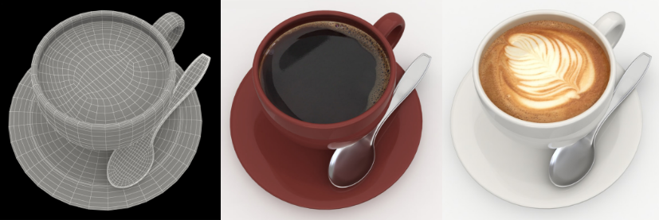

在计算机图形学中，做渲染就是将模型对象（一般是Mesh）绘制上颜色，让它呈现不同的质感。而对同一个 Mesh 绘制出不同的质感，需要使用不同的着色方式（不同的计算参数）。材质，就是决定我们该如何为 Mesh 进行着色，让其呈现出特定质感的重要因素。

对应到渲染方程中，材质就是 BRDF 项，即 $Material = f_r = BRDF$ 

BRDF 项，即材质，表示了着色点在渲染方程中，接收来自各个方向光照的，最终反射到指定方向的比例。

接下来，了解一下几种比较典型的材质

## 漫反射材质
Diffuse / Lambertian Material ，漫反射材质，在物体表面，光线会被均匀的反射到各个方向上

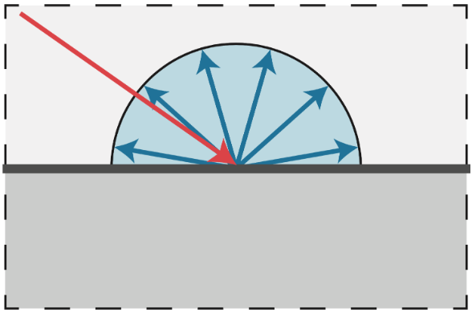

将漫反射材质运用到物体上，会有如下图中的效果

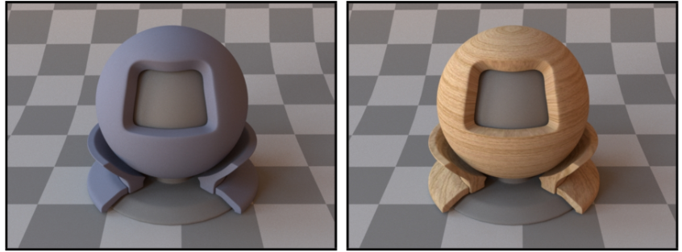

现在通过构造特殊场景，用渲染方程解出漫反射的材质 $f_r$ 的具体表达式

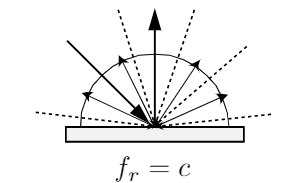

根据光线会被均匀的反射到各个方向上这一特点，我们给入射光线做一个假设 —— 光线是从各个方向均匀的照射着色点

那么根据渲染方程（假设物体不发光） $L_o(\omega_o) = \displaystyle \int_{H^2} f_r L_i(\omega_i) \cos\theta_i d\omega_i$

因为光线均匀的从各个方向入射，我们可以把 $L_i(\omega_i)$ 看做一个常数 $L_i$

带入可得 $L_o(\omega_o) = f_r L_i \displaystyle \int_{H^2} \cos\theta_i d\omega_i$

$\displaystyle \int_{H^2} \cos\theta_i d\omega_i$ 对半球上 $\cos \theta$ 的积分，解出来的积分值是 $\pi$

得到简化的式子 $L_o(\omega_o) = \pi f_r L_i$

光线在漫反射材质上从各个方向均匀的入射，会被均匀的反射到各个方向，结合能量守恒可以得到反射的辐照度等于入射的辐照度 $L_o(\omega_o) = L_i$

最终得到 $f_r = \displaystyle \frac {1}{\pi}$ 表示这种材质完全不吸收能量，多少光线射入着色点，就有多少光线被均匀的反射出去

给结果引入一个常量 $\rho \in [0, 1]$ ，来表示反射率

最终漫反射表达式 $f_r = \displaystyle \frac {\rho}{\pi}$ ，表示不同种类的漫反射材质，$\rho$ 表示不同反射率的漫反射程度或者颜色

## Glossy 材质
不是很好描述的的一种材质，可以理解成抛光的金属（古代的铜镜），有不完全的镜面反射，即它的反射是朝着某个方向发散开的

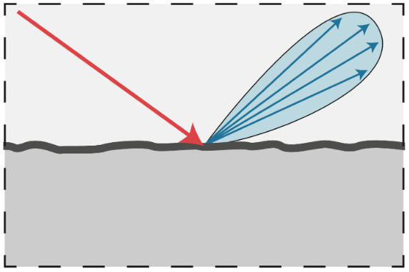

将 glossy 材质运用到物体上，会有如下图中的效果

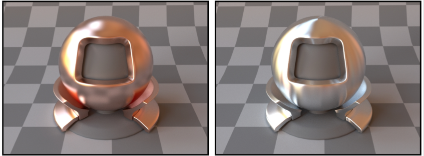

## Ideal reflective and refractive 材质
反射/折射材质，在物体表面，光线会被镜面反射或者发生折射

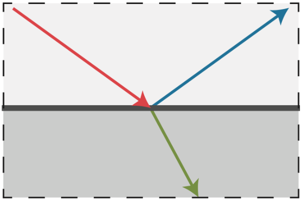

将 ideal reflective and refractive 材质 材质运用到物体上，会有如下图中的效果

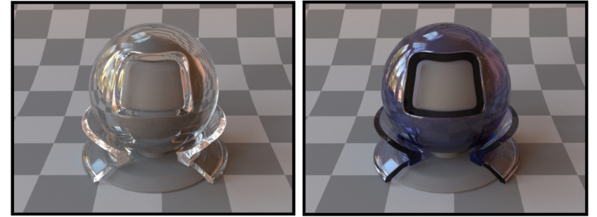

光线可以在物体表面发生反射或者折射，我们分别来分析一下这两种现象

### 反射
Perfect Specular Reflection ，光线会在镜面发生反射，且出射角和入射角完全相同

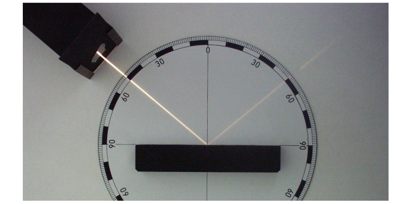

介绍两种描述反射的数学方法
+ 向量表示
    + $\theta = \theta_o = \theta_i$ ,出射角等于入射角

    

    + $\omega_o + \omega_i = 2 \cos\theta \overrightharpoon{n} = 2(\omega_i \cdot \overrightharpoon{n}) \overrightharpoon{n}$ ，入射向量和反射向量之和等于入射向量或反射向量投影到法线的 2 倍
    + $\omega_o = -\omega_i + 2(\omega_i \cdot \overrightharpoon{n}) \overrightharpoon{n}$ ，可以由入射向量和法线求出反射向量
+ 投影表示，方位角表示向量
    + 将入射向量和反射向量投影到局部坐标系上，即从顶往下看

    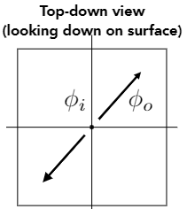

    + $\theta$ 和 $\phi$ 表示角度， $\theta$ 表示与竖直方向（投影方向、法线方向）的夹角， $\phi$ 表示向量与局部坐标轴的夹角
    + $\phi_o = (\phi_i + \pi) \ \ mod \ \ 2\pi$ ，在投影之后，入射向量和反射向量的 $\phi$ 方向恰好相反，可以根据入射向量的 $\phi$ 求出反射向量的 $\phi$
    + 入射向量和反射向量具有与法线方向相同的夹角，这样就可以由入射方向的 $\theta$ 和 $\phi$ 求出反射向量

下图展示了完全镜面反射材质的渲染效果

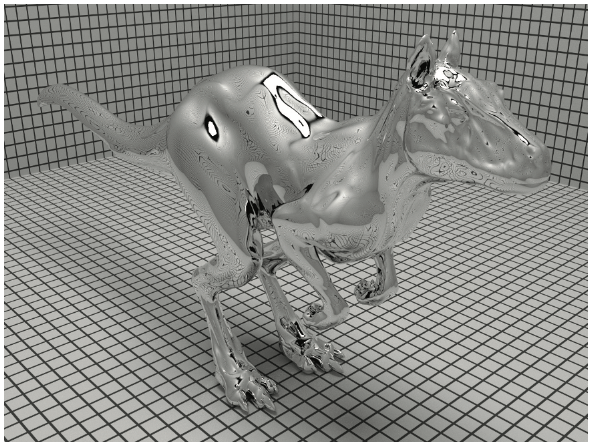

### 折射
Specular Refraction ，光线从一种介质进入另一种介质时会发生折射（光的色散）

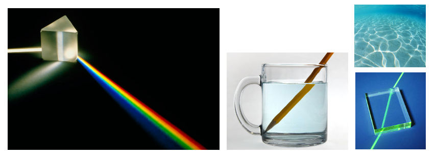

*题外话：右上角中的现象被叫做焦散（caustics），是由光线在凹凸不平的海面折射聚焦形成的，被翻译成焦散优点奇怪*

Snell's Law（斯内尔定律），用来描述折射和角度的关系，即入射角的正弦和入射介质折射率的乘积等于折射角的正弦和折射介质折射率
+ 向量表示
    + $\eta_i \sin\theta_i = \eta_t \sin\theta_t$ ，$\eta$ 表示介质的折射率

    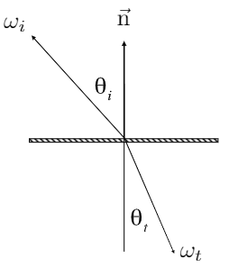
    
    + 写出折射角的余弦 $\cos\theta_t = \sqrt{1 - \sin^2\theta_t} = \sqrt{1 - (\frac {\eta_i}{\eta_t})^2 \sin^2\theta_i} = \sqrt{1 - (\frac {\eta_i}{\eta_t})^2 (1 - \cos^2\theta_i)}$
+ 投影表示，方位角表示向量
    + 将入射向量和折射向量投影到局部坐标系上，即从顶往下看

    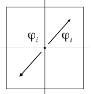

    + $\varphi_t = \varphi_i \pm \pi$

列出常见的折射率

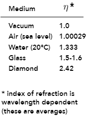

前面列出了向量表示的折射角的余弦 $\cos\theta_t = \sqrt{1 - (\frac {\eta_i}{\eta_t})^2 (1 - \cos^2\theta_i)}$

折射角余弦如果是实数，就需要保证 $1 - (\frac {\eta_i}{\eta_t})^2 (1 - \cos^2\theta_i) > 0$

我们来理解它小于 0 的情况

$1 - (\frac {\eta_i}{\eta_t})^2 (1 - \cos^2\theta_i) < 0 \Rightarrow \frac {\eta_i}{\eta_t} > 1$

小于 0 求不出折射角的余弦，表示 $\frac {\eta_i}{\eta_t} > 1$ 时无法发生折射，那么此时只会发生反射现象，这就是前面说到的全反射现象

Snell's Law 还和一个现象联系在一起，如下图

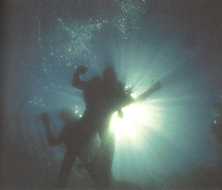

从高折射率的介质中看向低折射率的介质，只能看到一个锥形区域，这个现象被称为 Snell's Window/Circle（斯内尔窗）

原理很简单，画出它的示意图就能明白

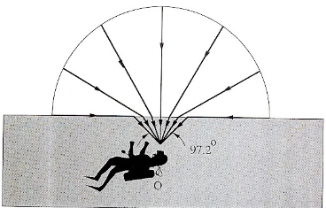

因为折射角度受限于折射率

### 菲涅耳项
光线被反射到不同角度的能量是不相同的，如下图

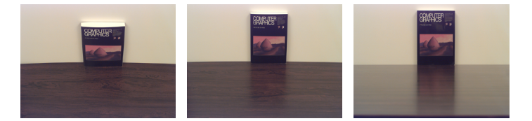

一本垂直桌面的书，我们从不同的角度去观察，会看到不同的桌面反射，也就是从桌面反射到人眼的光线的能量，因角度的不同而有所变化

因此，通过 Fresnel Term（菲涅耳项）来解释光线与法线的夹角变化引起的反射能量的变换

菲涅耳项描述了不同角度下，光线的折射和反射的能量占比

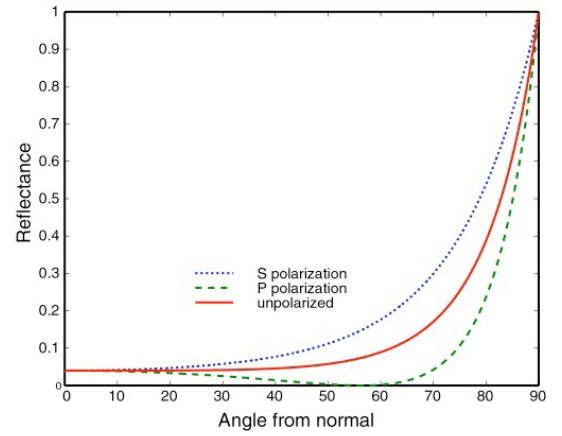

红色的线条，表示了不同角度的光线所反射的能量值，符合我们在刚才例子中的观察，接近平行（和法线夹角越大，表示观察角度越接近平行）的观察物体可看到很强烈的反射，接近垂直的观察物体几乎看不到反射

蓝色和绿色的线条，表示了光在 $S, P$ 方向的极化（震动）现象，红色线条基本上就是两个极化方向的平均值（我们只用到红色的线条）

生活中最常见的例子，应该是看玻璃。以公交车为例，看向自己边上的玻璃窗，能很清晰的看到车外的场景，大部分光都折射出去了，几乎不发生反射；而当我们看向前面几排的车窗，能看到反射出的车内前几排的场景，大部分光都发生了反射，几乎不发生折射

不同材质的物体拥有不同的菲涅耳项的分布，下图表示金属的菲涅耳项

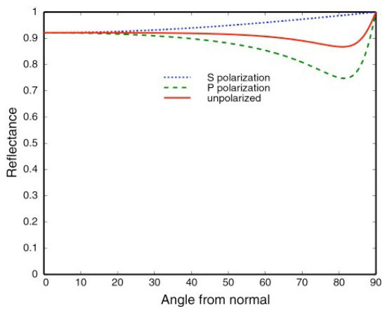

可以看到，不管什么角度观察，金属材质的反射的能量总是占比很高，这也是金属为什么总有高光的原因

菲涅耳项的计算公式这里直接给出来，即 $S, P$ 极化方向的平均
$\displaystyle R_S = \Big| \frac {n_1 \cos\theta_i - n_2 \cos\theta_t}{n_1 \cos\theta_i + n_2 \cos\theta_t} \Big|^2 = \Bigg| \frac {n_1 \cos\theta_i - n_2 \sqrt{1 - (\frac{n_1}{n_2} \sin\theta_i)^2}}{n_1 \cos\theta_i + n_2 \sqrt{1 - (\frac{n_1}{n_2} \sin\theta_i)^2}} \Bigg|^2$

$\displaystyle R_P = \Big| \frac {n_1 \cos\theta_t - n_2 \cos\theta_i}{n_1 \cos\theta_t + n_2 \cos\theta_i} \Big|^2 = \Bigg| \frac {n_1 \sqrt{1 - (\frac{n_1}{n_2} \sin\theta_i)^2} - n_2 \cos\theta_i}{n_1 \sqrt{1 - (\frac{n_1}{n_2} \sin\theta_i)^2} + n_2 \cos\theta_i} \Bigg|^2$

$\Large R_{eff} = \displaystyle \frac{1}{2}(R_S + R_P)$s

这个公式非常复杂，使用 Schlick's approximation 做近似替代，从而降低运算量

$R(\theta) = R_0 + (1 - R_0)(1 - \cos\theta)^5$
$R_0 = \displaystyle \Big(\frac{n_1 - n_2}{n_1 + n_2}\Big)^2$

以 $R_0$ 为起始基准，随着观察方向和法线的夹角增加， $R(\theta)$ 逐渐从 $R_0$ 增加到 1，而 $(1 - \cos\theta)$ 的幂 $n$ 表示了增加过程的陡峭程度

## 微表面材质
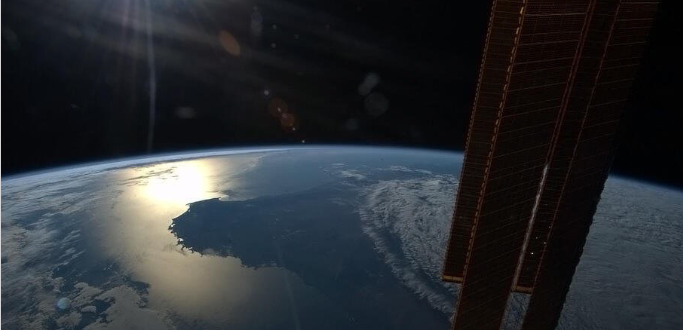

这是一张在太空拍摄的太阳照射地球的图片。图中有一个非常有意思的现象 —— 高光。产生高光的区域恰好是澳大利亚，太阳光直射澳大利亚，光线被镜面反射到了拍照的位置。但这会让人感到疑惑，尽管澳大利亚内陆是大片的沙漠，但它的表面实际应该是凹凸不平的，为什么会有光滑表面才会产生的镜面反射高光呢？

这个现象的原因，就是本章将要介绍的内容 —— 微表面材质（Microfacet Material）

### 微表面理论

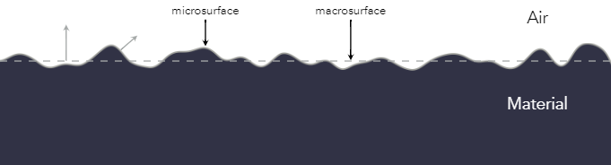

微表面理论做了一个假设，假设对于粗糙的物体
+ 从宏观（远处）来看，物体平整但粗糙
+ 从微观（近处）来看，物体凹凸不平但光滑

核心假设就是，物体细分得到的微表面（微元）是不均匀的分布在物体表面的镜面，从远处看到的物体是由所有微元平均得到的效果。

即从远处看，看到的是材质（外观）；从近处看，看到的是几何（镜面的法线）

### 微表面 BRDF


用这个理论来分析一下前面提到的典型材质
+ glossy 材质

    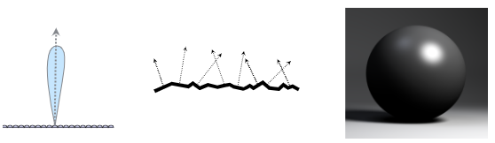

    + glossy 材质的微表面不均匀的分布在物体表面，但是不均匀程度较低
    + 微表面的法线分布有大致的朝向，并没有不规则的向四面八方分布
    + 由微表面的法线分布可以推出，宏观上 glossy 材质物体的 BRDF 项集中的分布趋近于法线分布的方向上
+ diffuse 材质

    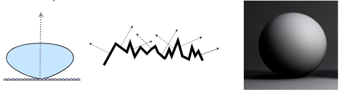

    + 漫反射材质的微表面分布极其不规则，不均匀程度很高
    + 微表面的法线分布没有大致的朝向，不规则的向四面八方分布
    + 由微表面的发现分布可以推出，宏观上漫反射物体的 BRDF 项均匀的分布在四面八方
+ 镜面材质
    + 微表面理想化的分布一致
    + 微表面的法线方向都一样

得到微表面理论的核心要点：**微表面的法线分布的趋势，表示了物体宏观的 BRDF 项的在方向上的分布**

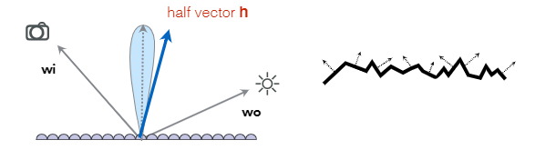

使用微表面的法线分布表示 BRDF 的公式

$$\Large f\mathbf{(i, o)} = \displaystyle \frac {\mathbf{F(i, h)G(i, o, h)D(h)}}{4 \mathbf{(n, 1)(n, o)}}$$

其中

$\mathbf{F(i, h)}$ 表示菲涅耳项， 我们要保证最终的结果符合物理学的实际情况

$\mathbf{G(i, o, h)}$ 表示几何项，表示微表面的几何的相互遮挡关系，跟 SSAO 中的 AO 是一个意思，几乎平行的角度（Grazing angle）发射光线，最容易发生微表面几何遮挡

$\mathbf{D(h)}$ 表示微表面的法线分布，使用入射方向和反射方向的夹角的半程向量 $\mathbf{h}$ 去查询发现分布，得到这个微表面是否会有光线反射

### 微表面材质渲染效果
~~【TODO：使用视频的截图】~~

## 各向异性和各向同性材质

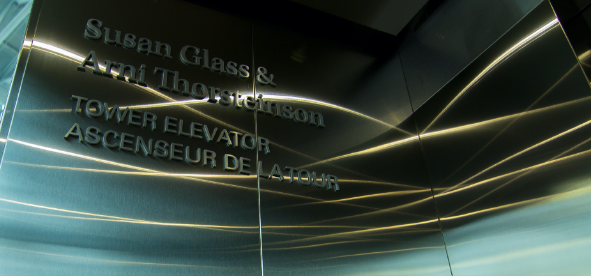

这是一张在电梯内部的图片，电梯顶上的小灯被电梯各个面反射形成的高光不再是圆形，而是呈现条形

这种条形的反射高光，是由各向异性的材质反射形成的（现实中，电梯壁是朝着同一个方向打磨过的，呈现出打磨方向有一条条凹凸的沟壑）

没错，材质也有各向同性和各向异性

我们可以将材质分为各向同性材质和各向异性材质
+ Isotropic，各向同性
    
    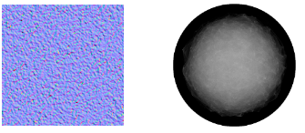

    + 材质微表面没有方向性
    + 法线分布在各个方向分布均匀
+ Anisotropic，各向异性

    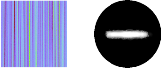

    + 材质微表面具有方向性
    + 法线分布集中再有一个方向上

各向异性材质的 BRDF 有普通的 BRDF 有一个重要的区别， $f_r(\theta_i, \phi_i;\theta_r, \phi_r) \not = f_r(\theta_i, \phi_i;\theta_r, -\phi_r)$ ，即各向异性材质的 BRDF 在方位角 $\phi$ 变化后会发生变化

给出几个常见的例子

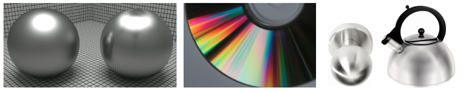

## BRDF 的性质
前面已经简单分析了几种典型的材质，现在正式总结 BRDF 的性质

+ Non-negativity，非负性
    + $f_r(\omega_i \rightarrow \omega_r) \ge 0$
+ Linearity，线性

    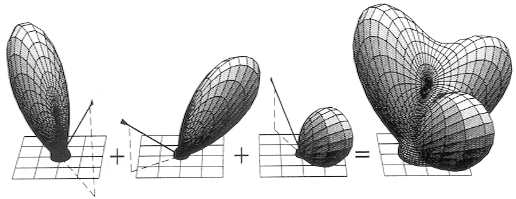

    + $L_r(p, \omega_r) = \displaystyle \int_{H^2}f_r(p, \omega_i \rightarrow \omega_r)L_i(p, \omega_i) \cos\theta_i d\omega_i$
+ Reciprocity principle，可逆性

    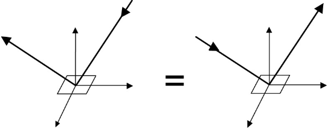

    + $f_r(\omega_i \rightarrow \omega_r) = f_r(\omega_r \rightarrow \omega_i)$
    + 调换入射光线和出射光线，得到的结果完全一样
+ Energy conservation，能量守恒
    + $\displaystyle \forall \omega_r \int_{H^2} f_r(\omega_i \rightarrow \omega_r) \cos \theta_i d\omega_i \le 1$

关于可逆性，结合各向异性和各向同性材质来扩展一下

对于各向同性的材质来说，只要相对方位角不变，那么它的 BRDF 也不会变 $f_r(\theta_i, \phi_i; \theta_r, \phi_r) = f_r(\theta_i, \theta_r, \phi_r - \phi_i)$

带入可逆性的公式里得到 $f_r(\theta_i, \theta_r, \phi_i - \phi_r) = f_r(\theta_i, \theta_r, \phi_r - \phi_i) = f_r(\theta_i, \theta_r, |\phi_i - \phi_r|)$

## BRDF 的测量
为什么需要测量 BRDF
+ 避免构建模型分析各个不同的材质
+ 避免搭建基于各种材质的分析模型
+ 测量的结果包含了自然光所有的散射（scattering）现象
+ 测量的结果比分析计算得到的结果更加准确
+ 准确的结果对于建模和设计更有帮助，能做出更好的效果

以某材质的菲涅耳项的理论模型和测量结果的对比为例

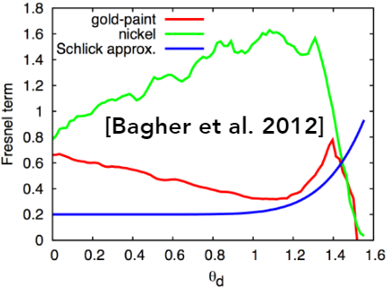

+ 蓝色线条是理论模拟的菲涅耳项
+ 红色和绿色线条表示了测量的该材质在两个方向极化的结果
+ 看见理论和实际测量之间还是有很大的误差
+ 并且使用测量值，也可以避免在实际过程中菲涅耳项复杂计算的性能消耗

如何测量？对于一个测试样本来说，我们固定摄像机的位置从固定角度观察测试样本，然后在四面八方用灯光对它进行照射，每个不同照射方向都用摄像机采集数据，就得到了这个固定观察角度下这个材质的 BRDF 结果。然后再从不同角度重复这个过程，直到获得所有角度下材质的 BRDF 数据结果。

这个方法被称为基于图像的 BRDF 测量方法，示意图如下：

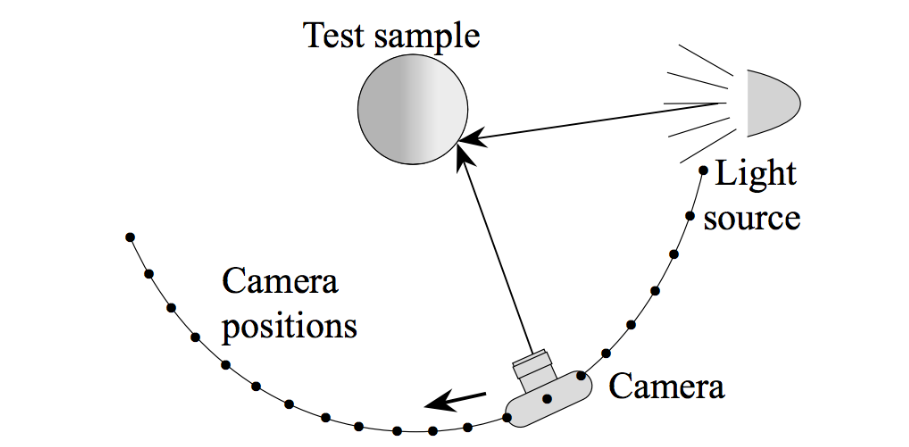

对应的测量器 gonioreflectometer ，这个机器在 UCSD ，作为兴趣点了解一下

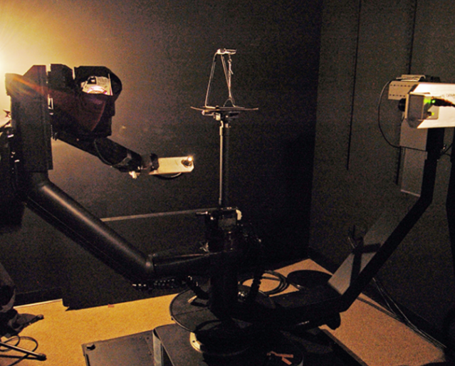

写出这个过程的伪代码
```c++
for each outgoing direction wo
    move light to illuminate surface with a thin beam from wo
    for each incoming direction wi
        move sensor to be at direction wi from surface
        measure incident radiance
```

这是一个 4 维的过程：`each outgoing direction X each direction of light X each direction of sensor X each incoming direction`

稍微优化一些：
+ 各向同性材质可以减少一个维度，从 4 维降到 3 维
+ BRDF 的可逆性，可以减少一半的测量方向
+ 通过一些计算优化和构建模型，测一部分数据猜一部分数据（当前比较热门的学术研究方向）