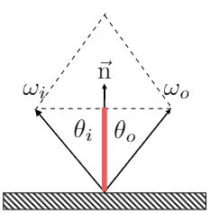

# Materials and Appearances
The Appearance of Natural Materials
外观是材质和光线共同作用的结果，研究材质就研究光线如何和材质相互作用

## 目录

## 图形学中的材质

在计算机图形学中，做渲染就是将模型对象（一般是Mesh）绘制上颜色，让它呈现不同的质感。而对同一个 Mesh 绘制出不同的质感，需要使用不同的着色方式（不同的计算参数）。材质，就是决定我们该如何为 Mesh 进行着色，让其呈现出特定质感的重要因素。

对应到渲染方程中，材质就是 BRDF 项，即 $Material = f_r = BRDF$ 

BRDF 项，即材质，表示了着色点在渲染方程中，接收来自各个方向光照的，最终反射到指定方向的比例。

接下来，了解一下几种比较典型的材质

### 漫反射材质
Diffuse / Lambertian Material ，漫反射材质，在物体表面，光线会被均匀的反射到各个方向上

将漫反射材质运用到物体上，会有如下图中的效果

现在通过构造特殊场景，用渲染方程解出漫反射的材质 $f_r$ 的具体表达式

根据光线会被均匀的反射到各个方向上这一特点，我们给入射光线做一个假设 —— 光线是从各个方向均匀的照射着色点

那么根据渲染方程（假设物体不发光） $L_o(\omega_o) = \displaystyle \int_{H^2} f_r L_i(\omega_i) \cos\theta_i d\omega_i$

因为光线均匀的从各个方向入射，我们可以把 $L_i(\omega_i)$ 看做一个常数 $L_i$

带入可得 $L_o(\omega_o) = f_r L_i \displaystyle \int_{H^2} \cos\theta_i d\omega_i$

$\displaystyle \int_{H^2} \cos\theta_i d\omega_i$ 对半球上 $\cos \theta$ 的积分，解出来的积分值是 $\pi$

得到简化的式子 $L_o(\omega_o) = \pi f_r L_i$

光线在漫反射材质上从各个方向均匀的入射，会被均匀的反射到各个方向，结合能量守恒可以得到反射的辐照度等于入射的辐照度 $L_o(\omega_o) = L_i$

最终得到 $f_r = \displaystyle \frac {1}{\pi}$ 表示这种材质完全不吸收能量，多少光线射入着色点，就有多少光线被均匀的反射出去

给结果引入一个常量 $\rho \in [0, 1]$ ，来表示反射率

最终漫反射表达式 $f_r = \displaystyle \frac {\rho}{\pi}$ ，表示不同种类的漫反射材质，$\rho$ 表示不同反射率的漫反射程度或者颜色

### Glossy 材质
不是很好描述的的一种材质，可以理解成抛光的金属（古代的铜镜），有不完全的镜面反射，即它的反射是朝着某个方向发散开的

将 glossy 材质运用到物体上，会有如下图中的效果

### Ideal reflective and refractive 材质
反射/折射材质，在物体表面，光线会被镜面反射或者发生折射

将 ideal reflective and refractive 材质 材质运用到物体上，会有如下图中的效果

光线可以在物体表面发生反射或者折射，我们分别来分析一下这两种现象

#### 反射
Perfect Specular Reflection ，光线会在镜面发生反射，且出射角和入射角完全相同

介绍两种描述反射的数学方法
+ 向量表示
    + $\theta = \theta_o = \theta_i$ ,出射角等于入射角

    

    + $\omega_o + \omega_i = 2 \cos\theta \overrightharpoon{n} = 2(\omega_i \cdot \overrightharpoon{n}) \overrightharpoon{n}$ ，入射向量和反射向量之和等于入射向量或反射向量投影到法线的 2 倍
    + $\omega_o = -\omega_i + 2(\omega_i \cdot \overrightharpoon{n}) \overrightharpoon{n}$ ，可以由入射向量和法线求出反射向量
+ 投影表示，方位角表示向量
    + 将入射向量和反射向量投影到局部坐标系上，即从顶往下看

    

    + $\theta$ 和 $\phi$ 表示角度， $\theta$ 表示与竖直方向（投影方向、法线方向）的夹角， $\phi$ 表示向量与局部坐标轴的夹角
    + $\phi_o = (\phi_i + \pi) \ \ mod \ \ 2\pi$ ，在投影之后，入射向量和反射向量的 $\phi$ 方向恰好相反，可以根据入射向量的 $\phi$ 求出反射向量的 $\phi$
    + 入射向量和反射向量具有与法线方向相同的夹角，这样就可以由入射方向的 $\theta$ 和 $\phi$ 求出反射向量

下图展示了完全镜面反射材质的渲染效果

#### 折射
Specular Refraction ，光线从一种介质进入另一种介质时会发生折射（光的色散）

*题外话：右上角中的现象被叫做焦散（caustics），是由光线在凹凸不平的海面折射聚焦形成的，被翻译成焦散优点奇怪*

介绍 Snell's Law（斯内尔定律），用来描述折射和角度的关系