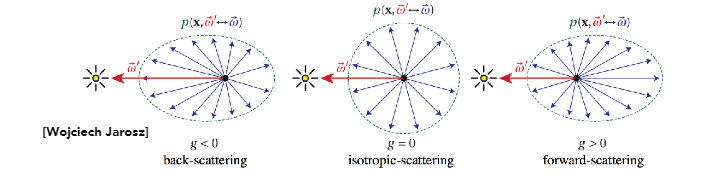
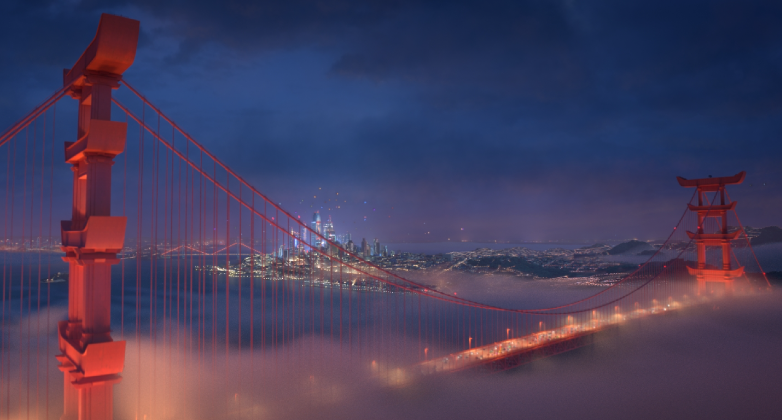

# Advanced Topics in Rendering

介绍一些学术上比较前沿的高级渲染课题

## 目录

## Advanced Light Transport
光线传播的算法（或者说计算方法）大致可以分为两种
+ 无偏光线传播方法
    + Bidirectional path tracing（BDPT）
    + Metroplis light transport（MLT）
+ 有偏光线传播方法
    + Photon mapping
    + Vertex connection and merging（VCM）
### 无偏和有偏蒙特卡洛积分估计
在介绍这些方法之前，先了解一下什么是无偏，什么是有偏

无偏和有偏只的是无偏蒙特卡洛积分估计和有偏蒙特卡洛积分估计
+ 无偏蒙特卡洛方法（unbiased Monte Carlo technique）是没有系统性偏差（error）的估计方法，即不管样本数量多少，无偏估计的期望就是正确的没有误差的值
+ 有偏蒙特卡洛方法（biased Monte Carlo technique）指所有不属于无偏估计的估计方法，也就是说一定有误差或期望不等于正确值
    + 特殊情况：随着样本数量增多，有偏估计的期望越来越接近真实值，直到样本数量无穷多，期望会收敛到真实值，这种有偏估计被称为一致（consistent）的估计

### Bidirectional Path Tracing (BDPT)
Bidirectional Path Tracing ，双向路径追踪，用一条光路将相机和光源连接起来

核心步骤：
+ 分别从光源和相机出发，向场景中发射一条光线，得到光源方向和相机方向的两条子路径
+ 连接两条子路径的结束点

先看一个例子

看得出来双向路径追踪在同样的采样条件下，效果明显好于单向路径追踪，这是为什么呢？

分析一下场景，在上面的场景中，光源被灯罩给挡住了，绝大部分光照都是通过墙角区域反射光源的直接光照给传播到场景中的。

这样的情况给单向路径追踪带来一个问题，相机位置发射的光线，绝大多数情况都不能直接打到光源或者不能经过少量反射打到光源，导致最终计算结果时打到光源的路径非常少，得到了一个充满噪点的结果。

而双向路径追踪所做的就是，从光源出发发射一系列的光线和场景求交，得到一系列的光源反射点，对应在图中就是灯罩上方那一块白色高亮区域，现在相机发射的光线不用再去找多次弹射打中光源的光线路径，而是选择打中白色高亮区域的光线路径，使用这个光线路径做计算就得到了一个较为理想的结果。

换一个的角度理解，我们将整个单向光线追踪的光线路径终点倒推了一个反射过程，从终点的光源倒退回到了之前的反射点。将这些反射点看成是新的光源，只对新的光源做路径追踪，就得到里理想的结果。

得出双向路径追踪的适用场景：**光线传播路径中，光源那一侧的路径较为复杂，光线不容易击中光源**

双向路径追踪的缺点：
+ 非常难以实现
+ 双向路径追踪比单向路径追踪慢，甚至慢很多

### Metropolis Light Transport (MLT)
Metropolis Light Transport ，Metropolis 光线传播（Metropolis 是人名，不是大都市），使用马尔可夫链蒙特卡洛方法（Markov Chain Monte Carlo / MCMC）来做光线路径推导

对于蒙特卡洛积分估计来说，如果使用的 PDF 越接近积分函数，在相同样本数量的情况下，积分估计的结果就越准确。而马尔可夫链可以为给定的函数生成对应 PDF 的随机样本。两者的结合就被称为马尔可夫链蒙特卡洛积分估计

将这个方法放到光线追踪里就表示为，为给定的光线路径生成一条相似的路径

MLT 和 BDPT 对比如下

MLT 的适用场景：**复杂的难以找到的光线路径**，MLT找到一条光线路径就可以通过这一条推导出更多的光线路径

MLT 的缺陷：
+ 难以推算出 MLT 的收敛速度，即不能确定具体要渲染多长时间才能得到比较理想的结果
+ 每个像素发出的光线，其收敛速度不同
    + 原因很简单，就是有些像素没有光线路径，不能推导其他光线路径，那么这个像素就会迅速收敛；而由光线路径的像素就会慢慢的推导出更多的光线路径
+ 收敛速度不同且无法预知收敛时间，共同导致 MLT 停止时，有些地方收敛了有些地方没有收敛，就会造成结果看上去很脏，有很多亮斑（未收敛，或者周围未收敛）
+ MLT 也无法渲染动画，因为前后两帧的收敛区域和收敛程度我们都没有办法保证，这会使动画看上去不连续

### Photon Mapping
Photon mapping ，光子映射，是一种有偏的光线传播方法。它非常适合用于处理光线的 SDS （Specular-Diffuse-Specular ，光线发生镜面反射打到 diffuse 材质，再发生镜面反射的路径，简称为 SDS）路径传播和生成焦散（caustics）
+ generating caustics

    

+ handling SDS paths

    

光子映射是一个“两步法（two-stage method）”，它拥有完全分开的两个步骤，我们介绍其中一种方法：
+ Stage 1：photon tracing
    + 从光源出发，向场景中发射光子
    + 光子正常做路径追踪，在场景中不同弹射
    + 光子不停弹射，直到打在了 diffuse 材质的表面，然后停止弹射
    + 记录每个光子的位置
    

+ Stage 2：photon collection / final gathering
    + 正常的从相机出发，逐像素的往场景中发射光线
    + 光线进行路径追踪，并在场景中弹射
    + 光线不停弹射，直到打在了 diffuse 材质的表面，然后停止弹射
+ Calculation：局部密度估计
    + 对 Stage 2 中光线打到的地方做局部密度估计 —— 对于局部而言，光子越多表示这个地方越亮
    + 放到渲染过程
        + 每个着色点，找到离它最近的 $N$ 个光子
        + 计算这个 $N$ 个光子所占的物体表面的面积 $A$
        + 计算该着色点的光子密度，即 $N / A$

        

得到下面的结果

分析结果：
+ 当 $N$ 很小的时候，光子映射生成的结果有很多的噪点
    这个是显而易见的，光子密度来说，光子数量越多，得到的光子密度越准确
+ 当 $N$ 很大的时候，光子映射生成的结果很模糊
    为什么光子数量增大，映射的结果却很模糊呢，因为光子映射是有偏光线传播方法，不能得到正确的结果

为什么光子映射是有偏光线传播？
+ 前面使用的局部密度估计是一个结果不正确的估计 $dN/dA \not= \varDelta N \varDelta A$ ，正确结果应该是 $dN / dA$ （$dA$ 无限小才是正确结果）
+ 如果正确的得到结果
    + 发射更多的光子，在有限面积范围内，光子数量越多，得到的结果越准确。因为这个时候，找到的含有 $N$ 个光子的面积 $\varDelta A$ 更小
    + 即有这样的关系：$光子的发射总数量 \uparrow \Rightarrow 包含 N 个光子的总面积 \varDelta A \downarrow \Rightarrow |\varDelta A - dA| \downarrow$
+ 光子映射的结果是不准确的（做不到发射无限多个光子），但是它的结果理论上可以收敛于某个常数，因此光子映射是一种有偏但一致的估计

通过 Photon Mapping 理解一下渲染中的 bias 是什么意思
+ Biased 表示模糊
+ Consistent 表示样本趋于无限时，结果不再模糊

### Vertex Connection and Merging
Vertex Connection and Merging ，简称为 VCM ，是 BDPT 和 Photon mapping 的结合体，也是一种有偏的光线传播方法

核心思路：
+ BDPT 过程中生成的 sub-paths 存在很多没有相连的情况
+ 可以使用 photon mapping 的思路，将连接点看做光子，去尝试连接那些非常相近的光子结束点
    核心过程如下图中极小范围内的红色和绿色结束点

### Instant Radiosity
Instant Radiosity ，实时辐射度算法（简称 IR），也被称为 many-light approaches ，核心思路就是把被照亮的表面也当做光源（对于着色点来说，从物体表面反射来的光和光源直接照射的光其实没有区别，都是 radiance）

基本步骤如下：
+ 处理光源，生成 VPLs
    + 从光源出发，发射 sub-paths 
    + sub-paths 经过弹射停留在光源路径的结束点
    + 把这些结束点当做虚拟光源（Virtual Point Light ，记作 VPL）
+ 使用 VPLs 对场景进行直接光渲染

IR 的优点是计算非常快，且对漫反射材质的渲染效果非常好

但 IR 也有明显的缺点
+ 如果 VPLs 和着色点很接近，他们之间的距离非常小，会导致这个着色点出现高亮
    至于原因，和对光源表面采样的公式（对光源方向的渲染方程优化，详情参考[路径追踪的优化](./../13_14_15_16_Ray_Tracing/Ray_Tracing.md)）有关，这个公式的分母是着色点和光源距离的平方，如果两者差值极小，会导致结果非常大
    

+ 无法处理 glossy 材质的物体

## Advanced Appearance Modeling
Advanced Appearance Modeling ，高级外观建模，指为不同质感的物体建立起对应的材质模型，用于着色计算

这里将材质建模大致分为一下几类：
+ 非表面模型（Non-surface models）
    + 散射介质
    + BCSDF ， hair / fur / fiber
    + 颗粒材质（Granular material），例如沙子堆成的小城堡
+ 表面模型（Surface models）
    + 半透明材质（Translucent material / BSSRDF）
    + 布料
    + 复杂模型材质（non-statistical BRDF）
+ 程序化生成外观材质

### Participating Media
Participating Media ，参与介质（散射介质），只有体积的会在体积内发生散射的介质，常见的雾和云就是散射介质

当传过散射介质时，光线可能会被吸收或者被散射，对于这个介质的某个着色点来说，有以下几种情况：
+ 吸收（Absorption），光线在这个点就发生衰减，能量被介质吸收
+ 自发光（Emission），这个着色点本身就是个光源
+ 向外发生散射（Out-scattering），介质中的小冰晶小水滴会将光线发散到周围各个方向
+ 接收其他着色点的散射光线（In-scattering）

描述光线如何散射的方法和描述光线如何反射类似。我们使用 BRDF 函数去描述光线在各个方向上反射的 Radiance 的分布，同理，使用使用相位函数来描述光线在散射介质内的点 $x$ 发生散射时，往各个方向散射的 Radiance 的分布，用 $g$ 来表示，典型的散射偏向如下图：

散射介质的渲染过程也和 BRDF 类似：
+ 随机选择方向进行光线的弹射（发射散射）
+ 选定方向后，随机选择该次弹射前进的方向
+ 重复上述步骤，得到光线路径
+ 对于着色点而言，将该着色点的路径和光源连接
+ 计算光源对这些路径的贡献

尽管过程和 BRDF 类似，但散射介质的渲染不能再使用渲染方程，渲染方程只针对表面渲染。而且散射介质的渲染过程，并不符合物理学的能量守恒（有没有守恒的建模计算方法？）

渲染效果还是比较不错的

此外，还有一些其他的东西也可以被散射介质模型给渲染出来，例如巧克力浆

### Hair Appearance
头发也不算是表面材质，和光线作用的时候，发丝是一根根的与光线发生作用。头发是被看做一条曲线和光线发生作用，不是表面材质的一个面和光线发生作用

人的头发与光线作用，有比较明显的特点：
+ 散碎的高光
+ 有不同的两种高光
    + 无色的偏白的高光
    + 有色的高光

