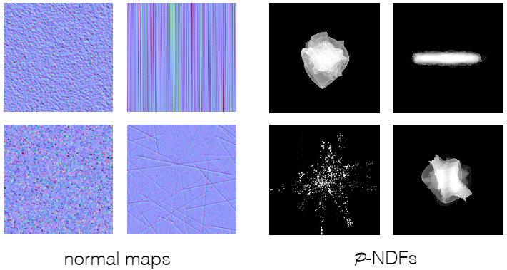

# Advanced Topics in Rendering
If you can not render Mathematical formula, please read this [Advanced_Topics_in_Rendering.pdf](./Advanced_Topics_in_Rendering.pdf)

介绍一些学术上比较前沿的高级渲染课题

## 目录
+ [Advanced Light Transport](#advanced-light-transport)
    + [无偏和有偏蒙特卡洛积分估计](#无偏和有偏蒙特卡洛积分估计)
    + [Bidirectional Path Tracing](#bidirectional-path-tracing)
    + [Metropolis Light Transport](#metropolis-light-transport)
    + [Photon Mapping](#photon-mapping)
    + [Vertex Connection and Merging](#vertex-connection-and-merging)
    + [Instant Radiosity](#instant-radiosity)
+ [Advanced Appearance Modeling](#advanced-appearance-modeling)
    + [Participating Media](#participating-media)
    + [Hair Appearance](#hair-appearance)
    + [Fur Appearance](#fur-appearance)
    + [Granular Material](#granular-material)
    + [Translucent Material](#translucent-material)
    + [Cloth](#cloth)
    + [Detailed Material](#detailed-material)
+ [Procedural Appearance](#procedural-appearance)
## Advanced Light Transport
光线传播的算法（或者说计算方法）大致可以分为两种
+ 无偏光线传播方法
    + Bidirectional path tracing（BDPT）
    + Metroplis light transport（MLT）
+ 有偏光线传播方法
    + Photon mapping
    + Vertex connection and merging（VCM）
### 无偏和有偏蒙特卡洛积分估计
在介绍这些方法之前，先了解一下什么是无偏，什么是有偏

无偏和有偏只的是无偏蒙特卡洛积分估计和有偏蒙特卡洛积分估计
+ 无偏蒙特卡洛方法（unbiased Monte Carlo technique）是没有系统性偏差（error）的估计方法，即不管样本数量多少，无偏估计的期望就是正确的没有误差的值
+ 有偏蒙特卡洛方法（biased Monte Carlo technique）指所有不属于无偏估计的估计方法，也就是说一定有误差或期望不等于正确值
    + 特殊情况：随着样本数量增多，有偏估计的期望越来越接近真实值，直到样本数量无穷多，期望会收敛到真实值，这种有偏估计被称为一致（consistent）的估计

### Bidirectional Path Tracing
Bidirectional Path Tracing ，双向路径追踪，简称 BDPT ，用一条光路将相机和光源连接起来

核心步骤：
+ 分别从光源和相机出发，向场景中发射一条光线，得到光源方向和相机方向的两条子路径
+ 连接两条子路径的结束点

先看一个例子

看得出来双向路径追踪在同样的采样条件下，效果明显好于单向路径追踪，这是为什么呢？

分析一下场景，在上面的场景中，光源被灯罩给挡住了，绝大部分光照都是通过墙角区域反射光源的直接光照给传播到场景中的。

这样的情况给单向路径追踪带来一个问题，相机位置发射的光线，绝大多数情况都不能直接打到光源或者不能经过少量反射打到光源，导致最终计算结果时打到光源的路径非常少，得到了一个充满噪点的结果。

而双向路径追踪所做的就是，从光源出发发射一系列的光线和场景求交，得到一系列的光源反射点，对应在图中就是灯罩上方那一块白色高亮区域，现在相机发射的光线不用再去找多次弹射打中光源的光线路径，而是选择打中白色高亮区域的光线路径，使用这个光线路径做计算就得到了一个较为理想的结果。

换一个的角度理解，我们将整个单向光线追踪的光线路径终点倒推了一个反射过程，从终点的光源倒退回到了之前的反射点。将这些反射点看成是新的光源，只对新的光源做路径追踪，就得到里理想的结果。

得出双向路径追踪的适用场景：**光线传播路径中，光源那一侧的路径较为复杂，光线不容易击中光源**

双向路径追踪的缺点：
+ 非常难以实现
+ 双向路径追踪比单向路径追踪慢，甚至慢很多

### Metropolis Light Transport
Metropolis Light Transport ，Metropolis 光线传播（Metropolis 是人名，不是大都市），简称 MLT ，使用马尔可夫链蒙特卡洛方法（Markov Chain Monte Carlo / MCMC）来做光线路径推导

对于蒙特卡洛积分估计来说，如果使用的 PDF 越接近积分函数，在相同样本数量的情况下，积分估计的结果就越准确。而马尔可夫链可以为给定的函数生成对应 PDF 的随机样本。两者的结合就被称为马尔可夫链蒙特卡洛积分估计

将这个方法放到光线追踪里就表示为，为给定的光线路径生成一条相似的路径

MLT 和 BDPT 对比如下

MLT 的适用场景：**复杂的难以找到的光线路径**，MLT找到一条光线路径就可以通过这一条推导出更多的光线路径

MLT 的缺陷：
+ 难以推算出 MLT 的收敛速度，即不能确定具体要渲染多长时间才能得到比较理想的结果
+ 每个像素发出的光线，其收敛速度不同
    + 原因很简单，就是有些像素没有光线路径，不能推导其他光线路径，那么这个像素就会迅速收敛；而由光线路径的像素就会慢慢的推导出更多的光线路径
+ 收敛速度不同且无法预知收敛时间，共同导致 MLT 停止时，有些地方收敛了有些地方没有收敛，就会造成结果看上去很脏，有很多亮斑（未收敛，或者周围未收敛）
+ MLT 也无法渲染动画，因为前后两帧的收敛区域和收敛程度我们都没有办法保证，这会使动画看上去不连续

### Photon Mapping
Photon mapping ，光子映射，是一种有偏的光线传播方法。它非常适合用于处理光线的 SDS （Specular-Diffuse-Specular ，光线发生镜面反射打到 diffuse 材质，再发生镜面反射的路径，简称为 SDS）路径传播和生成焦散（caustics）
+ generating caustics

    

+ handling SDS paths

    

光子映射是一个“两步法（two-stage method）”，它拥有完全分开的两个步骤，我们介绍其中一种方法：
+ Stage 1：photon tracing
    + 从光源出发，向场景中发射光子
    + 光子正常做路径追踪，在场景中不同弹射
    + 光子不停弹射，直到打在了 diffuse 材质的表面，然后停止弹射
    + 记录每个光子的位置
    

+ Stage 2：photon collection / final gathering
    + 正常的从相机出发，逐像素的往场景中发射光线
    + 光线进行路径追踪，并在场景中弹射
    + 光线不停弹射，直到打在了 diffuse 材质的表面，然后停止弹射
+ Calculation：局部密度估计
    + 对 Stage 2 中光线打到的地方做局部密度估计 —— 对于局部而言，光子越多表示这个地方越亮
    + 放到渲染过程
        + 每个着色点，找到离它最近的 $N$ 个光子
        + 计算这个 $N$ 个光子所占的物体表面的面积 $A$
        + 计算该着色点的光子密度，即 $N / A$

        

得到下面的结果

分析结果：
+ 当 $N$ 很小的时候，光子映射生成的结果有很多的噪点
    这个是显而易见的，光子密度来说，光子数量越多，得到的光子密度越准确
+ 当 $N$ 很大的时候，光子映射生成的结果很模糊
    为什么光子数量增大，映射的结果却很模糊呢，因为光子映射是有偏光线传播方法，不能得到正确的结果

为什么光子映射是有偏光线传播？
+ 前面使用的局部密度估计是一个结果不正确的估计 $dN/dA \not= \varDelta N \varDelta A$ ，正确结果应该是 $dN / dA$ （$dA$ 无限小才是正确结果）
+ 如果正确的得到结果
    + 发射更多的光子，在有限面积范围内，光子数量越多，得到的结果越准确。因为这个时候，找到的含有 $N$ 个光子的面积 $\varDelta A$ 更小
    + 即有这样的关系：$光子的发射总数量 \uparrow \Rightarrow 包含 N 个光子的总面积 \varDelta A \downarrow \Rightarrow |\varDelta A - dA| \downarrow$
+ 光子映射的结果是不准确的（做不到发射无限多个光子），但是它的结果理论上可以收敛于某个常数，因此光子映射是一种有偏但一致的估计

通过 Photon Mapping 理解一下渲染中的 bias 是什么意思
+ Biased 表示模糊
+ Consistent 表示样本趋于无限时，结果不再模糊

### Vertex Connection and Merging
Vertex Connection and Merging ，简称为 VCM ，是 BDPT 和 Photon mapping 的结合体，也是一种有偏的光线传播方法

核心思路：
+ BDPT 过程中生成的 sub-paths 存在很多没有相连的情况
+ 可以使用 photon mapping 的思路，将连接点看做光子，去尝试连接那些非常相近的光子结束点
    核心过程如下图中极小范围内的红色和绿色结束点

### Instant Radiosity
Instant Radiosity ，实时辐射度算法（简称 IR），也被称为 many-light approaches ，核心思路就是把被照亮的表面也当做光源（对于着色点来说，从物体表面反射来的光和光源直接照射的光其实没有区别，都是 radiance）

基本步骤如下：
+ 处理光源，生成 VPLs
    + 从光源出发，发射 sub-paths 
    + sub-paths 经过弹射停留在光源路径的结束点
    + 把这些结束点当做虚拟光源（Virtual Point Light ，记作 VPL）
+ 使用 VPLs 对场景进行直接光渲染

IR 的优点是计算非常快，且对漫反射材质的渲染效果非常好

但 IR 也有明显的缺点
+ 如果 VPLs 和着色点很接近，他们之间的距离非常小，会导致这个着色点出现高亮
    至于原因，和对光源表面采样的公式（对光源方向的渲染方程优化，详情参考[路径追踪的优化](./../13_14_15_16_Ray_Tracing/Ray_Tracing.md)）有关，这个公式的分母是着色点和光源距离的平方，如果两者差值极小，会导致结果非常大
    

+ 无法处理 glossy 材质的物体

## Advanced Appearance Modeling
Advanced Appearance Modeling ，高级外观建模，指为不同质感的物体建立起对应的材质模型，用于着色计算

这里将材质建模大致分为一下几类：
+ 非表面模型（Non-surface models）
    + 散射介质
    + BCSDF ， hair / fur / fiber
    + 颗粒材质（Granular material），例如沙子堆成的小城堡
+ 表面模型（Surface models）
    + 半透明材质（Translucent material / BSSRDF）
    + 布料
    + 复杂模型材质（non-statistical BRDF）
+ 程序化生成外观材质

### Participating Media
Participating Media ，参与介质（散射介质），只有体积的会在体积内发生散射的介质，常见的雾和云就是散射介质

当传过散射介质时，光线可能会被吸收或者被散射，对于这个介质的某个着色点来说，有以下几种情况：
+ 吸收（Absorption），光线在这个点就发生衰减，能量被介质吸收
+ 自发光（Emission），这个着色点本身就是个光源
+ 向外发生散射（Out-scattering），介质中的小冰晶小水滴会将光线发散到周围各个方向
+ 接收其他着色点的散射光线（In-scattering）

描述光线如何散射的方法和描述光线如何反射类似。我们使用 BRDF 函数去描述光线在各个方向上反射的 Radiance 的分布，同理，使用使用相位函数来描述光线在散射介质内的点 $x$ 发生散射时，往各个方向散射的 Radiance 的分布，用 $g$ 来表示，典型的散射偏向如下图：

散射介质的渲染过程也和 BRDF 类似：
+ 随机选择方向进行光线的弹射（发射散射）
+ 选定方向后，随机选择该次弹射前进的方向
+ 重复上述步骤，得到光线路径
+ 对于着色点而言，将该着色点的路径和光源连接
+ 计算光源对这些路径的贡献

尽管过程和 BRDF 类似，但散射介质的渲染不能再使用渲染方程，渲染方程只针对表面渲染。而且散射介质的渲染过程，并不符合物理学的能量守恒（有没有守恒的建模计算方法？）

渲染效果还是比较不错的

此外，还有一些其他的东西也可以被散射介质模型给渲染出来，例如巧克力浆

### Hair Appearance
头发也不算是表面材质，和光线作用的时候，发丝是一根根的与光线发生作用。头发是被看做一条曲线和光线发生作用，不是表面材质的一个面和光线发生作用

人的头发与光线作用，有比较明显的特点：
+ 散碎的高光
+ 有不同的两种高光
    + 无色的偏白的高光
    + 有色的高光

#### Kajiya-Kay Model
最开始，Kajiya 和 Kay 提出了 Kajiya-Kay Model 来描述光线与发丝的相互作用
+ 发丝被看做一根表面光滑的细长圆柱体
+ 光线照射发丝，会朝一个圆锥方向镜面反射，被记作 $S$
+ 光线照射发丝，也会朝着四面八方漫反射，被记作 $D$
+ 如何理解 $S$ 和 $D$ ，将光线看做在着色点朝圆锥方向发射镜面反射，并朝着各个方向发生漫反射，最终的着色结果由两个部分叠加起来

按照 Kajiya-Kay Model 渲染出来的效果如下

Kajiya-Kay Model 的效果看上去就比较一般

#### Marschner Model
在 Kajiya-Kay Model 的基础上，Marschner 给发丝增加了对折射的考虑，光线可以穿过发丝，发生折射
+ 发丝仍然被看做一根细长的圆柱体
+ 光线照射发丝发生反射，产生朝圆锥方向的镜面反射，被记作 $S$
+ 光线照射发丝发生折射，光线会折射进入圆柱体内部
    + 光线在圆柱体另一个内表面发生反射,之后在入射表面再发生一次反向的朝圆锥方向的折射，先折射再反射再折射，被记作 $TRT$
    + 光线在圆柱体另一个内表面发生折射，直接朝着另一面折射出了圆柱体，先后发生两次折射，被记作 $TT$

展开说明一下局部细节
+ 发丝局部被看做是玻璃材质的圆柱体
    + 圆柱体分为外表皮（cuticle）和皮质层（cortex ，这里不应该是皮质层，而应该是内表面）
    + 皮质层会有色素，对光线进行吸收，可以用来解释头发的颜色和光线的能量衰减

    

+ $R, TT, TRT$ 的示意图
    + $R$ 表示反射
    + $TT$ 表示折射进入，在另一个边折射出去
    + $TRT$ 表示折射进入，在另一边反射返回，在同一边折射出去

    

Marschner Model 渲染的效果就非常不错

### Fur Appearance
Marschner Model 在头发渲染上有非常不错的表现，但是将它运用到动物毛发渲染上，结果就不很理想了

从生物学上重新分析一下头发、毛发的结构，发现他们有共同的结构
+ Cuticle 表皮
+ Cortex 皮质，发丝内部充斥的物质，可以吸收光线
+ Medulla 髓质，是一种非常复杂的结果，可以散射光线

人的头发和动物的皮毛表现不一致的主要原因是，两者毛发结构里髓质的占比不一样，人的头发髓质占比较少，动物毛发髓质占比非常大

现在根据生物学上毛发的结构，重新对 Marschner Model 进行了完善，添加上了髓质对光线的影响，由闫令琪博士提出的 Double Cylinder Model

Double Cylinder Model 加入了对光线穿过髓质的考虑
+ 毛发被看做一根细长的圆柱体，其内部还有包裹了另一根更细长的圆柱体
+ 对于不穿过髓质的光线来说， $R, TT, TRT$ 仍然是存在的
    【TODO：需要补充不穿过髓质的示意图】
+ 对于穿过髓质的光线来说，光线和髓质发生散射形成了新的光线
    + 穿过髓质的光线在毛发另一边折射出去，即先折射进入毛发再穿过髓质最后折射出去，被记作 $TT^s$
    + 穿过髓质的光线在毛发另一边发射回来，从反方向折射出去，即先折射进入毛发再穿过髓质后发生反射最后折射出，被记作 $TRT^s$

    

Double Cylinder Model 渲染的结果由 $R, TT, TRT, TT^s, TRT^s$ 所组成，如下图所示

Double Cylinder Model 对于动物毛发的渲染结果，非常不错

### Granular Material
Granular Material ，颗粒材质，描述那些晶体或者颗粒组合在一起之后形成的外观材质，例如沙丘、香料堆、一包豆子等等

如果严格的对每个颗粒做渲染，得到的最终结果肯定是正确的，但是这个模型数量和计算量是非常巨大的，需要对颗粒模型进行简化。可以把颗粒组成的模型划分为基本单元，给每个颗粒在基本单元里设计一个比例，对应每个基本单元进行渲染。

以这种分割的方式，来渲染一个沙粒堆成的城堡，看上去效果还不错

### Translucent Material
Translucent Material ，半透明材质（透光的材质，不是指游戏引擎中的用来做深度测试的半透明，游戏引擎中的应该叫做 semitransparent），是一种与表面相关的材质。光线可以进入半透明物体内部，部分光线被吸收，剩余的光线发生各自反射折射从物体另一个地方出去

常见的半透明物体有玉石（Jade）和水母（Jellyfish）等等

为了描述光线在 Translucent Material 的物体表面的方式，我们将它描述为次表面散射（Subsurface Scattering）。次表面散射描述了光线在物体表面下发生的一系列散射，其核心特点是光线进入和离开物体内部的位置不一样

对 BRDF 的概念进行延伸，把次表面散射也给考虑进去，就得到了 BSSRDF 。BSSRDF 描述了光线以某个入射角度照射着色点后发射次表面散射，然后从另一个着色点出射时的不同出射角度的 Radiance 的分布

$$\Large \displaystyle S(x_i \rightarrow x_o; \omega_i \rightarrow \omega_o)$$

BRDF 的渲染方程 $L(x_o, \omega_o) = \displaystyle \int_{H^2} L_i(x_i, \omega_i) \cos\theta_i d\omega_i$ 是考虑各个方向照射同一个着色点的 Irradiance ，需要对半球进行积分 $\displaystyle \int_{H^2} ... d\omega$ 

那么将次表面散射也考虑进来，不止有各个方向的光照射着色点，也有其他着色点次表面散射过来的光从当前着色点离开物体表面，因此肯定需要对着色点周围的一定面积内发生的次表面散射做积分 $\displaystyle \int_{A} ... dA$ ，得到最终 BSSRDF 的渲染方程

$$\Large L(x_o, \omega_o) = \displaystyle \int_A \int_{H^2} L_i(x_i, \omega_i) \cos\theta_i d\omega_i dA$$

但是使用这种方式对次表面散射进行计算非常复杂，往往不太容易得到最终想要的结果，于是人们使用 Dipole Approximation 来近似的对次表面散射的结果进行模拟

Dipole Approximation 假设光源打到物体表面可以近似看成物体内部有一个光源（Real source）在照射物体同一个表面区域。在此基础上，优化出了第二个在物体外部垂直于物体表的虚拟光源（Virtual source），使用两个光源照射着色点来模拟光线在物体表面发生的次表面散射现象（一个内部光源还不够模拟出次表面散射，增加第二个光源使模拟的结果更好，更符合物理性质）

对比 BRDF 和 BSSRDF 的渲染效果

BSSRDF 还人体的渲染中由非常好的表现，可以还原很多人的皮肤细节

### Cloth
Cloth ，布料，是一种与表面相关的材质。布料有着比较规律的层级结构，最终呈现出比较规律的材质效果

常见的机织和针织的布料如下图

先对织成布料的线进行分析，它由几个层次构成：
+ Fibers to Ply ，多根纤维扭成一束 Ply

    

+ Plies to Yarn ，多根 Ply 扭成一束 Yarn

    

举个栗子，多根羊毛被拧成一束一束的“羊毛束”，多根“羊毛束”被拧成羊毛线，也就是生活中织毛衣用的毛线

Cloth 是由纱线规律的组成，那么我们可以根据不同的编织规律来给不同材质的布料定义各自的表面属性，即给定编织规则计算出布料的整体表现。最终使用 BRDF 将布料给渲染出来

例如给定如下的编织规则，可以得到布料整体表现的 BRDF

最终渲染出结果

但很多布料不全是规律的像表面一样的纤维分布，它可能在空间中朝着不同方向分布，例如天鹅绒的布料，就是朝表面外各个方向发散的

这个时候，我们将布料当做是 Participating Media 进行体积渲染，即将布料分解成微小的体积块，每个体积块散射分布都能通过纤维的规则获取，最终渲染得到相对准确的结果（当然，这样渲染的计算量也是非常的夸张）

当然，最暴力的还是将每一根纤维给渲染出来，不再对布料有任何层级划分（计算量爆炸，每个布料的组成，都让纤维的数量呈指数增加）

### Detailed Material
渲染出来的模型和真实世界的物体，在外观表现上仍然有很大的差距，渲染出来的物体过于理想过于完美，反而让人产生一种不真实感（恐怖谷效应？）

如上图对比所示，真实世界的物体，他们的外观材质都非常复杂，有很多的磨损细节，并不完全表现出本身材质最完美的视觉效果

如果渲染的时候，考虑到这些不完美细节，将其加渲染过程中，会让渲染结果变得更好

如何表现物体的细节，就需要用到微表面模型了

微表面模型的核心表达：表面 = 微表面高光分布 + 真实的法线分布

微表面模型渲染公式 $f(\mathbf{i, o}) = \displaystyle \frac {\mathbf{F(i, h) G(i, o, h) D(h)}}{4 \mathbf{(n, i)(n, o)}}$

其中真实的法线分布 $\mathbf {D(h)}$ 在渲染的时候，用到的是平滑理想的近似法线分布，并没有附带一些现实物体表面的细节信息

如果我们能这些信息考虑进去，用附带细节的真实法线分布，就能渲染得到很好的结果

尽管可以得到很好的结果，但是渲染出这样一个结果出来的耗时也是非常大的

左图是我们期望得到的结果，中间是每个像素的细节，右图是渲染两个小时的粗略结果，如果想要渲染出期望的结果，需要让他工作 20 天以上

计算量暴增的原因，还是路径追踪的核心问题 —— 不管是从相机还是从光源发射光线，都很难击中目标点

有一种方法可以减缓计算量问题：考虑光线反射时候，不再只考虑着色点，而是考虑发射光线的像素在物体表面的投影范围 $pathc \ \ \rho$，将这块范围的 $\rho-NDF$ 给取出来，放到渲染方程中进行计算

一旦考虑了像素的覆盖范围，事情就变得有趣了起来。不同的 $\rho-NDF$ 会表现出不同的特性

不同类型的法线，也会有不同的法线分布，他们的特性也各不相同

前面考虑了物体的微表面性质，但是随着观察的粒度不断减小，就不得不考虑波动光学（Wave Optics）的影响了（这也是最前沿的理论研究之一）。

在暗室单光源观察金属物体时，会发现金属的微表面不再是单一颜色，而是由不同颜色的光斑组成

日常生活中，也能看到这样的现象，例如观察 Macbook 和 铝片（aluminum patch）的表面

对比一下不同材质在考虑和不考虑波动光学的性质

可以看出波动光学和非波动光学的 BRDF 的分布是相似的，只有一点不同，那就是波动光学的 BRDF 是不连续的（光会发生干涉，干涉会引起有一些地方加强有一些地方减弱，就形成了不连续）

使用波动光学渲染 MacBook 的效果看上去就非常真实

## Procedural Appearance
还记得 3D Texture 吗，定义物体空间上的属性，我们可以直接查询花瓶每个位置的，这就是程序化生成的一种

Procedural Appearance ，程序化生成，用一定的方式来指导物体外观的生成的方法。但它并不是真正的生成，而是可以动态的去查询想要的结果

可以使用一些噪声函数来模拟不同的材质，这样我们直接查询函数就能获得物体的外观属性

例如使用噪声函数，来模拟车模型中的铁锈

而运用的最广泛的噪声函数就是柏林噪声函数