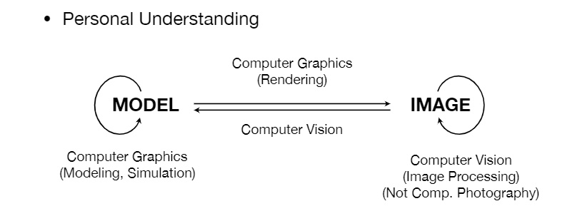

# Introduction to Computer Graphics

### What is Computer Graphics?
The use of computers to synthesize and manipulate visual information.
使用计算机来合成和操作视觉信息。

延伸一下，对自己提问，游戏引擎是什么？
答：使用计算机尽可能的描述现实世界。主要体现在物理和渲染上，前者通过计算描述现实世界的物理现象，后者通过计算来将现实世界的色彩表现呈现在屏幕上。这显然是个极其复杂的计算过程，如果想要的效果越好，那么需要的计算量就越大。我们必须在实际实现过程中做取舍，通过一些技巧来降低计算量。
重新定义一下：使用计算机模拟现实世界，使用近似的模型去表达现实世界的现象和色彩表现。

### Why Study Computer Graphics
#### applications
+ Video Games
+ Movies
+ Animations
+ Design
+ Visualization
+ Virtual Reality
+ Augmented Reality
+ Digital Illustration 数字图像处理
+ Simulation 模拟
+ Graphical User Interfaces
+ Typography 排版/字体

#### Fundamental Intellectual Challenges
+ Creates and interacts with realistic virtual world 创建一个真实的虚拟世界并与之交互
+ Requires understanding of all aspects of physical world 理解物理世界的各个方面（运动，光照等等）
+ New computing methods, displays, technologies 图形显示技术

#### Technical Challenges
+ Math of (perspective) projections, curves, surfaces
+ Physics of lighting and shading
+ Representing / operating shapes in 3D
+ Animation / simulation 
+ ~~3D graphics software programming and hardware~~
重点强调：**计算机图形学不是GUI，不是学习一种图形学接口就叫做学会了计算机图形学**

上面是课里面老师提到的一些原因，我们为什么要学计算机图形学？
+ 它很有用，在很多领域都有应用；
+ 它是一个非常复杂的、难以实现的课题；
+ 它涉及了很多方面的知识：数学的、物理的、显示技术的……

尽管有诸如此类的回答在这里，告诉我要学习这门，但我还是要问一下自己why？
+ 我对渲染感兴趣，我想在屏幕上描绘出真实世界的色彩，我想让我做的游戏引擎有真实细腻的色彩体现；
+ 这门课基础且重要，我目前已经看了10节内容了，目前来说比较基础，对我的图形学基础做了一个补充和完善；
+ 渲染听上去很酷炫，能让我做出一些非常不错的效果；
+ 已经是游戏行业的从业人员了，对技术的追求和提升，对知识的储备，这些方面决定了我将来的高度，我的实际待遇。

### Course Topics
+ Rasterization
+ Curves and Meshes
+ Ray Tracing
+ Animation / Simulation
课程主题，没什么好说的，大致内容就如上所示。

### 特殊内容
课程里面讲了计算机视觉和计算机图形学的区别，加上了闫令琪博士自己的一些理解：

先解释一些四个指向线段的含义：
+ model->image：三维空间中的模型及其信息转换为一幅图，就是渲染的过程，属于计算机图形学的范畴；
+ iamge->model：识别图像中的信息，转换为具体的某几个模型，从图像分析出信息的具体结构，属于计算机视觉的领域；
+ model->model：由模型得到另一模型的过程，比如建模和模拟的过程，可以被认为是计算机图形学；
+ image->image：图像处理，这里更多指使用计算机视觉的方法去分析图像，中间涉及猜测和推理，被认作计算机视觉。
这里的第三点和第四点属于闫博士自己的理解，我认为第四点，范围比较广了，图像处理和图像分析可以分开来看待的。
