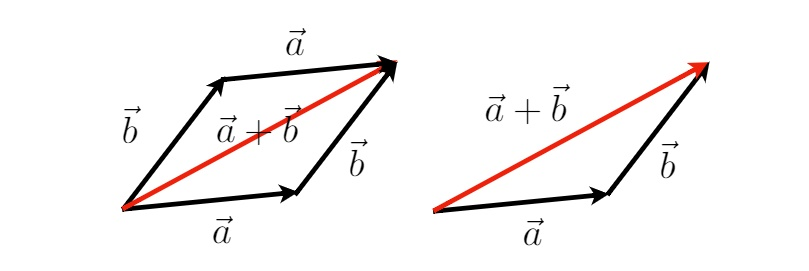
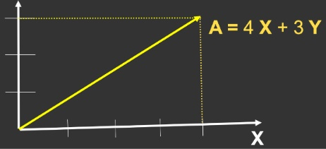
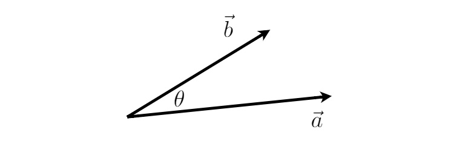
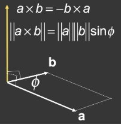

# Introduction to Linear Algebra

## 目录
+ 向量
+ 矩阵

## Vectors
### Basic
+ 向量常被写作 $\overrightarrow{a}$ 或者 $\LARGE{a}$
+ 也可以表示为由起始点指向结束点 $\overrightarrow{AB} = B - A$
+ 同时具有方向和大小（方向和长度）
+ 没有起始位置，表示两个点的相对关系
+ 向量的长度表示为 $\lVert \overrightarrow{a} \rVert$
### 单位向量（Unit vector）
+ 长度为1，$\lVert \overrightarrow{a} \rVert = 1$
+ 求某个向量 $\overrightarrow{a}$ 的单位向量：${\hat{a}} = {\overrightarrow{a}} / {\lVert \overrightarrow{a} \rVert}$
+ 我们一般默认单位向量表示方向，这一点被计算机图形学广泛使用
### 向量求和

+ 几何表示：如图，根据平行四边形法则或三角形法则求和
+ 代数表示：坐标值直接相加即可（参照下面的坐标系表示向量）
+ ${\overrightarrow{a}} - {\overrightarrow{b}} = {\overrightarrow{a}} + (-{\overrightarrow{b}})$，相减时可以转换为做加法
### 向量的坐标系表示

+ 向量可以用坐标系（常用正交坐标系）表示
+ 表示时默认向量的起始位置在原点

图形学中默认向量为列向量：$\LARGE{ { \mathbf{A} } = { \begin{pmatrix} x \\ y \end{pmatrix} } }$

转置，行列互换：$\LARGE{ { \mathbf{A}^\mathrm{T} } = { \begin{pmatrix} x , y \end{pmatrix} } }$

向量求长度：$\LARGE{ {\lVert \mathbf{A} \rVert} = { \sqrt{x^2 + y^2} } }$
### 向量的乘法
#### 点乘

>$\LARGE{ { \overrightarrow{a} \cdot \overrightarrow{b} } = { {\lVert \overrightarrow{ a } \rVert} {\lVert \overrightarrow{ b } \rVert} {\cos\theta} } }$
>$\LARGE{ \cos\theta = \dfrac{ \overrightarrow{a} \cdot \overrightarrow{b} }{ {\lVert \overrightarrow{ a } \rVert} {\lVert \overrightarrow{ b } \rVert} } }$
>对于单位向量来说：$\LARGE{ \cos\theta = \hat{a} \cdot \hat{b} }$
##### 性质
>+ 交换律：
>+ 结合律：
>+ 分配率：
##### 坐标表示
>+ 2维：
>+ 3维：
##### 图形学中的应用
+ **获取两个向量之间的夹角**
+ **获取一个向量在另一个向量上的投影**
    >a
    >b
    >c
+ **将向量按某个方向垂直和水平的分解**
    >a
    >b
    >c
+ **判断向量相较于另一方向是向前还是向后**
    >a
    >b

#### 叉乘

>两个向量叉乘获得一个垂直于原向量的一个新向量
>方向：
>大小：
##### 性质
>a
>aa
>b
>c
>d
##### 坐标表示
>a
##### 图形学中的应用
+ **判断向量在另一个向量的左边还是右边**
    >a
    >b
+ **判断点在两个向量的夹角内还是外**
    >a
    >b
+ **判断点在三角形内还是外**
    >a
    >b

[MD基本要素](https://shd101wyy.github.io/markdown-preview-enhanced/#/zh-cn/markdown-basics)
[KaTeK](https://katex.org/docs/supported.html)