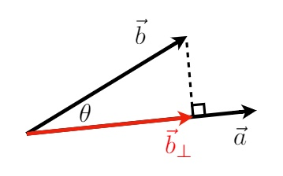
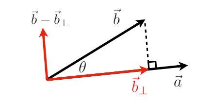
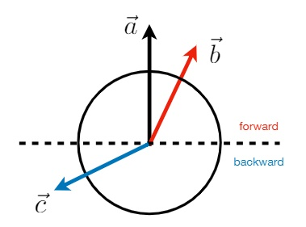
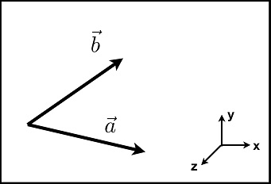
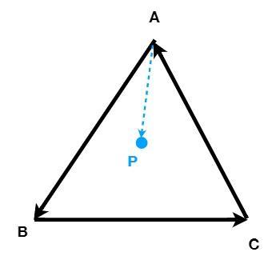

# Introduction to Linear Algebra

## 目录
+ 向量
+ 矩阵

## Vectors
### Basic
+ 向量常被写作 $\overrightarrow{a}$ 或者 $\LARGE{a}$
+ 也可以表示为由起始点指向结束点 $\overrightarrow{AB} = B - A$
+ 同时具有方向和大小（方向和长度）
+ 没有起始位置，表示两个点的相对关系
+ 向量的长度表示为 $\lVert \overrightarrow{a} \rVert$
### 单位向量（Unit vector）
+ 长度为1，$\lVert \overrightarrow{a} \rVert = 1$
+ 求某个向量 $\overrightarrow{a}$ 的单位向量：${\hat{a}} = {\overrightarrow{a}} / {\lVert \overrightarrow{a} \rVert}$
+ 我们一般默认单位向量表示方向，这一点被计算机图形学广泛使用
### 向量求和

+ 几何表示：如图，根据平行四边形法则或三角形法则求和
+ 代数表示：坐标值直接相加即可（参照下面的坐标系表示向量）
+ ${\overrightarrow{a}} - {\overrightarrow{b}} = {\overrightarrow{a}} + (-{\overrightarrow{b}})$，相减时可以转换为做加法
### 向量的坐标系表示

+ 向量可以用坐标系（常用正交坐标系）表示
+ 表示时默认向量的起始位置在原点

图形学中默认向量为列向量：$\LARGE{ { \mathbf{A} } = { \begin{pmatrix} x \\ y \end{pmatrix} } }$

转置，行列互换：$\LARGE{ { \mathbf{A}^\mathrm{T} } = { \begin{pmatrix} x , y \end{pmatrix} } }$

向量求长度：$\LARGE{ {\lVert \mathbf{A} \rVert} = { \sqrt{x^2 + y^2} } }$
### 向量的乘法
#### 点乘

>$\LARGE{
    { \overrightarrow{a} \cdot \overrightarrow{b} }
    = { {\lVert \overrightarrow{ a } \rVert} {\lVert \overrightarrow{ b } \rVert} {\cos\theta} }
}$
>$\LARGE{
    \cos\theta 
    = \dfrac{ \overrightarrow{a} \cdot \overrightarrow{b} }{ {\lVert \overrightarrow{ a } \rVert} {\lVert \overrightarrow{ b } \rVert} }
}$
>对于单位向量来说：$\LARGE{
    \cos\theta = \hat{a} \cdot \hat{b}
}$
##### 性质
>+ 交换律：$\LARGE{
    { \overrightarrow{a} \cdot \overrightarrow{b} }
    = { \overrightarrow{b} \cdot \overrightarrow{a} }
}$
>+ 结合律：$\LARGE{ 
    { \overrightarrow{a} \cdot ( \overrightarrow{b} + \overrightarrow{c} ) }
    = { \overrightarrow{a} \cdot \overrightarrow{b} } + { \overrightarrow{a} \cdot \overrightarrow{c} } }$
>+ 分配率：$\LARGE{
    { (k\overrightarrow{a}) \cdot \overrightarrow{b} }
    = { \overrightarrow{a} \cdot (k\overrightarrow{b}) }
    = { k(\overrightarrow{a} \cdot \overrightarrow{b}) }
}$
##### 坐标表示
>+ 2维：$\LARGE{
    { \overrightarrow{a} \cdot \overrightarrow{b} }
    = { \begin{pmatrix} x_a \\ y_a \end{pmatrix} } \cdot { \begin{pmatrix} x_b \\ y_b \end{pmatrix} }
    = {x_ax_b + y_ay_b}
}$
>
>+ 3维：$\LARGE{
    { \overrightarrow{a} \cdot \overrightarrow{b} }
    = { \begin{pmatrix} x_a \\ y_a \\ z_a \end{pmatrix} } \cdot { \begin{pmatrix} x_b \\ y_b \\ z_b \end{pmatrix} }
    = {x_ax_b + y_ay_b + z_az_b}
}$
##### 图形学中的应用
+ **获取两个向量之间的夹角**
    >$ \cos\theta 
        = \dfrac{ \overrightarrow{a} \cdot \overrightarrow{b} }{ {\lVert \overrightarrow{ a } \rVert} {\lVert \overrightarrow{ b } \rVert} }
    $
+ **获取一个向量在另一个向量上的投影**
    
    >定义$ \overrightarrow{b}_\perp $是$ \overrightarrow{b} $在$ \overrightarrow{a} $上的投影
    >显然，$ \overrightarrow{b}_\perp $属于$ \overrightarrow{a} $（或者说是属于$ \hat{a} $），$ \overrightarrow{b}_\perp = k\hat{a} $
    >$ k = \lVert { \overrightarrow{b}_\perp } \rVert = \lVert { \overrightarrow{b} } \rVert $
+ **将向量按某个方向垂直和水平的分解**
    
    >将$ \overrightarrow{b} $投影到$ \overrightarrow{a} $方向上，得到水平的分解量：$ \overrightarrow{b}_\perp $
    >设垂直分量为$ \overrightarrow{b_n} $，显然$ \overrightarrow{b} = \overrightarrow{b}_\perp + \overrightarrow{b_n} $
    >移项得到垂直分量：$ \overrightarrow{b} - \overrightarrow{b}_\perp $
+ **判断向量相较于另一方向是向前还是向后**
    
    >$ \overrightarrow{b} $相对于$ \overrightarrow{a} $是朝前的：$ \overrightarrow{a} \cdot \overrightarrow{b} > 0 $
    >$ \overrightarrow{c} $相对于$ \overrightarrow{a} $是朝后的：$ \overrightarrow{a} \cdot \overrightarrow{b} < 0 $

#### 叉乘

>两个向量叉乘获得一个垂直于原向量的一个新向量
>方向：右手螺旋定则：握手比大拇指的，四指按图中$\overrightarrow{a}$朝向$\overrightarrow{b}$的逆时针方向握，大拇指自然指向上，大拇指方向就是叉乘向量的方向
>大小：$\LARGE{
    { \lVert \overrightarrow{a} \times \overrightarrow{b} \rVert }
    = { \lVert \overrightarrow{a} \rVert }{ \lVert \overrightarrow{b} \rVert }\sin\theta
}$
##### 性质
>+ 性质一：$\LARGE{
    { \overrightarrow{a} \times \overrightarrow{b} } = { -\overrightarrow{b} \times \overrightarrow{a} }
}$，由性质一可得：
>   + ${ \overrightarrow{x} \times \overrightarrow{y} = +\overrightarrow{z} }$
>   + ${ \overrightarrow{y} \times \overrightarrow{x} = -\overrightarrow{z} }$
>   + ${ \overrightarrow{y} \times \overrightarrow{z} = +\overrightarrow{x} }$
>   + ${ \overrightarrow{z} \times \overrightarrow{y} = -\overrightarrow{x} }$
>   + ${ \overrightarrow{z} \times \overrightarrow{x} = +\overrightarrow{y} }$
>   + ${ \overrightarrow{x} \times \overrightarrow{z} = -\overrightarrow{y} }$
>+ 性质二：$\LARGE{ \overrightarrow{a} \times \overrightarrow{a} = \overrightarrow{0} }$
>+ 性质三：$\LARGE{
>    \overrightarrow{a} \times (\overrightarrow{b} + \overrightarrow{c})
>    = \overrightarrow{a} \times \overrightarrow{b} + \overrightarrow{a} \times \overrightarrow{c}
>}$
>+ 性质四：$\LARGE{ \overrightarrow{a} \times k\overrightarrow{b} = k(\overrightarrow{a} \times \overrightarrow{b}) }$
##### 坐标表示
>$\LARGE{
    \overrightarrow{a} \times \overrightarrow{b}
    = \begin{pmatrix} {y_az_b - y_bz_a} \\ {z_ax_b - x_az_b} \\ {x_ay_b - y_ax_b} \end{pmatrix}
}$
这里先列出矩阵表示：$\LARGE{
    \overrightarrow{a} \times \overrightarrow{b}
    = \mathbf{A}\overrightarrow{b}
    = \begin{pmatrix} 0 & -z_a & y_a \\ z_a & 0 & -x_a \\ -y_a & x_a & 0 \end{pmatrix} \begin{pmatrix} x_b \\ y_b \\ z_b \end{pmatrix}
}$
##### 图形学中的应用
+ **判断向量在另一个向量的左边还是右边**
    
    >$ \overrightarrow{a} \times \overrightarrow{b} $为正：$\overrightarrow{b}$在$\overrightarrow{a}$的右侧
    >$ \overrightarrow{a} \times \overrightarrow{b} $为负：$\overrightarrow{b}$在$\overrightarrow{a}$的左侧
+ **判断点P在三角形内还是外**
    
    >+ 计算$(\overrightarrow{AP} \times \overrightarrow{AB})$、$(\overrightarrow{BP} \times \overrightarrow{BC})$、$(\overrightarrow{CP} \times \overrightarrow{CA})$得到的三个向量是否同向
    *ABC三个点必须按顺时针或者逆时针取边的向量*
    >+ 如果同向，则点P在三角形内，否则点P就在三角形外

## Matrices
图形学中常用矩阵来表示变换信息
+ 平移、旋转、缩放等
### Basic
+ 矩阵是什么：m行n列的实数集，被称作$m \times n$的矩阵
    + 一个$3 \times 2$的矩阵：
        >$\mathbf{M} = \begin{pmatrix} 1 & 3 \\ 5 & 2 \\ 0 & 4 \end{pmatrix}$
+ 数的加法和乘法：
    + 矩阵$\mathbf{M}$加上一个数k：
        >$ k + \mathbf{M} = \begin{pmatrix} 1+k & 3+k \\ 5+k & 2+k \\ 0+k & 4+k \end{pmatrix} $
    + 矩阵$\mathbf{M}$乘上一个数k：
        >$ k\mathbf{M} = \begin{pmatrix} 1k & 3k \\ 5k & 2k \\ 0 & 4k \end{pmatrix} $
+ 矩阵的加法：
    矩阵只有行列相同时才能相加减，$m \times n$的矩阵相加：
    >$ \mathbf{M}+\mathbf{M}
        = 2M
        = \begin{pmatrix} 1+1 & 3+3 \\ 5+5 & 2+2 \\ 0+0 & 4+4 \end{pmatrix}
        = \begin{pmatrix} 2 & 6 \\ 10 & 4 \\ 0 & 8 \end{pmatrix}
    $
### 矩阵乘法
矩阵需要前矩阵的列数等于后矩阵行数才能相乘：$(M \times \mathbf{N})(\mathbf{N} \times P) = (M \times P)$
来看一下这个例子：
>$ { \begin{pmatrix} 1 & 3 \\ 5 & 2 \\ 0 & 4 \end{pmatrix} } { \begin{pmatrix} 3 & 6 & 9 & 4 \\ 2 & 7 & 8 & 3 \end{pmatrix} }
>        = \begin{pmatrix} 9 & 27 & 33 & 13 \\ 10 & 44 & 61 & 26 \\ 0 & 28 & 32 & 12 \end{pmatrix}
>$

+ $(3 \times 2)(2 \times 4) = (3 \times 4)$，结果必然是3行4列
+ 令 $\mathbf{Result}(i,j)$ 为结果矩阵 $\mathbf{Result}$ 的第 $i$ 行第 $j$ 列的数，它的值为**前矩阵第 $i$ 行的元素和后矩阵第 $j$ 列的元素一一对应相乘的和**
    >例如结果矩阵第 $1$ 行第 $2$ 列的数 $\mathbf{Result}(1,2) = 1 \times 6 + 3 \times 7 = 27$

##### 性质
+ 没有交换律，有一下两点说明：
    + 从乘法的约束来说：$(M \times \mathbf{N})(\mathbf{N} \times P) = (M \times P)$，如果$M \not = P$，交换之后根本不能相乘
    + 从乘法的定义来说：$(M \times \mathbf{N})(\mathbf{N} \times M) = (M \times M)$，交换之后的结果为 $(N \times N)$
        + 这里举一个 $(3 \times 3)(3 \times 3)$ 的例子：
            >$ { \begin{pmatrix} 1 & 2 & 3 \\ 1 & 2 & 3 \\ 1 & 2 & 3 \end{pmatrix} }
            >  { \begin{pmatrix} 4 & 5 & 6 \\ 4 & 5 & 6 \\ 4 & 5 & 6 \end{pmatrix} }
            >= \begin{pmatrix} 24 & 30 & 36 \\ 24 & 30 & 36 \\ 24 & 30 & 36 \end{pmatrix}
            >\not=
            >{ \begin{pmatrix} 4 & 5 & 6 \\ 4 & 5 & 6 \\ 4 & 5 & 6 \end{pmatrix} }
            >{ \begin{pmatrix} 1 & 2 & 3 \\ 1 & 2 & 3 \\ 1 & 2 & 3 \end{pmatrix} } 
            >= \begin{pmatrix} 15 & 30 & 45 \\ 15 & 30 & 45 \\ 15 & 30 & 45 \end{pmatrix}
            >$
        
        + 这里的例子同时也可以说明 $\mathbf{MVP}$ 变换为什么不能随意的交换顺序
+ 结合律
    > $(\mathbf{A}\mathbf{B})\mathbf{C} = \mathbf{A}(\mathbf{B}\mathbf{C})$
+ 分配率
    > $\mathbf{A}(\mathbf{B} + \mathbf{C}) = \mathbf{A}\mathbf{B} + \mathbf{A}\mathbf{C}$
    > $(\mathbf{A} + \mathbf{B})\mathbf{C} = \mathbf{A}\mathbf{C} + \mathbf{B}\mathbf{C}$

##### 矩阵和向量相乘
把向量看成 $m \times 1$ 的矩阵（或 $1 \times m$ 的矩阵）来做乘法：
+ 左乘：矩阵在向量的左侧，即 $(n \times m)(m \times 1)$
+ 右乘：矩阵在向量的右侧，即 $(1 \times m)(m \times n)$
**图形学中，根据向量的结构定义（ $m \times 1$ 或 $1 \times m$ ）采取左乘或者右乘进行计算**
**并且，我们希望做完乘法后，得到的结果仍然是一个维度不变的向量，因此矩阵往往是 $m \times m$ 的形式**
举一个例子，2维向量绕 $y$ 轴旋转：
    > $\large{\begin{pmatrix} -1 & 0 \\ 0 & 1 \end{pmatrix}\begin{pmatrix} x \\ y \end{pmatrix} = \begin{pmatrix} -x \\ y \end{pmatrix}}$

##### 转置
将矩阵转置，就是将该矩阵的行列互换：

$ { \begin{pmatrix} 1 & 2 \\ 3 & 4 \\ 5 & 6 \end{pmatrix} } ^ \mathrm{T} 
    = \begin{pmatrix} 1 & 2 & 3 \\ 4 & 5 & 6 \end{pmatrix} $

比较特别的一点：
$ (AB)^T = {B^T}{A^T} $

##### 矩阵的逆
+ 单位矩阵
    + 对角线上的元素为1，其余的元素为0的方阵（行列数相同的矩阵）
        > $\bm{I}_{3 \times 3} = \begin{pmatrix} 1 & 0 & 0 \\ 0 & 1 & 0 \\ 0 & 0 & 1 \end{pmatrix}$
+ 逆矩阵
    + 矩阵 $A$ 和它的逆矩阵 $A^{-1}$ 相乘的结果为单位矩阵 $I$
        > $AA^{-1} = A^{-1}A = I$
        > $ (AB)^{-1} = B^{-1}A^{-1} $

##### 向量乘法的矩阵表示
+ 向量点乘
    + > $ \overrightarrow{a} \cdot \overrightarrow{b} 
      >= \overrightarrow{a}^{T}\overrightarrow{b}
      >= \begin{pmatrix} x_a & y_a & z_a \end{pmatrix} \begin{pmatrix} x_b \\ y_b \\ z_b \end{pmatrix}
      >= \begin{pmatrix} x_ax_b + y_ay_b + z_az_b \end{pmatrix}
      >$
+ 向量叉乘
    + > $ \overrightarrow{a} \times \overrightarrow{b} 
      >= \mathbf{A}*b
      >= \begin{pmatrix} 0 & -z_a & y_a \\ z_a & 0 & -x_a \\ -y_a & x_a & 0 \end{pmatrix} \begin{pmatrix} x_b \\ y_b \\ z_b \end{pmatrix}
      >$
