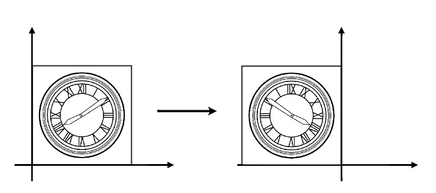
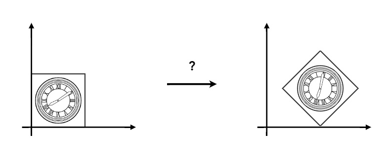
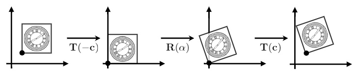

# Transformation
If you can not render Mathematical formula, please read this [image_Transformation_md_to_png](./Transformation_md_to_png.png)

## 目录
+ [2维变换](#2d-transformations)
+ [齐次坐标](#homogeneous-coordinates)
+ [变换的合成](#变换的合成)
+ [3D Transforms](#3d-transforms)

## 2D transformations

#### Scale Transform
等比缩放：将图像的横轴和纵轴都缩放0.5，变为原来的 $ 1/2 $

+ 数学形式：
    > $ x' = sx $
    > $ y' = sy $
+ 缩放矩阵：
    > $\LARGE{ \begin{bmatrix} x' \\ y' \end{bmatrix}
    > = \begin{bmatrix} s_x & 0 \\ 0 & s_y \end{bmatrix} \begin{bmatrix} x \\ y \end{bmatrix} }$

非等比缩放：将图像的横轴缩放0.5，纵轴不变

+ 缩放矩阵：
    > $ s_x = 0.5 $
    > $ s_y = 1 $
    >
    > $\LARGE{ \begin{bmatrix} x' \\ y' \end{bmatrix}
    > = \begin{bmatrix} s_x & 0 \\ 0 & s_y \end{bmatrix} \begin{bmatrix} x \\ y \end{bmatrix} }$

#### Reflection Matrix

水平方向翻转，图像相对于 $y$ 轴做了翻转
+ 数学形式：
    > $ x' = -x $
    > $ y' = y $
+ 反射矩阵：
    > $\LARGE{ \begin{bmatrix} x' \\ y' \end{bmatrix}
    > = \begin{bmatrix} -1 & 0 \\ 0 & 1 \end{bmatrix} \begin{bmatrix} x \\ y \end{bmatrix} }$

#### Shear Matrix

图像所有的点，竖直方向没有改变，水平方向做了一定规律的移动
+ 数学形式：
    > $ x' = x + ay $
    > $ y' = y $
+ 反射矩阵：
    > $\LARGE{ \begin{bmatrix} x' \\ y' \end{bmatrix}
    > = \begin{bmatrix} 1 & a \\ 0 & 1 \end{bmatrix} \begin{bmatrix} x \\ y \end{bmatrix} }$

#### Rotation Matrix
**默认情况下，绕远点做逆时针旋转**

图像旋转45°（默认绕远点 $(0,0)$ 逆时针旋转45°）
+ 数学形式：
    > $ x' = x\cos\theta - y\sin\theta $
    > $ y' = x\cos\theta + y\cos\theta $
+ 旋转矩阵：
    > $\LARGE{ \begin{bmatrix} x' \\ y' \end{bmatrix}
    > = \begin{bmatrix} \cos\theta & -\sin\theta \\ \sin\theta & \cos\theta \end{bmatrix} \begin{bmatrix} x \\ y \end{bmatrix} }$

#### 旋转矩阵的特殊性质
> $R_{\theta} = \begin{pmatrix} \cos\theta & -\sin\theta \\ \sin\theta & \cos\theta \end{pmatrix}$
> $R_{-\theta} = \begin{pmatrix} \cos\theta & \sin\theta \\ -\sin\theta & \cos\theta \end{pmatrix} = R_{\theta}^T$
> $R_{-\theta} = R_{\theta}^{-1}$

在旋转里面，旋转矩阵的逆就是旋转矩阵的转置：$R_{-\theta} = R_{\theta}^{-1} = R_{\theta}^T$
*在数学上，我们称矩阵的逆和矩阵的转置相同的矩阵为正交矩阵*

#### 线性变换
满足以下形式的变换被称为线性变换, $ X' = \mathbf{M}X $ ：
+ 数学形式：
    > $ x' = ax + by $
    > $ y' = cx + dy $
+ 变换矩阵：
    > $\LARGE{ \begin{bmatrix} x' \\ y' \end{bmatrix}
    > = \begin{bmatrix} a & b \\ c & d \end{bmatrix} \begin{bmatrix} x \\ y \end{bmatrix} }$
在图形学中，用矩阵来表示位置的变换

## Homogeneous coordinates

#### Translation
水平和竖直方向加上一定的偏移量

+ 数学形式：
    > $ x' = x + t_x $
    > $ y' = x + t_y $
+ 变换矩阵：
    > $\LARGE{ \begin{bmatrix} x' \\ y' \end{bmatrix}
    > = \begin{bmatrix} a & b \\ c & d \end{bmatrix} \begin{bmatrix} x \\ y \end{bmatrix} + \begin{bmatrix} t_x \\ t_y \end{bmatrix} }$

我们发现，不能把偏移量放到变换矩阵里边了
因此，**平移不是线性变换**
我们应该如何把平移和线性变换组合到同一个变换矩阵里——齐次坐标

#### 齐次坐标
给任意的点或向量增加一个维度（w-coordinate）
+ 2维的点：$(x,y,1)^T$
+ 2维的向量：$(x,y,0)^T$

这个时候，我们重新为三维表示的点或向量给出变平移的变换矩阵：
> $\LARGE{ \begin{bmatrix} x' \\ y' \\ w' \end{bmatrix}
> = \begin{bmatrix} 1 & 0 & t_x \\ 0 & 1 & t_y \\ 0 & 0 & 1 \end{bmatrix} \begin{bmatrix} x \\ y \\ 1 \end{bmatrix} }$

这样我们只用一个矩阵乘以向量的形式表示了平移变换

#### 为什么向量和点的新增维度 $w$ 的值定义不一致
向量具有**平移不变性**，向量乘以平移矩阵之后的结果不应该发生改变
我们以点和向量加减的几何意义来理解点和向量的区别：
+ 向量加上向量后仍然得到一个向量：
    > $ \begin{bmatrix} x_a \\ y_a \\ 0 \end{bmatrix} + \begin{bmatrix} x_b \\ y_b \\ 0 \end{bmatrix} 
    > = \begin{bmatrix} x_a + x_b \\ y_a + y_b \\ 0 \end{bmatrix} $
+ 两个点相减得到一个向量：
    > $ \begin{bmatrix} x_a \\ y_a \\ 1 \end{bmatrix} - \begin{bmatrix} x_b \\ y_b \\ 1 \end{bmatrix} 
    > = \begin{bmatrix} x_a - x_b \\ y_a - y_b \\ 0 \end{bmatrix} $
+ 点加上一个向量，表示点沿着向量移动向量长度这么远的距离，仍然是一个点：
    > $ \begin{bmatrix} x_a \\ y_a \\ 1 \end{bmatrix} + \begin{bmatrix} x_b \\ y_b \\ 0 \end{bmatrix} 
    > = \begin{bmatrix} x_a - x_b \\ y_a - y_b \\ 1 \end{bmatrix} $

我们扩充一下，连个点相加表示什么呢
+ > $ \begin{bmatrix} x_a \\ y_a \\ 1 \end{bmatrix} + \begin{bmatrix} x_b \\ y_b \\ 1 \end{bmatrix} 
  > = \begin{bmatrix} x_a + x_b \\ y_a + y_b \\ 2 \end{bmatrix} $

因为 $w$ 轴必须是 0 或 1 ，我们对其做个除法，得到：$ \begin{bmatrix} (x_a + x_b)/2 \\ (y_a + y_b)/2 \\ 1 \end{bmatrix} $ ，这是两个点的中点

#### Affine Transformations
仿射变换，是线性变换和平移变换的组合
+ 数学形式：
    > $ x' = ax + by + t_x $
    > $ y' = cx + dy + t_y $
+ 变换矩阵：
    > $\LARGE{ \begin{bmatrix} x' \\ y' \end{bmatrix}
    > = \begin{bmatrix} a & b \\ c & d \end{bmatrix} \begin{bmatrix} x \\ y \end{bmatrix} + \begin{bmatrix} t_x \\ t_y \end{bmatrix} }$
+ 齐次坐标表示：
    > $\LARGE{ \begin{bmatrix} x' \\ y' \\ w' \end{bmatrix}
    > = \begin{bmatrix} a & b & t_x \\ c & d & t_y \\ 0 & 0 & 1 \end{bmatrix} \begin{bmatrix} x \\ y \\ 1 \end{bmatrix} }$

现在我们使用一个矩阵既能表示线性变换又能表示平移变换：

现在我们给出每种变换的齐次坐标表示的变换矩阵：
+ **缩放**
    > $\LARGE{ S(s_x, s_y) = \begin{pmatrix} s_x & 0 & 0 \\ 0 & s_y & 0 \\ 0 & 0 & 1 \end{pmatrix} }$
+ **旋转** 
    > $\LARGE{ R(\alpha) = \begin{pmatrix} \cos\alpha & -\sin\alpha & 0 \\ \sin\alpha & \cos\alpha & 0 \\ 0 & 0 & 1 \end{pmatrix} }$
+ **平移**
    > $\LARGE{ T(t_x,t_y) = \begin{pmatrix} 1 & 0 & t_x \\ 0 & 1 & t_y \\ 0 & 0 & 1 \end{pmatrix} }$

#### Inverse Transform
图像经过变换矩阵 $M$ 变换得到新的图像，此时把新图像变换回原来的图像，这个变换过程被称为逆变换，变换矩阵数学上就是矩阵 $M$ 的逆矩阵 $M^{-1}$

## 变换的合成

我们要得到这样一个结果，需要经过多个变换过程，先旋转后平移或者先平移后旋转都能达到目的

#### 变换的顺序
我们实际看一下先旋转后平移或者先平移后旋转的结果是否有区别：
+ 先平移后旋转，得到图中上方的结果
+ 先旋转后平移，得到图中下发的结果

有几个值得注意的点：
+ 从结果来看，变换的顺序会影响变换的结果：
    > $ R_{45} \cdot T_{(1,0)} \not= T_{(1,0)} \cdot R_{45} $
+ 后进行的变换写在了矩阵的左侧：$Result = R_{45} \cdot T_{(1,0)} \cdot Point $
    上一节讲矩阵和向量的乘法时说到过，为了和点的列矩阵形式配合，使得变换之后的结果仍然是列矩阵，**变换矩阵的应用是从右往左进行的**：
    > $ Result = R_{45} \cdot T_{(1,0)} \cdot \begin{bmatrix} x \\ y \\ 1 \end{bmatrix}
    > = \begin{bmatrix} 1 & 0 & 1 \\ 0 & 1 & 0 \\ 0 & 0 & 1 \end{bmatrix}
    >   \begin{bmatrix} \cos45^\circ & -\sin45^\circ & 0 \\ \sin45^\circ & \cos45^\circ & 0 \\ 0 & 0 & 1 \end{bmatrix}
    >   \begin{bmatrix} x \\ y \\ 1 \end{bmatrix} $

#### 合成变换矩阵
我们把前面变换 $T_{(1,0)} \cdot R_{45}$ 推广到多次连续变换，我们把图像进行从 $A_1, A_2, A_3, \cdot\cdot\cdot, A_n$ 的 $n$ 次变换：
> $ A_n(...(A_3(A_2(A_1(x))))) $
> 我们使用矩阵乘法的交换律来做一下调整，得到：
> $ A_n(...(A_3(A_2(A_1(x))))) = (A_n \cdot\cdot\cdot A_3 \cdot A_2 \cdot A_1) \cdot \begin{pmatrix} x \\ y \\ 1 \end{pmatrix} $

$n$ 个 $3 \times 3$ 的矩阵相乘得到的结果仍然是一个 $3 \times 3$ 的矩阵，我们可以用一个矩阵表示一串非常复杂的变换：
> $Result = M \cdot \begin{pmatrix} x \\ y \\ 1 \end{pmatrix} $

现在，我们将很多不同的矩阵合成了一个矩阵

#### 分解复合的变换
矩阵可以合成，那么就可以分解
举个例子，我们想绕给定的点 $c$ 进行旋转：

我们先将图像移回原点，然后绕原点旋转，再把得到的结果移回给定的点，这样就得到了这个变换的结果
我们把它记为：$Result = M_c \cdot \begin{pmatrix} x \\ y \\ 1 \end{pmatrix} $
我们按照图示中的过程把它分解出来得到
$Result = T(c) \cdot R(\alpha) \cdot T(-c) \cdot \begin{pmatrix} x \\ y \\ 1 \end{pmatrix} $

## 3D Transforms
*我们前面已经搞清楚了 2维的变换，现在我们将它推广到 3维*

#### 齐次坐标
我们仍然需要使用齐次坐标：
+ 3维的点：$ (x, y, z, 1)^T $
+ 3维的向量：$ (x, y, z, 0)^T $

使用齐次坐标描述 3维空间中的仿射变换：
> $ \begin{pmatrix} x' \\ y' \\ z' \\ 1 \end{pmatrix}
> = \begin{pmatrix} a & b & c & t_x \\ d & e & f & t_y \\ g & h & i & t_z \\ 0 & 0 & 0 & 1 \end{pmatrix}
> \cdot \begin{pmatrix} x \\ y \\ z \\ 1 \end{pmatrix} $

#### 仿射变换
Scale
>+ $S(s_x, s_y, s_z) = \begin{pmatrix} s_x & 0 & 0 & 0 \\ 0 & s_y & 0 & 0 \\ 0 & 0 & s_z & 0 \\ 0 & 0 & 0 & 1 \end{pmatrix}$

Translation
>+ $S(t_x, t_y, t_z) = \begin{pmatrix} 1 & 0 & 0 & t_x \\ 0 & 1 & 0 & t_y \\ 0 & 0 & 1 & t_z \\ 0 & 0 & 0 & 1 \end{pmatrix}$

Rotation
>+ 绕 $x$ 轴旋转：$R_x(\alpha) = \begin{pmatrix} 1 & 0 & 0 & 0 \\ 0 & \cos\alpha & -\sin\alpha & 0 \\ 0 & \sin\alpha & \cos\alpha & 0 \\ 0 & 0 & 0 & 1 \end{pmatrix}$

>+ 绕 $y$ 轴旋转：$R_y(\alpha) = \begin{pmatrix} \cos\alpha & 0 & \sin\alpha & 0 \\ 0 & 1 & 0 & 0 \\ -\sin\alpha & 0 & \cos\alpha & 0 \\ 0 & 0 & 0 & 1 \end{pmatrix}$

>+ 绕 $z$ 轴旋转：$R_z(\alpha) = \begin{pmatrix} \cos\alpha & -\sin\alpha & 0 & 0 \\ \sin\alpha & \cos\alpha & 0 & 0 \\ 0 & 0 & 1 & 0 \\ 0 & 0 & 0 & 1 \end{pmatrix}$

为什么这里绕 $y$ 轴旋转跟绕其他轴旋转的变换矩阵符号不一样呢？
因为在 $xyz$ 坐标系中，$x$坐标由$y \times z$得到，$z$坐标由$x \times y$得到，而$y$坐标由$z \times x$得到
我们默认为逆时针旋转，而由$z \times x$所组成的 2维坐标系就需要转动$-\alpha$度才行

#### 3维旋转的合成
绕任意轴做任意角度的旋转都可以由绕$xyz$三个轴分别旋转得到：$R_{xyz}(\alpha, \beta, \gamma) = R_x(\alpha)R_y(\beta)R_z(\gamma)$
在数学上我们将这三个角度叫做欧拉角（Euler angles），绕$xyz$轴旋转分别被称为 Roll，Pitch，Yaw
现在我们使用罗德里格斯旋转公式（Rodrigues' Rotation Formula）将它表示出来：
> 绕任意轴 $\mathbf{n}$ 旋转 $\alpha$度：
> $ R(\mathbf{n}, \alpha) = \cos(\alpha)\mathbf{I} + (1 - \cos(\alpha))\mathbf{n}\mathbf{n^T} + \sin(\alpha) \underbrace{\begin{pmatrix} \cos45^\circ & -\sin45^\circ & 0 \\ \sin45^\circ & \cos45^\circ & 0 \\ 0 & 0 & 1 \end{pmatrix}}_{\mathbf{N}}$
> $\mathbf{N}$ 是向量叉乘的矩阵表示中的矩阵
