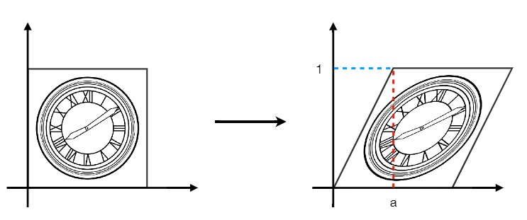

# Transformation

## 目录
+ [2维变换](#2d-transformations)
+ [齐次坐标](#homogeneous-coordinates)
+ 组合变换
+ 3维变换

## 2D transformations

### Scale Transform
等比缩放：将图像的横轴和纵轴都缩放0.5，变为原来的 $ 1/2 $

+ 数学形式：
    > $ x' = sx $
    > $ y' = sy $
+ 缩放矩阵：
    > $\LARGE{ \begin{bmatrix} x' \\ y' \end{bmatrix}
    > = \begin{bmatrix} s_x & 0 \\ 0 & s_y \end{bmatrix} \begin{bmatrix} x \\ y \end{bmatrix} }$

非等比缩放：将图像的横轴缩放0.5，纵轴不变

+ 缩放矩阵：
    > $ s_x = 0.5 $
    > $ s_y = 1 $
    >
    > $\LARGE{ \begin{bmatrix} x' \\ y' \end{bmatrix}
    > = \begin{bmatrix} s_x & 0 \\ 0 & s_y \end{bmatrix} \begin{bmatrix} x \\ y \end{bmatrix} }$

### Reflection Matrix

水平方向翻转，图像相对于 $y$ 轴做了翻转
+ 数学形式：
    > $ x' = -x $
    > $ y' = y $
+ 反射矩阵：
    > $\LARGE{ \begin{bmatrix} x' \\ y' \end{bmatrix}
    > = \begin{bmatrix} -1 & 0 \\ 0 & 1 \end{bmatrix} \begin{bmatrix} x \\ y \end{bmatrix} }$

### Shear Matrix

图像所有的点，竖直方向没有改变，水平方向做了一定规律的移动
+ 数学形式：
    > $ x' = x + ay $
    > $ y' = y $
+ 反射矩阵：
    > $\LARGE{ \begin{bmatrix} x' \\ y' \end{bmatrix}
    > = \begin{bmatrix} 1 & a \\ 0 & 1 \end{bmatrix} \begin{bmatrix} x \\ y \end{bmatrix} }$

### Rotation Matrix
**默认情况下，绕远点做逆时针旋转**

图像旋转45°（默认绕远点 $(0,0)$ 逆时针旋转45°）
+ 数学形式：
    > $ x' = x\cos\theta - y\sin\theta $
    > $ y' = x\cos\theta + y\cos\theta $
+ 旋转矩阵：
    > $\LARGE{ \begin{bmatrix} x' \\ y' \end{bmatrix}
    > = \begin{bmatrix} \cos\theta & -\sin\theta \\ \sin\theta & \cos\theta \end{bmatrix} \begin{bmatrix} x \\ y \end{bmatrix} }$

### 线性变换

## Homogeneous coordinates