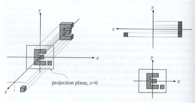

# Viewing transformation
*闫令琪博士将视图变换和投影变换合在一起，统称为观测变换*

If you can not render Mathematical formula, please read this [image_Viewing_transformation_md_to_png](./Viewing_transformation_md_to_png.png)

## 目录
+ View/Camera transformation
+ Projection transformation
    + Orthographic projection
    + Perspective projection

将 3维空间中的东西放到 2维的窗口显示出来需要经过以下几个步骤：

+ model transformation
    将模型从模型空间转换到世界空间
+ view transformation
    将世界空间的模型转换到摄像机位置所对的观察空间
+ projection transformation
    将观察空间 3维的模型映射到 2维空间坐标，转换到裁剪空间
+ viewport transformation
    将裁剪空间得到的平面映射到屏幕的分辨率范围内，转换到屏幕空间

## View/Camera Transformation

#### define a camera

+ 位置（eye position）：$\overrightharpoon{e}$
+ 观察方向（Look-at/gaze direction)：$\hat{g}$
+ 向上方向（Up direction）：$\hat{t}$

通过这个三个属性，我们在世界空间中定义了一个相机。

#### 观察空间

相机和模型的相对位置固定，现在我们做视图变换，变换后的相机和模型的相对位置没有改变。
我们假定，变换后的相机在观察空间的位置：
+ 位置（eye position）：$\overrightharpoon{e} = (0, 0, 0)$
+ 观察方向（Look-at/gaze direction)：$\hat{g} = -Z$
+ 向上方向（Up direction）：$\hat{t} = Y$

#### 视图变换
由于相对位置没有改变，我们对相机做视图变换，就相当于对模型做了视图变换。现在我们需要求一个矩阵，将我们定义在世界空间的相机变换到观察空间的固定位置，所得的矩阵就是我们需要的视图变换矩阵。

使用变换矩阵 $M_{view}$ 将相机从世界空间变换到观察空间
+ 将 $\overrightharpoon{e}$ 平移到原点
+ 将 $\hat{g}$ 旋转到 $-Z$ 轴
+ 将 $\hat{t}$ 旋转到 $Y$ 轴
+ 将 $\hat{g} \times \hat{t}$ 旋转到 $X$ 轴

可以简写为：$M_{view} = R_{view}T_{view}$
直接写出平移的变换矩阵：$T_{view} = \begin{bmatrix} 1 & 0 & 0 & -x_e \\ 0 & 1 & 0 & -y_e \\ 0 & 0 & 1 & -z_e \\ 0 & 0 & 0 & 1 \end{bmatrix}$
但是 $R_{view}$ 就非常复杂，不是很好求解出来，这个时候我们反过来想，将观察空间旋转到世界空间：
+ $X$ 轴旋转到 $\hat{g} \times \hat{t}$
+ $Y$ 轴旋转到 $\hat{t}$
+ $-Z$ 轴旋转到 $\hat{g}$

$R = \begin{bmatrix} 
    x_{\hat{g} \times \hat{t}} & x_{\hat{t}} & x_{-\hat{g}} & 0 \\
    y_{\hat{g} \times \hat{t}} & y_{\hat{t}} & y_{-\hat{g}} & 0 \\ 
    z_{\hat{g} \times \hat{t}} & z_{\hat{t}} & z_{-\hat{g}} & 0 \\ 
    0 & 0 & 0 & 1 
\end{bmatrix}$

由于旋转矩阵的特性性质：$R_{-\theta} = R_{\theta}^{-1} = R_{\theta}^T$
我们就得到了视图变换的旋转矩阵：$R_{view} = R^{-1} = \begin{bmatrix} 
    x_{\hat{g} \times \hat{t}} & y_{\hat{g} \times \hat{t}} & z_{\hat{g} \times \hat{t}} & 0 \\
    x_{\hat{t}} & y_{\hat{t}} & z_{\hat{t}} & 0 \\ 
    x_{-\hat{g}} & y_{-\hat{g}} & z_{-\hat{g}} & 0 \\ 
    0 & 0 & 0 & 1 
\end{bmatrix}$

我们已经求得了视图变换矩阵 $M_{view}$，模型乘上这个矩阵就获得了观察空间的模型位置。

## Projection Transformation

相机和截面形成一个锥体，把锥体中远截面到近截面的相机所看到的物体给映射到 2维屏幕上的过程，被称为投影变换。
+ 透视投影：相机在**不远处**的一个点上，近截面小远截面大，把近远截面所形成的视锥体内的物体映射到近截面上
+ 正交投影：相机在**无限远**的一个点上，近截面和远截面一样大，将视锥体（长方体）内的物体映射到近截面上

#### Orthographic Projection

我们从原点，以 $y$轴为向上方向，看向 $-z$的方向，然后忽略 $z$轴就能得到这个模型在 $xy$平面的投影，然后我们把它挪到 $[-1, 1]$的矩阵上，就得到了正交投影

我们如何求取变换矩阵？

我们把 $[l, r] \times [b, t] \times [f, n]$的视锥体映射到原点的 ${[-1, 1]}^3$的规范立方体（canonical cube）的过程就是正交投影的过程
投影过程简写为：$M_{ortho} = S_{ortho}T_{ortho}$
+ 将视锥体中心平移到原点
+ 将视锥体缩放到标准立方体的范围内

我们可以直接写出上图例子的变换矩阵：
$M_{ortho} = 
\begin{bmatrix} 
    \frac 2 {r-l} & 0 & 0 & 0 \\
    0 & \frac 2 {t-b} & 0 & 0 \\
    0 & 0 & \frac 2 {n-f} & 0 \\
    0 & 0 & 0 & 1 
\end{bmatrix}
\begin{bmatrix} 
    1 & 0 & 0 & -{\frac {r+l} 2} \\
    0 & 1 & 0 & -{\frac {r+l} 2} \\
    0 & 0 & 1 & -{\frac {r+l} 2} \\
    0 & 0 & 0 & 1 
\end{bmatrix}$

#### Perspective Projection

+ 在计算机图形学，美术等领域使用广泛
+ 近大远小
+ 平行线不再平行，相交于一个点
*欧式几何里的平行线永不相交，只的是在同一平面内，透视投影这里不是同一平面所以相交了*

现在我们来做透视投影：
+ 将透视投影的视锥体变换到正交投影的视锥体（$M_{persp->ortho}$）

+ 得到的视锥体做一次正交投影

这样我们就能得到透视投影的结果

那么，$M_{persp->ortho}$该如何求取？
我们从透视投影视锥体的侧面来看，这里我们只关注上半部分
变换后的点 $(x', y', z')$ 和原来的点 $(x, y, z)$ 的关系如下：

$ x' = {\frac n z}x $ 和 $ y' = {\frac n z}y $

我们写出它的齐次坐标表示：$
\begin{pmatrix} x \\ y \\ z \\ 1 \end{pmatrix} \Rightarrow
\begin{pmatrix} nx/z \\ ny/z \\ unknown \\ 1 \end{pmatrix} \xlongequal{\times z}
\begin{pmatrix} nx \\ ny \\ unknown \\ z \end{pmatrix}$
> 齐次坐标表示点的时候，乘以一个数，仍然表示这个点（做归一化即可）

透视视锥体变换到正交视锥体的过程如下：
$M_{persp->ortho}^{4 \times 4} \begin{pmatrix} x \\ y \\ z \\ 1 \end{pmatrix} =
\begin{pmatrix} nx \\ ny \\ unknown \\ z \end{pmatrix}$
这个时候我们可以写出部分的 $M_{persp->ortho}$
$M_{persp->ortho} =
\begin{pmatrix} 
n & 0 & 0 & 0 \\ 
0 & n & 0 & 0 \\ 
? & ? & ? & ? \\
0 & 0 & 1 & 0 \end{pmatrix}$

这个时候我们将近截面的坐标 $(x, y, n, 1)^T$ 带入式子中，用 $n$ 来代替 $z$，可以得到下面的式子：
$M_{persp->ortho}^{4 \times 4} \begin{pmatrix} x \\ y \\ z \\ 1 \end{pmatrix} =
\begin{pmatrix} nx \\ ny \\ unknown \\ z \end{pmatrix} \xRightarrow{replace\ z\ with\ n}
M_{persp->ortho}^{4 \times 4} \begin{pmatrix} x \\ y \\ n \\ 1 \end{pmatrix} =
\begin{pmatrix} nx \\ ny \\ unknown \\ n \end{pmatrix}$
我们观察可以发现，近截面的点在变换后，坐标不会发生改变，且**近截面点的坐标同时乘以一个数，仍然表示这个点**，可以写出：
$M_{persp->ortho}^{4 \times 4} \begin{pmatrix} x \\ y \\ n \\ 1 \end{pmatrix} =
\begin{pmatrix} nx \\ ny \\ unknown \\ n \end{pmatrix} = 
\begin{pmatrix} x \\ y \\ n \\ 1 \end{pmatrix} = 
\begin{pmatrix} nx \\ ny \\ n^2 \\ n \end{pmatrix}$
可以看到，带入近截面的点，$unknown$ 的值是 $n^2$ ，与 $x\ y$ 没有任何关系，可以直接进一步的写出变换矩阵的第三行未知量：
$(0 \ 0 \ A \ B)\begin{pmatrix} x \\ y \\ n \\ 1 \end{pmatrix} = n^2$，写成代数式子：$An + B = n^2$
再观察另一个特殊点，远截面的中心点 $(0, 0, f, 1)^T$ ，这个点再变换后，坐标也不会发生改变，同理可以写出：
$M_{persp->ortho}^{4 \times 4} \begin{pmatrix} 0 \\ 0 \\ f \\ 1 \end{pmatrix} =
\begin{pmatrix} 0 \\ 0 \\ f \\ 1 \end{pmatrix} =
\begin{pmatrix} 0 \\ 0 \\ f^2 \\ f \end{pmatrix}$ ，写出代数式子：$Af + B = f^2$
$n$ 和 $f$ 都是我们的已知量，根据两个代数式可以直接求得 $A$ 和 $B$ 的值：
${A = n + f} \\ {B = -nf}$

整理一下我们的结果：$M_{persp->ortho} =
\begin{pmatrix} 
n & 0 & 0 & 0 \\ 
0 & n & 0 & 0 \\ 
0 & 0 & n+f & -nf \\
0 & 0 & 1 & 0
\end{pmatrix}$

做完透视投影视锥体到正交投影视锥体的变换后，再做一次正交投影就得到透视投影的变换结果了
写出透视投影的变换矩阵：$M_{persp} = M_{ortho}M_{persp->ortho}$

现在我们已经确定了透视投影的变换矩阵的求解方法，但是还需要解决一个问题：
透视投影视锥体做变换得到一个 $[l, r] \times [b, t] \times [f, n]$的正交投影视锥体，其中 $f$ 和 $n$ 是已知的近截面和远截面的 $z$ 值，那么，我们该如何定义 $l$、$r$、$b$、$t$呢
我们定义相机到近截面的关系：
+ **field-of-view(fovY)**：视角，表示相机可以看到的近截面的上下范围，如下图两个红色线段的夹角
+ **aspect ratio**：宽高比，表示相机可以看到的近截面的大小，如下图近截面的宽高之比

我们同样从侧面来观察这个四棱锥，看一下 $l$、$r$、$b$、$t$ 与定义之间的关系：

$\LARGE{\tan{\frac {fovY} 2} = \frac t {\lVert n \rVert}} \\ {aspect = \frac r t}$

现在我们已经可以通过 $fovY$、$aspect$、$n$、$f$ 来做透视投影变换了