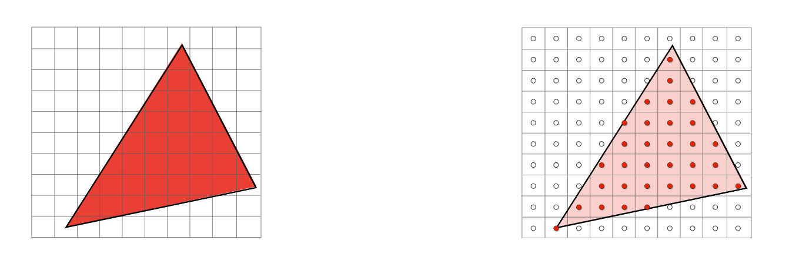
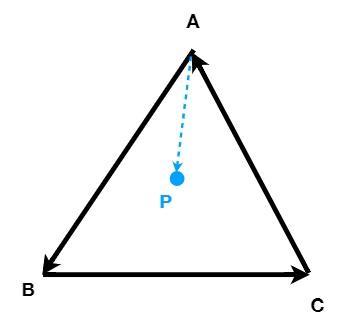
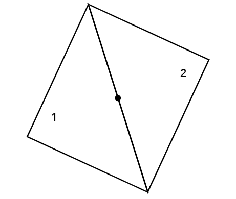
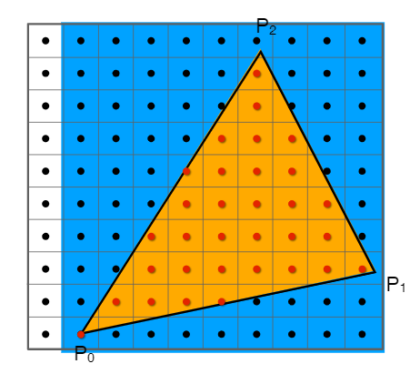
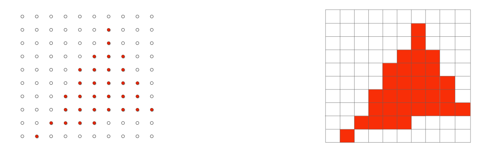

# Rasterization
If you can not render Mathematical formula, please read this [Rasterization.pdf](./Rasterization.pdf)

## 目录
+ [Canonical Cube to Screen](#canonical-cube-to-screen)
+ [Rasterizing triangles](#绘制一个三角形)
    + [基础图元——三角形](#基础图元)
    + [采样三角形](#采样三角形)
    + [判断点是否在三角形内](#判断点是否在三角形内)
    + [优化计算](#优化计算)

## Canonical Cube to Screen
经过 MVP 变换，得到了一个 ${[-1, 1]}^3$ 的标准立方体，我们需要把这个标准立方体绘制到屏幕上。
在了解这个过程之前，先做一些定义
+ 屏幕（screen）
    + 二维像素数组
    + 数组的大小被叫做分辨率（resolution），1920x1440就是1920列1440行像素（2k）
+ 光栅化（rasterize）
    + 绘制到屏幕上的过程
+ 像素（pixel，抽象意义上的概念，与实际不符）
    + 屏幕上显式的最小单位，只显示一种颜色
    + 像素颜色由 R G B 三个颜色值表示
+ 屏幕空间（screen space）

    

    + 用 2维坐标表示屏幕空间
    + 像素的坐标范围 $(0, 0)$ 到 $(width - 1, height - 1)$
    + 像素 $(x, y)$ 的中心是 $(x + 0.5, y + 0.5)$，可以看图中的蓝色像素 $(2, 1)$ 的中心为 $(2.5, 1.5)$
    + 由于每个像素宽度为 1，那么屏幕的范围实际是 $(0, 0)$ 到 $(width, height)$

现在，就可以把 ${[-1, 1]}^3$ 的标准立方体绘制到屏幕空间：
+ 舍弃 $z$ 轴得到 ${[-1, 1]}^2$ 的 2维图像
+ 将 ${[-1, 1]}^2$ 的 2维图像变换到屏幕空间 $[0, width] \times [0, height]$
+ 这个变换叫做视口变换，变换矩阵：
$$\LARGE M_{viewport} = \begin{pmatrix}
{\frac {width} 2} & 0 & 0 & {\frac {width} 2} \\
0 & {\frac {height} 2} & 0 & {\frac {height} 2} \\
0 & 0 & 1 & 0 \\
0 & 0 & 0 & 1
\end{pmatrix}$$

## 绘制一个三角形
#### 基础图元
图形学中常用三角形作为基础图元去表示其他复杂的形状


为什么要用三角形：
+ 三角形是最基本的几何单位
    + 复杂几何单位可以分解为三角形表示
+ 特殊性质
    + 三角形一定是在一个平面上
    + 明确的内外关系，可以使用叉乘快速计算点与三角形的内外关系
    + 良好的插值计算，使用重心坐标插值，计算简单效果好

#### 采样三角形
现在三角形经过 MVP + viewport 变换，变成了屏幕空间里的三角形，我们如何用像素近似表示出这个三角形？


一个简单的光栅化方法，**采样**
+ 将连续的函数离散化的过程
    一个连续的函数，我们在各个不同的地方去取它的值，这个过程就被叫做采样

如果用代码表示就像这样
```c++
for (int x = 0; x < xmax; ++x)
    output[x] = f(x);
```

那么我们做出定义，**光栅化的本质就是对屏幕空间做 2D采样**
那么对于光栅化一个三角形来说，采样就是判断像素的中心是否在三角形内



数学表达式：
$$inside(tri, x, y) =
\begin{cases}
   1 &\text{if Point(x, y) in triangle tri} \\
   0 &\text{if not}
\end{cases}$$
伪代码
```c++
for (int x = 0; x < xmax; ++x)
    for (int y = 0; y < ymax; ++y)
        image[x][y] = inside(tri, x + 0.5, y + 0.5); // 还记得吗 像素中心点要偏移0.5个单位
```

#### 判断点是否在三角形内
我们做采样的时候需要判断点是否在三角形内，前面我们已经提到过方法，做三次叉乘



>+ 计算 $(\overrightarrow{AP} \times \overrightarrow{AB})$、$(\overrightarrow{BP} \times \overrightarrow{BC})$、$(\overrightarrow{CP} \times \overrightarrow{CA})$ 得到的三个向量是否同向
*ABC三个点必须按顺时针或者逆时针取边的向量*
>+ 如果同向，则点P在三角形内，否则点P就在三角形外

如果点恰好落在了两个三角形共线的边上，如何处理呢



常见的做法
+ 不做处理，课程里就不做处理，那么点既在三角形 1 内也在三角形 2 内
+ 自定义规则处理

#### 优化计算
前面我们提到，对三角形做光栅化，就是判断像素是否在三角形内，但是我们有必要对所有像素都做一次判断吗



像图中展示这样，我们完全没有必要对白色区域做判断，这块区域显然不在三角形内。
包围三角形的蓝色区域被称为包围盒，我们可以在用三角形三个点来得到这个包围盒的范围
$$\begin{split} 
&[MinX_{\text{bounding box}}, MaxX_{\text{bounding box}}] = [min(x_{P_0}, x_{P_1}, x_{P_2}), max(x_{P_0}, x_{P_1}, x_{P_2})] \\
&[MinY_{\text{bounding box}}, MaxY_{\text{bounding box}}] = [min(y_{P_0}, y_{P_1}, y_{P_2}), max(y_{P_0}, y_{P_1}, y_{P_2})]
\end{split}$$

最终我们采用像素，得到了所有在三角形内的像素点，并将该像素绘制为对应的颜色


