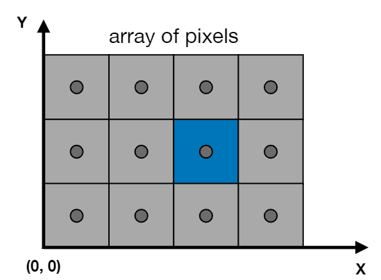
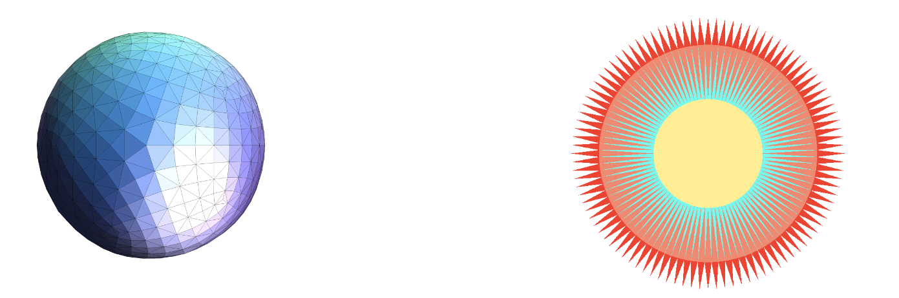
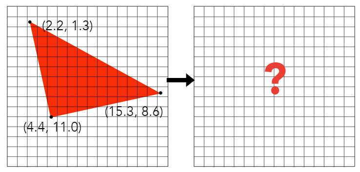

# Rasterization

## 目录
+ Rasterization
    + Canonical Cube to Screen
    + Rasterizing triangles
    + Aliasing
+ Antialiasing
    + Sampleing theory
    + Antialiasing in practice
+ Visibility/occlusion
    + Z-buffering
+ Shading
    + Illumination & Shading
    + Graphics Pipeline

## Rasterization
### Canonical Cube to Screen
经过 MVP 变换，得到了一个 ${[-1, 1]}^3$ 的标准立方体，我们需要把这个标准立方体绘制到屏幕上。
在了解这个过程之前，先做一些定义
+ 屏幕（screen）
    + 二维像素数组
    + 数组的大小被叫做分辨率（resolution），1920x1440就是1920列1440行像素（2k）
+ 光栅化（rasterize）
    + 绘制到屏幕上的过程
+ 像素（pixel，抽象意义上的概念，与实际不符）
    + 屏幕上显式的最小单位，只显示一种颜色
    + 像素颜色由 R G B 三个颜色值表示
+ 屏幕空间（screen space）
    
    + 用 2维坐标表示屏幕空间
    + 像素的坐标范围 $(0, 0)$ 到 $(width - 1, height - 1)$
    + 像素 $(x, y)$ 的中心是 $(x + 0.5, y + 0.5)$，可以看图中的蓝色像素 $(2, 1)$ 的中心为 $(2.5, 1.5)$
    + 由于每个像素宽度为 1，那么屏幕的范围实际是 $(0, 0)$ 到 $(width, height)$

现在，就可以把 ${[-1, 1]}^3$ 的标准立方体绘制到屏幕空间：
+ 舍弃 $z$ 轴得到 ${[-1, 1]}^2$ 的 2维图像
+ 将 ${[-1, 1]}^2$ 的 2维图像变换到屏幕空间 $[0, width] \times [0, height]$
+ 这个变换叫做视口变换，变换矩阵：
$$\LARGE M_{viewport} = \begin{pmatrix}
{\frac {width} 2} & 0 & 0 & {\frac {width} 2} \\
0 & {\frac {height} 2} & 0 & {\frac {height} 2} \\
0 & 0 & 1 & 0 \\
0 & 0 & 0 & 1
\end{pmatrix}$$

### 绘制一个三角形
#### 基础图元：三角形
图形学中常用三角形作为基础图元去表示其他复杂的形状

为什么要用三角形：
+ 三角形是最基本的几何单位
    + 复杂几何单位可以分解为三角形表示
+ 特殊性质
    + 三角形一定是在一个平面上
    + 明确的内外关系，可以使用叉乘快速计算点与三角形的内外关系
    + 良好的插值计算，使用重心坐标插值，计算简单效果好

#### 采样三角形
现在三角形经过 MVP + viewport 变换，变成了屏幕空间里的三角形，我们如何用像素近似表示出这个三角形？

一个简单的光栅化方法，**采样**
+ 将连续的函数离散化的过程
    一个连续的函数，我们在各个不同的地方去取它的值，这个过程就被叫做采样

如果用代码表示就像这样
```c++
for (int x = 0; x < xmax; ++x)
    output[x] = f(x);
```

现在我们需要在屏幕空间内拿所有像素对三角形做一次采样，过程就像这样
