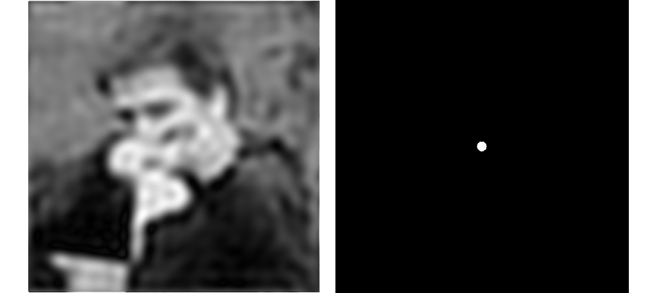
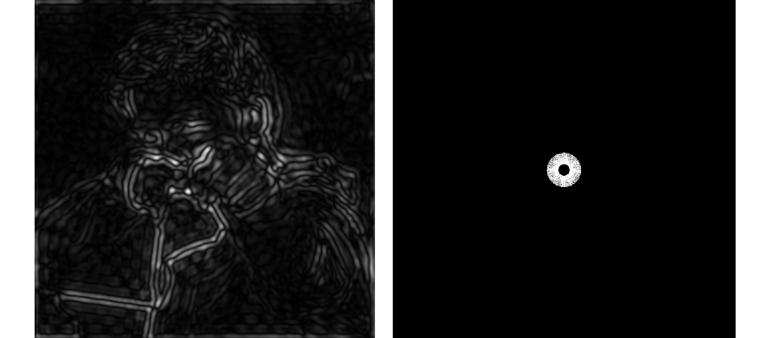
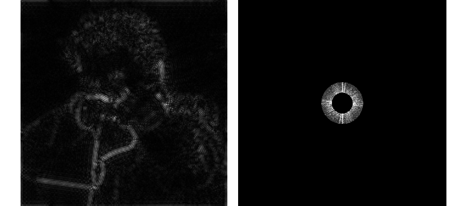
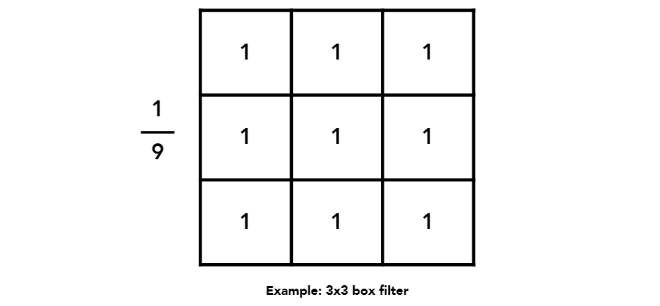
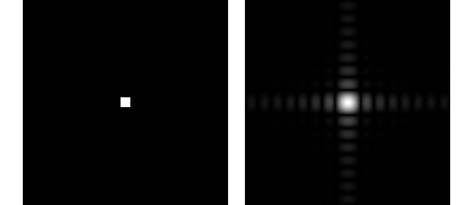
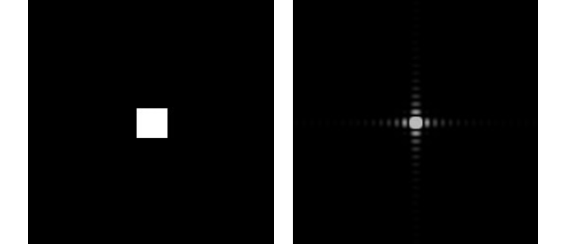
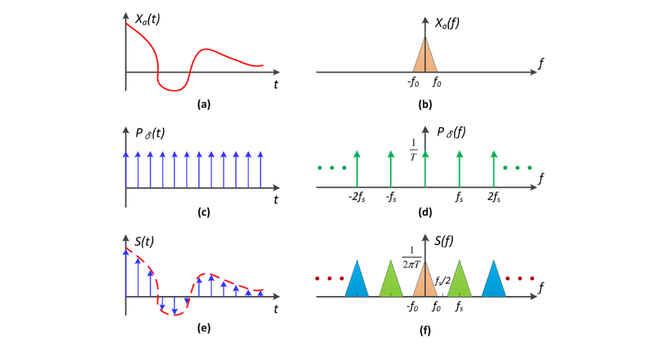

# Antialiasing and Visibility

## 目录
+ Antialiasing
    + Aliasing
    + Sampleing theory
    + Antialiasing
+ Visibility
    + Z-buffering

## Antialiasing
### Aliasing
我们光栅化三角形的三角形就像这样：

似乎有点不对，我们的三角形被像素表示出来就不是一个完整的三角形。像素是一个有大小的方块，被填色表示某些形状的时候，由于大小限制，就表示得有些问题。这个现象被叫做**走样（Aliasing）**，即像素作为采样过程中的最小单位来说过大了，采样频率过小。

这里举出几个常见的采样的例子：
+ Rasterization = Sample 2D Positions
+ Photograph = Sample Image Sensor Plane
+ Video = Sample Time

接下来看一下常见的走样所形成的问题：
+ Jaggies（锯齿），空间中采样

+ Moire（摩尔纹），对图片做降采样（把图片中的奇数列和奇数行给去掉）

+ Wagon wheel effect（车轮效应），时间中采样（常见于高速行驶的车辆，人眼观察车轮会有向后转的假象）

总结一下这些问题，走样的本质就是**信号的变换太快（高频），采样的频率太慢（采样间隔大）**

这里我们先给出反走样的方法：**采样之前先做模糊**
以光栅化三角形为例：

先对三角形做一次模糊（去掉高频的信号），把它变成一个边界模糊的三角形，采样边界时，离三角形边界近的地方像素颜色深一些，远的地方像素颜色浅一些
对于刚才的锯齿问题，我们做完预先模糊后采样的结果如下：

可以看见锯齿明显减少了，但是为什么做完模糊之后采样会减少我们的走样现象？
让我们来研究一下根本原因

### 采样的理论基础
#### 频域（Frequency Domain）
正弦波（Sines）和余弦波（Cosines）

我们以 $\LARGE \cos 2\pi fx$ 为例
+ 周期（$T$），每个多久重复自己一次，这里 $\LARGE T = 1$，$\LARGE \cos 2\pi x$ 函数每隔1个周期重复自己一次
+ 频率（$f$），周期的倒数，这里 $\LARGE f = \frac 1 T$

我们可以看出，频率越高代表重复自己一次的间隔越短

傅里叶级数展开（Fourier Series Expansion），周期函数可以由 $\sin$ 和 $\cos$ 函数展开式的权重和近似得到

$\LARGE f(x) = \frac A 2 + \frac {2A\cos(t\omega)} {\pi} - \frac {2A\cos(3t\omega)} {3\pi} + \frac {2A\cos(5t\omega)} {5\pi} - \frac {2A\cos(7t\omega)} {7\pi} + \cdot\cdot\cdot$
可以看到图中的周期函数经过傅里叶变换得到的结果，相似程度随着展开次数的增加而提高

傅里叶变换（Fourier Transform），任何一个函数都可以经过变换得到周期函数
$$\begin{split} 
\LARGE F(\omega) = \displaystyle\int_{-1}^{1}f(x)e^{-2\pi i\omega x}dx \\
\\ 
\LARGE f(x) = \displaystyle\int_{-1}^{1}F(\omega)e^{2\pi i\omega x}d\omega \\
\end{split}
\LARGE e^{ix} = \cos x + i \sin x
$$

**我们可以把转换后的结果定义为频域，也就是：傅里叶变换把信号从时域（spatial domain）转换到频域（frequency domain）**
那么对于任何函数 $f(x)$ 来说
+ 我们通过傅里叶变换把 $f(x)$ 转换为周期函数 $F(\omega)$
+ 我们通过傅里叶级数展开，用正弦和余弦函数去模拟 $F(\omega)$
+ 结合正弦和余弦的频率可知，频率越高得到的结果与原函数越相似

信号可以看做一种函数，那么看下图

这里展示了在固定的采样频率下，信号的频率越高，采样出来的结果就越差

现在我们从频率的角度理解走样

灰色的线条代表采样的频率，我们可以看见，在相同的采样频率下去采样频率差异巨大的两种函数，得到了相同的结果
也就是说，在当前的采样频率下，我们无法区分两种函数表示的信号

#### 滤波（Filtering）
前面我们提到反走样就是在采样之前先做一次模糊，把高频的信号给去掉，这个去掉某些频率信号的过程被叫做滤波。
**滤波就是去掉某些特定频率的信号（Filtering = Getting rid of certain frequency contents）**
现在我们借助前面提到的频域来理解滤波的过程和结果
##### 频域可视化

+ 我们把左边的信号做傅里叶变换，它从时域变到频域
+ 我们把它的频域表示可视化出来，得到右边的图案
    这里有几点需要注意：
    + 中心定义为低频区域，周围定位高频区域，也就是说从中心到四周，频率是在变高的
    + 用亮度来表示不同位置（频率）上有多少信息，图里的中心位置比较亮就表示图片大多是信息都是低频信息
    + 水平和竖直的线含义
    我们分析信号的时候会认为信号是周期性的，在处理非周期信号时（例如图片），我们会人为的重复这个段信号（图片水平和竖直重复），但是这段信号的左右边界不相同，在边界连接处信号发生了剧烈变换（同一张图片首尾相连，这个连接的地方有非常明显的差异），在频域中就呈现出明显的高频差异，表现上就是一条水平和竖直的白色线条

现在我们尝试对这个图片进行滤波，即去除频域中某一块区域（某一段频率）的信息
##### 高通滤波

+ 我们把低频区域全部去掉，仅保留高频区域，这被称为高通滤波（High-pass filter），如图中右边所示
+ 然后我们对频域的信号做逆傅里叶变换，还原剩余的高频信息，得到了左边的图像
+ 还原后的信息表示了图像内容的边界（轮廓），边界的两边信号的差异比较大
##### 低通滤波

+ 我们把高频区域全部去掉，仅保留低频区域，这被称为低通滤波（Low-pass filter），如图中右边所示
+ 然后我们对频域的信号做逆傅里叶变换，还原保留的低频信息，得到了左边的图像
+ 我们发现图像变模糊了，图像内容的轮廓不见了
##### 去掉高频和低频信息

这里对比了分别保留不同的频率信号时，图像的变化，我们可以观察得出**保留的频率越高，图像内容的边界越明显**

#### 卷积（Convolution）与滤波
Filtering = Convolution = Averaging
##### 卷积
我们认识一下什么是卷积，如图所示

+ 用滤波器Filter对信号数组Signal做卷积，得到结果Result
+ 信号值与滤波器做点乘，再将结果写回，这个过程被称为卷积
    如图中的第二个信号值做卷积，就是将信号值按照Filter的权重值进行平均计算，然后把结果写回第二个信号值
    $Signal[1] = Signal[0] * Filter[0] + Signal[1] * Filter[1] + Signal[2] * Filter[2]$
+ **卷积就是按照滤波器的权重对周围的信号值做加权平均（这里是不完全正确的说法，只是用来简易理解，并非数学上的卷积）**

##### 重要的结论
**时域上做卷积就是在频域上做乘积，在时域上做乘积就是在频域上做卷积**
现在对信号做卷积有两种方法：
+ 用滤波器在时域上对信号做卷积（加权平均）
+ 在频域上做乘积
    + 把信号和滤波器变换到频域上（傅里叶变换）
    + 变换后的信号和滤波器相乘
    + 将结果逆变换回时域（逆傅里叶变换）

这里给出这个结论的例子：

+ 对图像信号做卷积，对像素做3x3的平均，即对图像做均值模糊
+ 对应就是频域上，将两个频域信号做乘积
+ 从频域观察可得，相当于在频域做了一个低通滤波，只留下了低频信号（前面提到了频域低通滤波就是对图像做模糊）

##### Box Filter

这个滤波器（数学上称为卷积核）是把像素周围9个点的值做平均，然后乘上 1/9 做归一化，而作用就是我们上面提到的做模糊
用傅里叶变换把它变到频域上，就得到了我们上面提过的低通滤波：

如果把这个filter kernel的范围放大，那么对应的时域将会怎么样变换？

卷积核越大，对应频率就越低
+ 如果图片做平均的范围越大，那么图像就会越模糊，频域保留的低频信号区域就越小
+ 推到极限，如果平均的范围囊括了整张图，那么每个像素的值都一样，也就是说图像的信号值没有差异，在频域也就表示为中心的一点

#### 从频域的角度理解走样
Sampling = Repeating Frequency Contents

+ 时域上有一个函数 $X_{\alpha}(t)$ ，如图（a）所示
+ $X_{\alpha}(t)$ 的频域表示为 $X_{\alpha}(f)$ （被称为频谱），如图（b）所示
+ 函数 $P_{\delta}(t)$ 是冲激函数，只在固定位置有值的函数（用来采样的函数），如图（c）所示
+ 冲激函数 $P_{\delta}(t)$ 的频域表示为 $P_{\delta}(f)$ ，也是一个冲激函数，如图（d）所示
+ 对函数 $X_{\alpha}(t)$ 用冲激函数 $P_{\delta}(t)$ 采样，也就是将两个函数乘起来，得到采样结果 $S(t)$ ，如图（e）所示
+ 在时域做乘积，就是对频域做卷积，采样也就是对频域 $X_{\alpha}(f)$ 函数用冲激函数 $P_{\delta}(f)$ 做卷积，得到采样结果 $S(f)$ ，如图（f）所示

经过上述操作我们可以得出结论，采样就是在重复原始信号的频谱（在频域做重复）

那么由此可知，Aliasing = Mixed Frequency Contents，走样就是频谱在频域卷积冲激函数时发生了混叠，如下图：

+ 采样的间隔会影响在频域对原始信号重复的步长，即采样间隔越大（采样频率约小）对应的频域重复信号的步长越小
+ 在密集采样（Dense sampling）时，采样间隔很小，那么它在频域重复原始信号时的步长足够大，大到足以在一个步长内容纳完整的原始信号
+ 在稀疏采样（Sparse sampling）时，采样间隔很大，它在频域重复原始信号的步长较小，导致一个步长内不能完整重复原始信号，导致了频谱混叠
