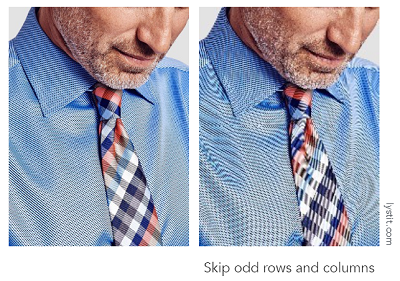

# Antialiasing and Visibility

## 目录
+ Antialiasing
    + Aliasing
    + Sampleing theory
    + Antialiasing
+ Visibility
    + Z-buffering

## Antialiasing
### Aliasing
我们光栅化三角形的三角形就像这样：

似乎有点不对，我们的三角形被像素表示出来就不是一个完整的三角形。像素是一个有大小的方块，被填色表示某些形状的时候，由于大小限制，就表示得有些问题。这个现象被叫做**走样（Aliasing）**，即像素作为采样过程中的最小单位来说过大了，采样频率过小。

这里举出几个常见的采样的例子：
+ Rasterization = Sample 2D Positions
+ Photograph = Sample Image Sensor Plane
+ Video = Sample Time

接下来看一下常见的走样所形成的问题：
+ Jaggies（锯齿），空间中采样

+ Moire（摩尔纹），对图片做降采样（把图片中的奇数列和奇数行给去掉）

+ Wagon wheel effect（车轮效应），时间中采样（常见于高速行驶的车辆，人眼观察车轮会有向后转的假象）

总结一下这些问题，走样的本质就是**信号的变换太快（高频），采样的频率太慢（采样间隔大）**

### Antialiasing
这里我们先给出反走样的方法：**采样之前先做模糊**
以光栅化三角形为例：

先对三角形做一次模糊（去掉高频的信号），把它变成一个边界模糊的三角形，采样边界时，离三角形边界近的地方像素颜色深一些，远的地方像素颜色浅一些
对于刚才的锯齿问题，我们做完预先模糊后采样的结果如下：

可以看见锯齿明显减少了，但是为什么做完模糊之后采样会减少我们的走样现象？
让我们来研究一下根本原因

#### 频域（Frequency Domain）
正弦波（Sines）和余弦波（Cosines）

我们以 $\LARGE \cos 2\pi fx$ 为例
+ 周期（$T$），每个多久重复自己一次，这里 $\LARGE T = 1$，$\LARGE \cos 2\pi x$ 函数每隔1个周期重复自己一次
+ 频率（$f$），周期的倒数，这里 $\LARGE f = \frac 1 T$

