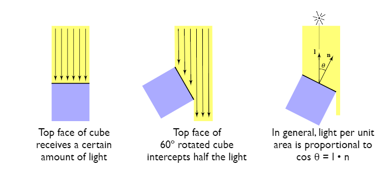

# Shading
If you can not render Mathematical formula, please read this [Shading.pdf](./Shading.pdf)

## 目录
+ [Blinn-Phong Reflectance Model](#blinn-phong-reflectance-model)
+ [Shading Frequecies](#shading-frequencies)
+ [实时渲染管线](#实时渲染管线)
+ [重心坐标插值](#重心坐标插值)
+ [纹理映射](#纹理映射)
+ [Mipmap](#mipmap)
+ [纹理的应用](#纹理的应用)
+ [阴影贴图](#阴影贴图)

## Blinn Phong Reflectance Model
### 光线类型
以下图为例，将光线分为不同类型：


+ Specular highlights，镜面反射高光（也被称为镜面光），可以观察图中比较亮的高光部分，这里接收到的光线经过镜面反射，将光线射入摄像机，这种光被称为镜面光
+ Diffuse reflection，漫反射光，物体除高光外，整体表现出一个变化不明显的颜色，这是光线在物体表面发生漫反射，只有一定类型的光辉射入摄像机，这些光线被叫做漫反射光
+ Ambient lighting，环境光，图中杯子的最左侧，可以看到没有光照直射，但是仍然可以看见光，因为这是光线多次反射折射所形成的光，它的来源很复杂，我们把它简化为一种光，叫环境光，一般是被设置为常量

### 基础着色定义
简化一下着色场景，只考虑对抽象出来的着色点进行着色（我们认为这个着色点是一个平面），我们做出一下基本定义：
+ 观察方向 $\vec V$ ，即我们摄像机的Lookat方向
+ 着色点的法向 $\vec n$ ，即平面的法向
+ 光线的入射方向 $\vec I$
+ 这些值只取方向不取大小，因此他们被定义为单位向量
+ 还有一些其他物体表面的属性
    + 颜色color
    + 光滑度shininess
    + $\cdot \cdot \cdot$


着色具有局部性，它只考虑当前这个点本身，不关注这个点是否遮挡其他物体

### 漫反射光
光线打到物体的表面会被均匀的散射到各个方向，从所有观察方向上都会看到同一种颜色，这就是物体的颜色


但是漫反射实际接收到的光要受到两个条件的约束——入射角度和光源距离
+ **光线的入射角度影响物体接收到光的大小，可以使用 $\cos\theta = \mathbf{n} \cdot \mathbf{l}$ 来表示**
    Lambert's cosine law（Lambert余弦定理）：以不同角度接收到的相同强度的光，所获得的光线数量（光能）不一样
    + 假设光是离散的，在垂直入射到shading point的数量是6
    + 光照不变，仅仅是将shadingpoint旋转60度，此时入射光线只有3，接收到的光减少了，物体表面就会暗一些
    + 我们推广可得，物体接收到的光的大小和光线方向与法向的夹角负相关，和 $\cos\theta = n \cdot l$ 正相关

    

+ **光源的距离影响物体接收到光的大小，可以使用 $I/r^2$ 来表示**
    光的能量会随距离增加而衰减：距离越远，单位面积内接收到的光能越小
    + 假设点光源向外辐射的光能是离散的，下图是不同时刻光能在不同位置的可视化
    + 由能量守恒假设光能不会衰减，那么每个时刻的光能总量不变，即每个光圈代表的能量相同
    + 那么随着距离的增加，光圈面积变大，那么单位面积内接收到的光能就减小了
    + 光能大小和球体面积的增加成反比，即 $I/r^2$

    
    
给出漫反射的着色公式：

$\LARGE L_d = k_d(I/r^2)max(0, \mathbf{n} \cdot \mathbf{l})$
+ $L_d$，与观察方向没有关系，因为漫反射是均匀的向各个方向上散射，所有方向光都一样
+ $k_d$，漫反射系数，表示这个点的吸收率（明暗）；如果用一个RGB值来表示这个系数，就可以表示这个shading point的颜色
+ $I/r^2$，光强随距离的增加而衰减
+ $max((0, \mathbf{n} \cdot \mathbf{l})$，这里约束为非负数，因为 $\mathbf{n} \cdot \mathbf{l}$ 的结果为负表示光从下方射过来，这样对这个着色点完全没有贡献（不考虑折射）


这里就展示了，光照不变的情况下，漫反射系数越大那么物体就越亮

### 镜面反射光
在光线镜面反射的出射方向附近看向shading point，会发现shading point更加明亮，也就是说镜面反射方向 ${R}$ 与观察方向 ${v}$ 的夹角越小，镜面反射光越大


在 Blinn-Phong光照模型中，镜面反射方向和观察方向的关系转换为了半程向量与法向的关系
+ 半程向量与法向越接近，表示镜面反射方向与观察方向越接近


+ 镜面反射方向比较难求，但是半程向量非常好计算
+ 半程向量公式：$\mathbf{h} = bisector(\mathbf{v}, \mathbf{l}) = \frac {\mathbf{v + l}} {||\mathbf{v + l}||}$

给出镜面反射的着色公式：
$$\LARGE\begin{split}
L_s &= k_s(I/r^2){max(0, \cos\alpha)}^p \\
    &= k_s(I/r^2){max(0, \mathbf{n \cdot h})}^p
\end{split}$$
+ $L_s$，镜面反射光
+ $k_s$，镜面反射系数；如果用一个RGB值来表示这个系数，就可以表示这个shading point高光的颜色
+ ${max(0, \mathbf{n \cdot h})}^p$ ，光使用夹角来表示高光的变化太过于平滑，真正的高光是只有一小段夹角才能观察到，因此给夹角关系增加一个指数级的系数，来凸显高光跟角度的剧烈变化关系

    

    只要角度轻微变化，那么这个项的值就会快速衰减，这正符合我们对镜面高光的期望

这里就展示了，光照不变的情况下，漫反射系数越大那么物体高光就越亮；$p$值越大，高光区域就越小


### 环境光
光线经过环境中所有物体的多次反射与折射，最终照射到shading point，这一部分光太过于复杂，被Blinn-Phong模型近似成了一个固定值，不受任何参数的影响
给出环境光的着色公式：

 $\LARGE L_a = k_aI_a$
+ $L_a$，环境光反射
+ $k_a$，环境光系数；如果用一个RGB值来表示这个系数，就可以表示这个shading point环境光的颜色

### Blinn-Phong Reflection Model
我们用上面提到的三种光照将Blinn-Phong光照明模型给组合起来：
$$\LARGE\begin{split}
L &= L_a + L_d + L_s \\
    &= k_aI_a + k_d(I/r^2)max(0, \mathbf{n} \cdot \mathbf{l}) + k_s(I/r^2){max(0, \mathbf{n \cdot h})}^p
\end{split}$$
作用于模型的结果如下：


+ 环境光，给模型所有位置均匀的光照
+ 漫反射光，光线照射到模型的方向与模型法线，夹角越小的地方，光照越强
+ 镜面反射光，观察方向和光线的镜面反射方向接近的地方，模型会产生高光

## Shading Frequecies
### 三种着色频率
展示同一个球模型在三种不同着色频率的着色结果：


+ 面着色(Flat shading)，以模型的三角面为最小单位，计算光照，给面的所有像素设置相同的颜色

    
    
    + 三角形可以求取面法线，作为光照模型的中shading point的法向
    + 这个着色在平滑曲面的表现很不好
+ 顶点着色(Gouraud shading)，以模型的顶点为单位，计算每个顶点的光照，然后使用顶点颜色给三角形内的像素插值
    
    

    + 三角形各个点的颜色由顶点插值得到
    + 这个点所在的几个面的法线做平均来求取顶点的法线
    + 这个着色对高光描述得不是很好
+ 像素着色(Phong shading)，以像素为单位，计算每个像素的光照
    
    

    + 三角形每个像素的法线由三角形的顶点插值获得
    + 着色是计算每个像素的颜色值

下图展示随着模型精细度越来越高之后，不同着色频率的实际效果：


当模型足够复杂细致（顶点、面数足够多）的时候，不同着色频率的效果以及几乎没有差别了。
这个时候，Phong shading的劣势就凸显出来了。因为着色单位小意味着着色计算量大，那么复杂模型Phong shading的消耗就比较高了。

### 顶点法向
我们使用一种简单的策略来求顶点的法向，即算取顶点所在面的法向的平均值

 $\LARGE N_v = \frac {\sum_i N_i} {||\sum_i N_i||}$

后续可以使用加权平均来做优化

### 像素法向
我们已经有了每个顶点的法向，使用三角形重心插值法，可以计算出三角形内任意一点的法向

## 实时渲染管线
### 管线总览


管线的作用就是把我们的三维场景渲染成二维的图像

### 管线各阶段说明
+ Vertex Processing
    这个阶段，主要是把我们输入的顶点进行MVP变换，得到屏幕空间的顶点表示，方便后续处理
    
    

+ Triangle Processing
    按照一定顺序，将顶点组成不同的三角形
    了解图形API的对这一步应该都有印象，indexbuffer的顺序就定义了如何组成三角形
+ Rasterization
    对每个像素进行采样，判断像素在不在三角形内
    
    

+ Fragment Processing
    + 判定每个像素位置哪些物体可见，使用Z-Buffer做深度测试

        

    + 计算shading point（根据不同的着色频率决定不同粒度的shading point）的颜色，并着色

        

    + 这个阶段也会做纹理映射，简单说就是把贴图（颜色、法线等等）给映射到物体的不同位置上，后面会详细说明这一部分

        

    + 着色并不只是发生在这个阶段，还是拿图形学API做例子，我们也可以在 VS 阶段对顶点进行颜色修改，这也算是着色的一种
+ Framebuffer Operations
    根据像素大小，最终生成一个用于显示的Framebuffer

## 重心坐标插值
为了得到三角形内部任意一点的属性值（从顶点到任意一点，数值平滑过渡），我们使用重心坐标进行插值，根据三角形三个顶点的属性和任意一点的重心坐标来计算属性值
### 重心坐标


+ 三角形平面上任意一点，都可以由三角形三个点线性组合而成
+ 线性组合系数加起来要等于1
+ 如果点在三角形内，那么三个点的属性都要是非负的

公式表示为：
$$\LARGE
(x, y) = \alpha A + \beta B + \gamma C \\
\alpha + \beta + \gamma = 1
$$

我们以 $A$ 点来理解一下：


现在我们来算线性组合系数


顶点的系数，等于顶点对应的那条边与任意点组成的三角形与原三角形的面积比，公式如下：
$$\LARGE
\alpha = \frac {A_A} {A_A + A_B + A_C} \\
\beta = \frac {A_B} {A_A + A_B + A_C} \\
\gamma = \frac {A_C} {A_A + A_B + A_C}
$$

现在，我们能快速得到，三角形重心（将三角形按面积均分的点）的重心坐标表示


去算每一个三角形的面积，然后通过相比得出线性组合系数，是非常复杂且慢的过程，这里简化计算过程：
$$\LARGE \begin{split}
&\alpha = \frac {-(x - x_B)(y_C-y_B) + (y - y_B)(x_C - x_B)} {-(x_A - x_B)(y_C-y_B) + (y_A - y_B)(x_C - x_B)} \\
&\beta = \frac {-(x - x_C)(y_A-y_C) + (y - y_C)(x_A - x_C)} {-(x_B - x_C)(y_A-y_C) + (y_B - y_C)(x_A - x_C)} \\
&\gamma = 1 - \alpha - \beta
\end{split}$$

如果我们分别给 $A, B, C$ 三个点设置为 $R, G, B$ 三种颜色，那么我们可以得到这样一个重心插值结果：


得到了一个非常丝滑的结果

## 纹理映射
### 什么是纹理
纹理映射就用一张图去填充物体的表面，让物体各个位置有自己的颜色值。推广开来就是，我们用图来存储物体表面各个位置的不同属性，然后在着色阶段，我们根据这张图来获取想要的位置的属性。


我们以Blinn-Phong的漫反射为例，漫反射着色公式：$L_d = k_d*(l/r^2)*(\mathbf{n \cdot l})$
+ 图中皮球的漫反射光都是使用同一个漫反射公式，球的任意一点离光源的距离一样，但各个部分的颜色并不相同，这就是球各个位置都有自己的漫反射系数
+ 图中的地板也是这样，距离光源的位置没有改变，但各个部分的颜色也不尽相同，地板模型各个位置的漫反射系数不同

我们可以想象，模型把各个位置的系数存在一张贴图里面，在着色时我们根据模型的位置去获取贴图的数据，就拿到了shading point的漫反射系数

### 纹理映射
纹理映射，简单来说就是把物体表面的属性给赋值到一张图片上去，能做到物体表面任意一点的属性都能在图片上找到对应的一个属性值存储点
这种对应过程，有一点需要我们去理解：**任何一个三维物体，它的表面都是二维的**，我们通过地球与地图的关系来理解这一点


地球本身是一个三维物体，但我们制作的地图都是二维的，我们将地球绘制到图上，这个过程就是纹理映射的过程

展示一个纹理应用到物体表面的例子：


这是一个模型着色前和着色后的样子


这是模型的颜色纹理图，我们可以找到眼睛下方的一块小三角形


这个纹理上的小三角形与模型表面的小三角形一一对应，我们找到对应的地方，将颜色绘制上去

我们将模型的每一个顶点都映射到纹理上，使用一个叫纹理坐标的坐标系进行表示


+ 通常使用 `(u, v)` 来表示纹理坐标系
+ `u, v` 值的范围默认为 $[0, 1]$

### 使用纹理
我们有顶点和顶点对应的纹理坐标，那么使用纹理坐标为顶点取数据就是一件很自然的事情。我们只需要拿着顶点的纹理坐标去纹理上做查询，或者说去纹理上做采样，就能得到对应的数值。
在 shader 里常见的形式是这样
```
(u, v) = evaluate texture coordinate at (x, y);
texcolor(x, y) = textur.sample(u, v);
```
这里以漫反射系数（即物体颜色）为例，我们去采样每一个像素的颜色，得到物体每个像素的漫反射系数

### 纹理放大
#### 纹素
我们把屏幕最小的显色单位叫做像素（pixel），对应的我们把纹理的最小单位叫做纹素（texel），可以用 `A pixel on a texture` 来理解
#### 纹素过小
我们来想象一下，我们为一个很大像素的物体采样一张很小的纹理，那么很多像素会被映射到同一个纹素上，最终呈现在画面上就有许多类似锯齿的形状


#### 双线性插值
我们使用双线性插值（Bilinear Interpolation）来解决纹素过小的问题，让某些像素的纹理变换不那么剧烈


基本步骤如下：
+ 有一个 $4 \times 4$ 的纹理，我们用像素更多的对象对它进行采样
    这个红色点的纹理采样值应该怎么计算

    

    *~~最简单的方法就是取离红色点最近的纹素，但这显然不能解决问题~~*
+ 我们找到离红色点最近的四个纹素
    如下图选取的浅红色纹素

    

+ 我们计算出离红色点最远的纹素，距离红色点的水平距离和竖直距离
    水平和竖直距离我们使用 $(s, t)$ 表示

    

+ 我们定义线性插值（Linear Interpolation）
    + $lerp(x, v_0, v_1) = v_0 + x(v_1 - v_0)$
    + 直白的说，据说按照比例 $x$ 去 $v_0, v_1$ 线性的取对应的点
+ 我们先对纹素做水平线性插值，得到竖直方向的两个点 $u_0, u_1$
    + $u_0 = lerp(s, u_{00}, u_{10})$
    + $u_1 = lerp(s, u_{01}, u_{11})$

    

+ 我们最后对 $u_0, u_1$ 做竖直的插值，就得到了红色点处的纹素的值
    + $f(x, y) = lerp(t, u_0, u_1)$

    

#### 纹素过大
那么反过来，我们为物体采样一张很大的纹理，每个像素采样得到的纹素都距离很远（一个像素对应一片纹素区域），最终呈现到画面上远处有摩尔纹，近处有锯齿


分析一下原因


我们发现，像素采样纹理的区域不是固定的，距离越远的像素，采样的纹素越多，但是我们只能取其中一个纹素来代表整个采样区域的纹素值变化，这显然的不对的
远处的像素对应的纹素太多了，也就是远处的采样频率太低了（纹素多也就是频率高，像素少对应采样频率低），我们是否可以使用反走样来解决这个问题呢？显然可以，下图是 $512 \times$ supersampling 的结果


超采样的效果很好，但是它的性能消耗也是非常巨大的，这一点我们并不能接受
那么我们转变一下思路，既然不能提高采样频率，那么我们直接就取这块纹素区域的平均值作为采样的结果，即得到某个区域的平均值，也被叫做范围查询
+ 点查询：查询像素和纹理对应的值
+ 范围查询：查询某一个范围内纹理的值（可以查范围内的平均值，最大值，最小值等特殊值），简单理解就是以某个方法得到一个值来代表这个范围的对外查询值

范围查询其实可以理解成，我们把信号的频率降低了，降低到采样频率可以接受的范围，这样就减缓了走样问题

## Mipmap
图形学上广泛使用的范围查询的方法
+ 快速查询
+ 近似查询，结果不准确
+ 方形查询，只能在正方形范围做查询

下面是128分辨率的贴图和它的mipmap：


每一级mipmap贴图的分辨率都是上一级的一半

我们来估算一下mipmap的消耗，假设原贴图的长度为1，可以得到以下计算公式：
$$\begin{split}
mipmap
&= 1 \times 1 + \frac {1} {2} \times \frac {1} {2}+ \frac {1} {4} \times \frac {1} {4}+ \frac {1} {8} \times \frac {1} {8} + \cdot \cdot \cdot + \frac {1} {2^{level}} \times \frac {1} {2^{level}} \\
&\lessapprox \frac {4} {3}
\end{split}$$
所以Mipmap相较于原图，消耗仅仅增加了 $1/3$

### 计算Mipmap等级
#### Mipmap Level D


我们通常把原图叫做 $D = 0$ ，即mipmap等级为0

#### 计算过程
在采样纹理之前，我们将像素从屏幕空间还原到纹理空间


这里可以清晰的看见，原来紧密的像素还原到纹理空间后间距变大了，这表示这个像素需要采样的纹理的区域从一个纹素变成了一个纹素区域

我们现在来确认，其中一个像素该采样的纹理区域有多大


我们使用在纹理空间像素和周围其他像素的距离来组成一个四边形，这个四边形就是该像素采样时范围查询的区域
公式著名的“DDX,DDY”算法来计算这个距离：
$$L = max\Bigg(\sqrt{(\frac{du}{dx})^2 + (\frac{dv}{dx})^2}, \sqrt{(\frac{du}{dy})^2 + (\frac{dv}{dy})^2}\Bigg)$$
这里为什么会使用max函数呢？
还记得吗，mipmap只能做方形查询，因此我们取最长的距离来将原来的区域近似为方形


我们需要做的就是根据我们得到的 $L$ 来找到对应的mipmap等级 $D$
我们在前面计算面积的时候有这样一个规律：第 $level$ 层的长度为 $2^{level} = 2^D = L$
那么现在我们知道 $L$ ，自然可以求出 $level = D = lgo_{2}{L}$

我们现在可以了立即采样对应等级的mipmap了

我们可视化使用mipmap的结果


但是结果并不连续，他的每一层差异很明显

### 三线性插值优化Mipmap
我们使用三线性插值（Trilinear Interpolation）来解决每一层的差异问题


+ 分别为 level D 和 level D+1 做双线性插值求出各自等级纹理数据
+ 把 Bilinear result D 和 Blinear result D+1 再做一次线性插值，得到mipmap层级连续的纹理数据

每层计算纹理数据是双线性插值，即做了两次线性插值，把结果再做一次线性插值就被叫做三线性插值（Trilinear Interpolation）


计算开销不大的情况下，效果还是很好的

### mipmap的缺陷
我们尝试解决原问题场景：


我们确实将原问题的锯齿和隔断的去掉了（左问题场景，中原图，右mipmap），但是mipmap采样得到的结果，非常的模糊（Overblur）

原因是，mipmap只能做方形查询


当像素映射到类似矩形的区域，再使用最大长度做mipmap level计算，就相当于使用了一个更大的方形区域做采样，求了一个大区域的平均，这就是做了一次模糊，就造成了Overblur

### 各向异性过滤缓解Overblur
各向异性过滤（Anisotropic Filtering，各向异性指各个方向表现不相同）对应的处理贴图方法叫做Ripmap
mipmap是对原贴图做每次缩小长宽各一半的压缩，而Ripmap做的就是分别对长和宽方向做原长度一般的压缩


对角线的压缩结果就是mipmap，水平和竖直方向的压缩结果就是Ripmap


最右就是各向异性过滤的结果，效果还算比较不错，但它只能解决类似矩形区域查询的问题，如果其他形状的区域查询，仍然有问题

### EWA filtering解决Overblur


大致思路为：把任意形状分解为不同的圆形，然后又对圆形进行多次查询，得到较为准确的结果
多次查询，开销较大，基本没有被使用到

## 纹理的应用
这里介绍一下场景的纹理的应用场景和对应的技术
### 环境贴图


我们将周围的光照信息（环境光）收集到一张纹理上，然后将它应用到物体表面，以这样的方式来模拟物体对周围的反射

#### Spherical Environment Map
我们可以将环境信息记录到一个球形贴图上，它包含了周围360度的环境信息，可以很好的记录物体周围的环境信息


但是把它展开成一个正常贴图，会在上方和下方产生扭曲（世界地图的上下靠近极点处较小，就是这个原因）


#### Cube Map
我们可以将球面映射到一个立方体上，来消除球形贴图展开产生的扭曲
这个映射的过程就是，球心和球面连线的延长线达到立方体表面的某一个点，一一做对应


看一下立方体贴图的展开面是什么样子


这个展开的贴图已经没有扭曲现象了，它仍然记录了周围环境的信息

### 影响着色
纹理不止可以表示颜色，还可以存储一些其他在着色中可能使用到的数据
#### Bump Mapping
我们以使用凹凸映射（Bump Mapping）来模拟物体凹凸不平的表面


图中橘子凹凸不平的表面，并不是我们做了这么细致的建模，而是我们使用贴图来改变了着色的结果，模拟处理凹凸不平的效果

基本原理：
+ 不改变顶点的位置
+ 扰动每个像素的面法线
+ 使用纹理来定义每个纹素的相对高度
+ 由高度差引起面法线发生改变


在这整个过程中我们只是假设对物体表面进行了高度变换，经过计算求出了变换后的法线，把这个法线应用到最后的着色上

我们现在来看扰动法线的过程（以2D为例）：
+ 原表面点 p 的面法线是 $n(p) = (0, 1)$
+ 高度变换后，我们算出变换后点 P 的切线 $dp = c * [h(p+1) - h(p)]$
    + c 是认为引入的常数，用来表示高度图的影响程度
    + 我们使用差分方法求切线
    + 点 p 的切线 $t(p) = (1, dp)$
+ 使用切线旋转90度算出扰动后的法线 $n(p) = (-dp, 1)$


推广到三维时，同理：
+ 原表面点 p 的面法线是 $n(p) = (0, 0, 1)$
+ 纹理的 u, v 方向分别求导
    + $dp/du = c1 * [h(u+1) - h(u)]$
    + $dp/dv = c2 * [h(v+1) - h(v)]$
+ 使用切线旋转90度算出扰动后的法线 $n(p) = (-dp/du, -dp/dv, 1)$

#### Displacement Mapping
位移映射，使用凹凸映射用到的同一张高度贴图，对顶点进行实际的位移操作，改变模型顶点的位置（需要模型的三角形足够细，能支持我们使用高度图对顶点进行位移）


可以看到凹凸映射在物体边缘和阴影形状上会露馅，但是位移映射就没有这样的问题

#### 3D Procedural Noise + Solid Modeling
将纹理假设为3维的，我们可以使用立体纹理来表示任意一点的值，它被表示为3维空间的噪声函数，我们根据3维空间的坐标去算出噪声值，然后应用到物体上


#### 环境光遮罩
模型的环境光也不总是一样，在角落或者沟壑，环境光应该相对较弱，我们可以使用环境光遮罩贴图来记录这些信息，并将它用到着色过程中


#### 3D Textures and Volume Rendering
一些立体的空间每一点的信息，我们也可以把它当做纹理来处理（如X光扫描，核磁共振的结果等等）


## 阴影贴图
在光栅化的前提下进行着色，我们是没有办法处理遮挡产生的阴影，着色只会处理局部的光源、着色点（甚至不会是几何体的整体，而是局部表面）、相机之间的关系，无法判断当前着色点是否处于遮挡产生的阴影中

因此，我们使用 Shadow mapping 技术来完成对阴影的相关处理


### Shadow Mapping
+ Shadow mapping 是一种基于图像空间的算法
    + 在计算阴影的整个过程中，我们都不用知道场景的几何信息（所以是基于图像空间）
    + 我们必须处理阴影的走样问题（阴影贴图转换到世界空间时，会发现阴影贴图与真实的世界坐标不是一一对应的，会产生走样和精度差异）
+ 核心思想：着色点是否在阴影中由光源和相机共同决定

### 核心过程
+ 从光源位置出发，渲染出一张深度图
    + 从光源看向场景，做一次类似光栅化的处理
    + 我们可以得到从光源朝向场景，所能看到的图
    + 将看到的所有点的深度记录下来，生成一张深度图

    

+ 从相机位置出发，重新对场景进行渲染

    

+ 把相机能看到的点放到光源空间中做处理
    + 将点映射回光源空间，计算点在光源空间的深度值

    

    + 将点的深度值与对应坐标下深度图的值做比较，来判断该点是否接受光照，即是否在阴影中

    

### Visualizing Shadow Mapping
对比一下同一个场景，使用 Shadow mapping 和不使用 Shadow mapping 渲染出来的结果：


我们看一下这个场景从光源位置看到的画面：


我们记录下这个画面的每个点（每个像素）的深度值，并显示出来：


将深度图放到实际渲染过程中去做深度比较：


我们实际会从这张图发现，比较结果不是逐像素的，在物体表面有很多像素区域没有判断出深度信息，这就是我们在前面提到的 Shadow mapping 的缺陷：

阴影贴图转换到世界空间时，会发现阴影贴图与真实的世界坐标不是一一对应的，会产生走样和精度差异

### Shadow Mapping Artifact
简单介绍 Shadow mapping 的瑕疵，这里我推荐[Learn OpenGL](https://learnopengl-cn.github.io/)的阴影章节对 [Shadow mapping 瑕疵的介绍和处理](https://learnopengl-cn.github.io/05%20Advanced%20Lighting/03%20Shadows/01%20Shadow%20Mapping/)

+ Hard shadows

    

    

+ 深度图的分辨率对阴影质量影响很大
+ 阴影贴图和世界坐标并不能一一对应，由浮点数精度造成的问题