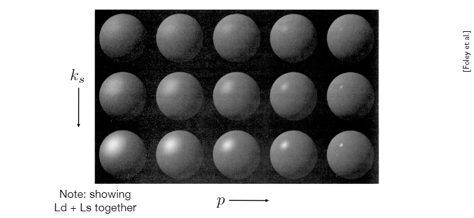

# Shading

## 目录
+ [Blinn-Phong Reflectance Model](#blinn-phong-reflectance-model)
+ [Shading Frequecies](#shading-frequencies)
+ [Graphics Pipeline](#graphics-pipeline)
+ [Texture Mapping](#texture-mapping)
+ [Barycentric Coordinates](#barycentric-coordinates)

## Blinn Phong Reflectance Model
### 光线类型
以下图为例，将光线分为不同类型：

+ Specular highlights，镜面反射高光（也被称为镜面光），可以观察图中比较亮的高光部分，这里接收到的光线经过镜面反射，将光线射入摄像机，这种光被称为镜面光
+ Diffuse reflection，漫反射光，物体除高光外，整体表现出一个变化不明显的颜色，这是光线在物体表面发生漫反射，只有一定类型的光辉射入摄像机，这些光线被叫做漫反射光
+ Ambient lighting，环境光，图中杯子的最左侧，可以看到没有光照直射，但是仍然可以看见光，因为这是光线多次反射折射所形成的光，它的来源很复杂，我们把它简化为一种光，叫环境光，一般是被设置为常量

### 基础着色定义
简化一下着色场景，只考虑对抽象出来的着色点进行着色（我们认为这个着色点是一个平面），我们做出一下基本定义：
+ 观察方向 $\vec V$ ，即我们摄像机的Lookat方向
+ 着色点的法向 $\vec n$ ，即平面的法向
+ 光线的入射方向 $\vec I$
+ 这些值只取方向不取大小，因此他们被定义为单位向量
+ 还有一些其他物体表面的属性
    + 颜色color
    + 光滑度shininess
    + $\cdot \cdot \cdot$

着色具有局部性，它只考虑当前这个点本身，不关注这个点是否遮挡其他物体

### 漫反射
光线打到物体的表面会被均匀的散射到各个方向，从所有观察方向上都会看到同一种颜色，这就是物体的颜色

但是漫反射实际接收到的光要受到两个条件的约束——入射角度和光源距离
+ **光线的入射角度影响物体接收到光的大小，可以使用 $\cos\theta = \mathbf{n} \cdot \mathbf{l}$ 来表示**
    Lambert's cosine law（Lambert余弦定理）：以不同角度接收到的相同强度的光，所获得的光线数量（光能）不一样，
    + 假设光是离散的，在垂直入射到shading point的数量是6
    + 光照不变，仅仅是将shadingpoint旋转60度，此时入射光线只有3，接收到的光减少了，物体表面就会暗一些
    + 我们推广可得，物体接收到的光的大小和光线方向与法向的夹角负相关，和 $\cos\theta = n \cdot l$ 正相关
    
+ **光源的距离影响物体接收到光的大小，可以使用 $I/r^2$ 来表示**
    光的能量会随距离增加而衰减：距离越远，单位面积内接收到的光能越小
    + 假设点光源向外辐射的光能是离散的，下图是不同时刻光能在不同位置的可视化
    + 由能量守恒假设光能不会衰减，那么每个时刻的光能总量不变，即每个光圈代表的能量相同
    + 那么随着距离的增加，光圈面积变大，那么单位面积内接收到的光能就减小了
    + 光能大小和球体面积的增加成反比，即 $I/r^2$
    
    
给出漫反射的着色公式：
$\LARGE L_d = k_d(I/r^2)max(0, \mathbf{n} \cdot \mathbf{l})$
+ $L_d$，与观察方向没有关系，因为漫反射是均匀的向各个方向上散射，所有方向光都一样
+ $k_d$，漫反射系数，表示这个点的吸收率（明暗）；如果用一个RGB值来表示这个系数，就可以表示这个shading point的颜色
+ $I/r^2$，光强随距离的增加而衰减
+ $max((0, \mathbf{n} \cdot \mathbf{l})$，这里约束为非负数，因为 $\mathbf{n} \cdot \mathbf{l}$ 的结果为负表示光从下方射过来，这样对这个着色点完全没有贡献（不考虑折射）

这里就展示了，光照不变的情况下，漫反射系数越大那么物体就越亮

### 镜面反射
在光线镜面反射的出射方向附近看向shading point，会发现shading point更加明亮，也就是说镜面反射方向 ${R}$ 与观察方向 ${v}$ 的夹角越小，镜面反射光越大

在 Blinn-Phong光照模型中，镜面反射方向和观察方向的关系转换为了半程向量与法向的关系
+ 半程向量与法向越接近，表示镜面反射方向与观察方向越接近

+ 镜面反射方向比较难求，但是半程向量非常好计算
+ 半程向量公式：$h = bisector(\mathbf{v}, \mathbf{l}) = \frac {\mathbf{v + l}} {||\mathbf{v + l}||}$

给出镜面反射的着色公式：
$$\LARGE\begin{split}
L_s &= k_s(I/r^2){max(0, \cos\alpha)}^p \\
    &= k_s(I/r^2){max(0, \mathbf{n \cdot h})}^p
\end{split}$$
+ $L_s$，镜面反射光
+ $k_s$，镜面反射系数；如果用一个RGB值来表示这个系数，就可以表示这个shading point高光的颜色
+ ${max(0, \mathbf{n \cdot h})}^p$ ，光使用夹角来表示高光的变化太过于平滑，真正的高光是只有一小段夹角才能观察到，因此给夹角关系增加一个指数级的系数，来凸显高光跟角度的剧烈变化关系
    
    只要角度轻微变化，那么这个项的值就会快速衰减，这正符合我们对镜面高光的期望

这里就展示了，光照不变的情况下，漫反射系数越大那么物体高光就越亮；$p$值越大，高光区域就越小
## Shading Frequecies